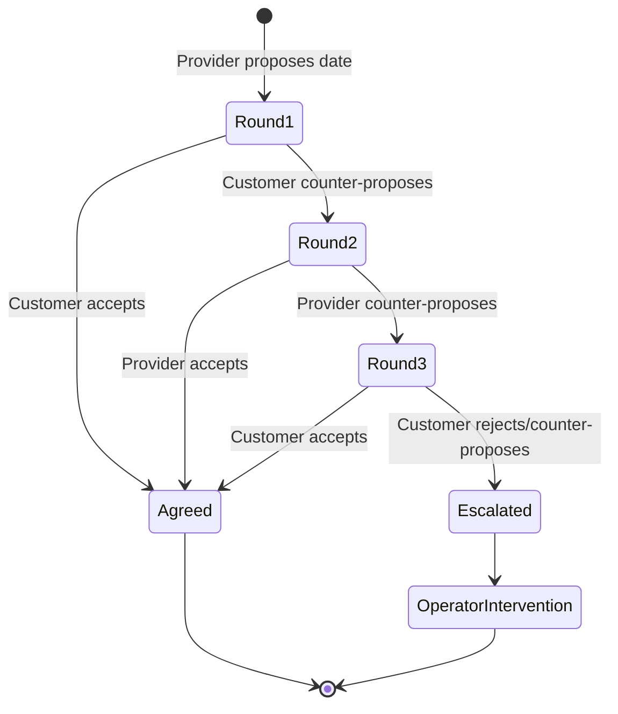

# Date Negotiation 3-Round Limit Specification

**Document Version**: 1.0
**Last Updated**: 2025-01-16
**Owner**: Product & Engineering
**Status**: Specification
**Gap Filled**: Provider-Customer Date Negotiation Workflow

---

## Overview

When a provider accepts a service order offer but proposes a different date than originally scheduled, a negotiation process begins between the provider and customer. This specification defines the **3-round limit** and **escalation to operator** when no agreement is reached.

---

## Business Rules

1. **Maximum 3 Rounds**: Provider and customer can exchange date proposals up to 3 times
2. **Round Definition**: Each counter-proposal from either party counts as one round
3. **Escalation**: After 3rd round without agreement, task created for operator manual handling
4. **Agreement**: Negotiation ends immediately when both parties agree on a date

---

## Data Model

```typescript
interface DateNegotiation {
  id: string;
  serviceOrderId: string;
  providerId: string;
  customerId: string;
  originalProposedDate: DateTime;

  rounds: NegotiationRound[];
  maxRounds: number; // = 3
  currentRound: number;

  status: NegotiationStatus;
  agreedDate?: DateTime;
  escalatedAt?: DateTime;
  escalatedTaskId?: string;

  createdAt: DateTime;
  completedAt?: DateTime;
}

enum NegotiationStatus {
  IN_PROGRESS = 'IN_PROGRESS',
  AGREED = 'AGREED',
  ESCALATED = 'ESCALATED',
  CANCELLED = 'CANCELLED',
}

interface NegotiationRound {
  roundNumber: number; // 1, 2, or 3
  initiator: 'PROVIDER' | 'CUSTOMER';
  proposedDate: DateTime;
  response: ResponseType;
  counterProposalDate?: DateTime;
  respondedAt: DateTime;
  notes?: string;
}

enum ResponseType {
  ACCEPTED = 'ACCEPTED',
  REJECTED = 'REJECTED',
  COUNTER_PROPOSED = 'COUNTER_PROPOSED',
}
```

---

## Workflow



---

## Implementation

### Round 1: Provider Proposes Date

```typescript
// Trigger: Provider accepts offer with condition (different date)
async function handleProviderAcceptanceWithCondition(
  serviceOrderId: string,
  providerId: string,
  proposedDate: DateTime
): Promise<void> {
  // Create negotiation
  const negotiation = await negotiationRepo.create({
    serviceOrderId,
    providerId,
    customerId: so.customerId,
    originalProposedDate: so.scheduledDate,
    maxRounds: 3,
    currentRound: 1,
    status: NegotiationStatus.IN_PROGRESS,
    rounds: [{
      roundNumber: 1,
      initiator: 'PROVIDER',
      proposedDate,
      response: ResponseType.COUNTER_PROPOSED,
      respondedAt: DateTime.now()
    }]
  });

  // Send notification to customer
  await notificationService.sendToCustomer(so.customerId, {
    type: 'DATE_PROPOSAL_FROM_PROVIDER',
    serviceOrderId,
    proposedDate,
    acceptUrl: `/appointments/${negotiation.id}/accept`,
    proposeNewDateUrl: `/appointments/${negotiation.id}/counter-propose`
  });
}
```

### Round 2: Customer Responds

```typescript
async function handleCustomerResponse(
  negotiationId: string,
  response: ResponseType,
  counterProposalDate?: DateTime
): Promise<void> {
  const negotiation = await negotiationRepo.findById(negotiationId);

  if (response === ResponseType.ACCEPTED) {
    // Agreement reached
    negotiation.status = NegotiationStatus.AGREED;
    negotiation.agreedDate = negotiation.rounds[0].proposedDate;
    negotiation.completedAt = DateTime.now();

    // Update service order
    await serviceOrderService.reschedule(
      negotiation.serviceOrderId,
      negotiation.agreedDate
    );

    return;
  }

  // Customer counter-proposes → Round 2
  negotiation.currentRound = 2;
  negotiation.rounds.push({
    roundNumber: 2,
    initiator: 'CUSTOMER',
    proposedDate: counterProposalDate,
    response: ResponseType.COUNTER_PROPOSED,
    respondedAt: DateTime.now()
  });

  await negotiationRepo.save(negotiation);

  // Notify provider
  await notificationService.sendToProvider(negotiation.providerId, {
    type: 'DATE_COUNTER_PROPOSAL_FROM_CUSTOMER',
    serviceOrderId: negotiation.serviceOrderId,
    proposedDate: counterProposalDate
  });
}
```

### Round 3 & Escalation

```typescript
async function handleProviderResponse(
  negotiationId: string,
  response: ResponseType,
  counterProposalDate?: DateTime
): Promise<void> {
  const negotiation = await negotiationRepo.findById(negotiationId);

  if (response === ResponseType.ACCEPTED) {
    // Agreement reached
    negotiation.status = NegotiationStatus.AGREED;
    negotiation.agreedDate = negotiation.rounds[negotiation.currentRound - 1].proposedDate;
    negotiation.completedAt = DateTime.now();

    await serviceOrderService.reschedule(
      negotiation.serviceOrderId,
      negotiation.agreedDate
    );

    return;
  }

  // Check if max rounds reached
  if (negotiation.currentRound >= negotiation.maxRounds) {
    // ESCALATE TO OPERATOR
    await escalateToOperator(negotiation);
    return;
  }

  // Continue to next round
  negotiation.currentRound++;
  negotiation.rounds.push({
    roundNumber: negotiation.currentRound,
    initiator: 'PROVIDER',
    proposedDate: counterProposalDate,
    response: ResponseType.COUNTER_PROPOSED,
    respondedAt: DateTime.now()
  });

  await negotiationRepo.save(negotiation);

  // Notify customer
  await notificationService.sendToCustomer(negotiation.customerId, {
    type: 'DATE_COUNTER_PROPOSAL_FROM_PROVIDER',
    serviceOrderId: negotiation.serviceOrderId,
    proposedDate: counterProposalDate,
    roundNumber: negotiation.currentRound
  });
}
```

### Escalation Logic

```typescript
async function escalateToOperator(negotiation: DateNegotiation): Promise<void> {
  negotiation.status = NegotiationStatus.ESCALATED;
  negotiation.escalatedAt = DateTime.now();

  // Create operator task
  const task = await taskService.createTask({
    type: 'DATE_NEGOTIATION_FAILED',
    serviceOrderId: negotiation.serviceOrderId,
    priority: 'HIGH',
    assignedTo: await getProjectOwner(negotiation.serviceOrderId),
    dueDate: DateTime.now().plus({ hours: 4 }),
    title: 'Date Negotiation Failed - Manual Intervention Required',
    description: `Provider and customer unable to agree on date after 3 rounds`,
    context: {
      negotiationId: negotiation.id,
      providerId: negotiation.providerId,
      rounds: negotiation.rounds.map(r => ({
        round: r.roundNumber,
        initiator: r.initiator,
        proposedDate: r.proposedDate.toISO()
      }))
    },
    suggestedActions: [
      'Find alternative provider with available dates',
      'Contact customer to expand date flexibility',
      'Manual coordinate between provider and customer'
    ]
  });

  negotiation.escalatedTaskId = task.id;
  await negotiationRepo.save(negotiation);

  // Notify operator
  await notificationService.send({
    recipientId: task.assignedTo,
    type: 'DATE_NEGOTIATION_ESCALATED',
    priority: 'HIGH',
    serviceOrderId: negotiation.serviceOrderId
  });
}
```

---

## API Endpoints

### 1. Customer Responds to Proposal

**POST** `/api/v1/negotiations/{negotiationId}/customer-response`

```json
{
  "response": "COUNTER_PROPOSED",
  "counterProposalDate": "2025-02-05T09:00:00Z",
  "notes": "Only available mornings that week"
}
```

### 2. Provider Responds to Counter-Proposal

**POST** `/api/v1/negotiations/{negotiationId}/provider-response`

```json
{
  "response": "ACCEPTED"
  // OR
  "response": "COUNTER_PROPOSED",
  "counterProposalDate": "2025-02-05T10:00:00Z"
}
```

### 3. Get Negotiation Status

**GET** `/api/v1/negotiations/{negotiationId}`

```json
{
  "negotiationId": "neg_123",
  "serviceOrderId": "so_456",
  "status": "IN_PROGRESS",
  "currentRound": 2,
  "maxRounds": 3,
  "rounds": [
    {
      "roundNumber": 1,
      "initiator": "PROVIDER",
      "proposedDate": "2025-02-03T14:00:00Z",
      "response": "COUNTER_PROPOSED"
    },
    {
      "roundNumber": 2,
      "initiator": "CUSTOMER",
      "proposedDate": "2025-02-05T09:00:00Z",
      "response": "COUNTER_PROPOSED"
    }
  ]
}
```

---

## Database Schema

```sql
CREATE TABLE app.date_negotiations (
  id UUID PRIMARY KEY DEFAULT gen_random_uuid(),
  service_order_id UUID NOT NULL REFERENCES app.service_orders(id),
  provider_id UUID NOT NULL,
  customer_id UUID NOT NULL,

  original_proposed_date TIMESTAMP WITH TIME ZONE NOT NULL,
  agreed_date TIMESTAMP WITH TIME ZONE,

  max_rounds INTEGER NOT NULL DEFAULT 3,
  current_round INTEGER NOT NULL DEFAULT 1,

  status VARCHAR(20) NOT NULL CHECK (status IN ('IN_PROGRESS', 'AGREED', 'ESCALATED', 'CANCELLED')),

  escalated_at TIMESTAMP WITH TIME ZONE,
  escalated_task_id UUID,

  created_at TIMESTAMP WITH TIME ZONE DEFAULT NOW(),
  completed_at TIMESTAMP WITH TIME ZONE
);

CREATE TABLE app.negotiation_rounds (
  id UUID PRIMARY KEY DEFAULT gen_random_uuid(),
  negotiation_id UUID NOT NULL REFERENCES app.date_negotiations(id),

  round_number INTEGER NOT NULL CHECK (round_number BETWEEN 1 AND 3),
  initiator VARCHAR(20) NOT NULL CHECK (initiator IN ('PROVIDER', 'CUSTOMER')),
  proposed_date TIMESTAMP WITH TIME ZONE NOT NULL,
  response VARCHAR(20) NOT NULL CHECK (response IN ('ACCEPTED', 'REJECTED', 'COUNTER_PROPOSED')),
  counter_proposal_date TIMESTAMP WITH TIME ZONE,
  responded_at TIMESTAMP WITH TIME ZONE NOT NULL,
  notes TEXT,

  UNIQUE(negotiation_id, round_number)
);

CREATE INDEX idx_negotiations_service_order ON app.date_negotiations(service_order_id);
CREATE INDEX idx_negotiations_status ON app.date_negotiations(status) WHERE status = 'IN_PROGRESS';
```

---

## Business Rules Summary

| Rule | Description |
|------|-------------|
| **3-Round Limit** | Maximum 3 counter-proposals allowed |
| **Auto-Escalation** | 4th rejection/counter-proposal triggers operator task |
| **Immediate Agreement** | Acceptance at any round ends negotiation |
| **SLA for Operator** | 4 hours to resolve escalated negotiation |
| **Provider Timeout** | If provider doesn't respond in 24h, negotiation cancelled → new provider search |
| **Customer Timeout** | If customer doesn't respond in 48h, original date confirmed |

---

**Document Status**: Complete
**Implementation Priority**: HIGH (critical workflow)
**Estimated Effort**: 1-2 weeks
**Dependencies**: Task Management, Notification Service
