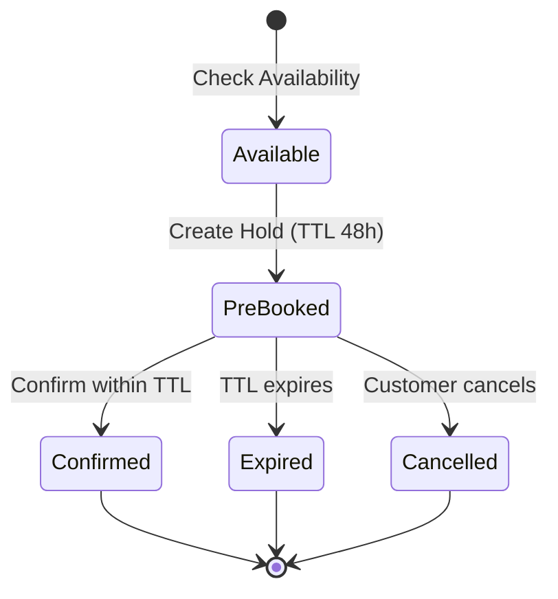

# AHS Calendar vs Yellow Grid Platform - Gap Analysis

**Document Version**: 1.0
**Date**: 2025-01-16
**Analysis Type**: Calendar Feature Coverage Assessment
**Status**: Critical - Mandatory Features Identified

---

## Executive Summary

After analyzing the **AHS Provider Calendar** specifications against the **Yellow Grid Platform** documentation, I've identified that the calendar feature is **PARTIALLY covered** with **CRITICAL GAPS** that must be addressed.

### Key Findings

| Aspect | Status | Coverage |
|--------|--------|----------|
| **Check Availability** | ⚠️ **PARTIALLY COVERED** | 60% |
| **Pre-booking (Holds)** | ❌ **NOT COVERED** | 0% |
| **Minute-Level Scheduling** | ❌ **NOT COVERED** | 0% |
| **Travel Buffers** | ✅ **COVERED** | 100% |
| **Bank Holiday Integration** | ⚠️ **PARTIALLY COVERED** | 40% |
| **Shift-Based Scheduling** | ⚠️ **PARTIALLY COVERED** | 50% |

### Critical Gap

🔴 **The Yellow Grid Platform REQUIRES the AHS Calendar feature** because:

1. ✅ You explicitly mentioned "check availability and pre-booking are **mandatory**"
2. ❌ Current Yellow Grid specs have only **conceptual** scheduling, not **operational** calendar
3. ❌ **Pre-booking/holds** functionality is **completely missing**
4. ❌ **Minute-level granularity** with 15-min slots is **not specified**
5. ❌ **Atomic capacity checks** (Redis Lua) are **not documented**

---

## Table of Contents

1. [Features Covered in Yellow Grid](#1-features-covered-in-yellow-grid)
2. [Features NOT Covered (Critical Gaps)](#2-features-not-covered-critical-gaps)
3. [AHS Calendar Key Concepts](#3-ahs-calendar-key-concepts)
4. [Required Integration Architecture](#4-required-integration-architecture)
5. [Data Model Gaps](#5-data-model-gaps)
6. [API Requirements](#6-api-requirements)
7. [Implementation Recommendation](#7-implementation-recommendation)

---

## 1. Features Covered in Yellow Grid

### 1.1 ✅ Buffer Calculation (FULLY COVERED)

**Yellow Grid**: `product-docs/domain/04-scheduling-buffer-logic.md`

**Coverage**:
- ✅ Global Buffer (Advance Notice) - 3-5 days by country
- ✅ Static Buffer (Product-Specific) - 1-7 days by product
- ✅ Commute Buffer (Travel Time) - Distance/API-based calculation
- ✅ Holiday & Closure Buffer

**AHS Calendar Equivalent**:
- `globalBufferNonWorkingDays` (2-5 days)
- `staticBufferNonWorkingDays` (1-3 days)
- `travelBufferMinutes` (30-45 min)
- Bank holidays (Nager.Date integration)

**Gap**: ⚠️ **Minor** - Yellow Grid has more detailed buffer logic, but AHS Calendar's simpler approach (non-working days vs exact dates) needs alignment.

---

### 1.2 ✅ Provider Eligibility Filtering (FULLY COVERED)

**Yellow Grid**: `product-docs/domain/05-assignment-dispatch-logic.md`

**Coverage**:
- ✅ Geographic zone filtering
- ✅ Service type participation
- ✅ Required certifications
- ✅ Risk status filtering
- ✅ Capacity constraints

**AHS Calendar Equivalent**:
- Assumes **SDT (Scheduling Decision Tool)** performs eligibility filtering
- Calendar receives **pre-filtered** `eligibleTeams[]` list

**Gap**: ✅ **No Gap** - Yellow Grid's assignment funnel is equivalent to SDT's matching logic.

---

### 1.3 ⚠️ Shift-Based Scheduling (PARTIALLY COVERED)

**Yellow Grid**: Mentions "AM/PM slots" in scheduling docs

**Coverage**:
- ⚠️ AM/PM concept exists
- ❌ No explicit shift configuration (Morning 07:00-12:00, Afternoon 12:00-17:00, Evening 17:00-20:00)
- ❌ No per-BU shift window configuration
- ❌ No shift-level capacity counters

**AHS Calendar**:
- ✅ Shift codes: `M`, `A`, `E` (configurable per BU)
- ✅ Per-shift capacity aggregation (`counter` = # of feasible teams)
- ✅ Cross-shift and cross-day job support

**Gap**: 🟡 **MEDIUM** - Yellow Grid needs to add **shift configuration** per BU/country.

---

## 2. Features NOT Covered (Critical Gaps)

### 2.1 ❌ Pre-Booking / Holds (CRITICAL GAP)

**Status**: ❌ **COMPLETELY MISSING**

**What AHS Calendar Does**:
- **Pre-book** (hold) reserves capacity with TTL (default 48h, configurable 10min-72h)
- Customer has time to review and confirm without losing slot
- Atomic Redis Lua script ensures no double-booking during hold
- Per-customer limit: ≤2 active holds
- Auto-expiration after TTL with `PreBookingExpired` event

**What Yellow Grid Has**: ❌ NOTHING

**Why This is Critical**:
> You said: "check availability and pre-booking are **mandatory**"

Without pre-booking:
- ❌ Customer cannot "reserve" a slot to think about it
- ❌ Slots can be taken by other customers during checkout process
- ❌ No hold/confirm workflow (common in e-commerce for appointments)
- ❌ Increased cart abandonment (slot disappears before payment)

**Business Impact**:
- **High**: Pre-booking is standard in appointment booking systems
- Prevents "slot sniping" (customer sees availability, slot gone when they confirm)
- Allows customer to review order before committing provider capacity

**Required Implementation**:
```typescript
// MISSING in Yellow Grid
interface PreBooking {
  id: string;
  serviceOrderId: string;
  providerId: string;
  workerId: string;
  date: Date;
  shift: 'M' | 'A' | 'E';
  durationMinutes: number;
  status: 'PRE_BOOKED' | 'CONFIRMED' | 'EXPIRED' | 'CANCELLED';
  expiresAt: DateTime;
  createdAt: DateTime;
}

// API endpoints needed
POST /api/v1/bookings (preBooking=true)  // Create hold
POST /api/v1/bookings/{id}/confirm       // Confirm hold → booking
POST /api/v1/bookings/{id}/cancel        // Release hold
```

---

### 2.2 ❌ Minute-Level Scheduling with 15-Min Slots (CRITICAL GAP)

**Status**: ❌ **COMPLETELY MISSING**

**What AHS Calendar Does**:
- **15-minute slot granularity** (96 slots per day: 0-95)
- **Redis bitmaps** for each work team per day: `wt:{id}:day:{YYYYMMDD}`
- Each bit represents one 15-min slot (1=busy, 0=free)
- Jobs can span multiple slots (120-min job = 8 slots)
- Travel buffers applied as additional busy slots before/after jobs

**What Yellow Grid Has**:
- ⚠️ AM/PM concept (2 slots per day)
- ❌ No minute-level granularity
- ❌ No bitmap data structure
- ❌ No 15-min slot allocation algorithm

**Why This is Critical**:
- **Precision**: Can schedule at 09:15, 10:30, etc. (not just "morning" or "afternoon")
- **Capacity**: Multiple short jobs can fit in same shift (2x 1h jobs in 4h morning shift)
- **Travel Buffers**: 30-min buffer = 2 slots (precise calculation)

**Example Scenario**:
```
Morning Shift: 08:00-12:00 (4 hours = 16 slots)

Without 15-min slots (current Yellow Grid):
- Can only schedule 1 "morning" job per provider

With 15-min slots (AHS Calendar):
- Job 1: 08:00-09:30 (6 slots) + 2 slots travel buffer
- Job 2: 10:00-11:30 (6 slots) + 2 slots travel buffer
- Total: 16 slots (both jobs fit!)
```

**Required Implementation**:
```typescript
// MISSING in Yellow Grid
interface DayBitmap {
  workTeamId: string;
  date: string; // YYYYMMDD
  slots: number; // 96-bit integer (or array of booleans)
}

// Redis key structure
key: `wt:863:day:20250126`
value: bitmap with 96 bits
```

---

### 2.3 ❌ Atomic Capacity Checks (Redis Lua) (CRITICAL GAP)

**Status**: ❌ **COMPLETELY MISSING**

**What AHS Calendar Does**:
- **Atomic Redis Lua scripts** for booking placement
- Single-operation check-and-set across multiple day keys
- Prevents race conditions when 2 customers try to book same slot
- WATCH/MULTI fallback for multi-key transactions

**What Yellow Grid Has**:
- ❌ No atomic capacity checks
- ⚠️ Mentions "optimistic locking" in database context
- ❌ No Redis-based synchronization

**Why This is Critical**:
- **Race Conditions**: Without atomic checks, double-booking is possible
- **Concurrency**: High-traffic systems (1000s of concurrent users) need atomic ops
- **Data Integrity**: Database-level locking is too slow for real-time availability

**Required Implementation**:
```lua
-- MISSING in Yellow Grid: Redis Lua script
-- Atomic check-and-set for booking
local function atomicBooking(workTeamId, date, startSlot, durationSlots)
  local key = "wt:" .. workTeamId .. ":day:" .. date
  local bitmap = redis.call('GET', key) or string.rep('\0', 12) -- 96 bits

  -- Check if all slots are free
  for i = startSlot, startSlot + durationSlots - 1 do
    if getBit(bitmap, i) == 1 then
      return { status = "CAPACITY_CHANGED", slot = i }
    end
  end

  -- Set all slots to busy
  for i = startSlot, startSlot + durationSlots - 1 do
    bitmap = setBit(bitmap, i, 1)
  end

  redis.call('SET', key, bitmap)
  return { status = "SUCCESS", slotsSet = durationSlots }
end
```

---

### 2.4 ❌ Bank Holiday Integration (Nager.Date API) (CRITICAL GAP)

**Status**: ⚠️ **PARTIALLY COVERED** (concept exists, no integration)

**What AHS Calendar Does**:
- **Nager.Date API** integration (public bank holiday API)
- Daily cron job (02:00 local time) to sync holidays
- **24-month rolling horizon** caching
- **Regional support** (ES-MD, PL-DS, etc.)
- **Manual overrides** (add/remove holidays)
- **Absolute policy**: No bookings on bank holidays

**What Yellow Grid Has**:
- ✅ Concept of "holidays" in buffer logic
- ❌ No Nager.Date integration
- ❌ No automated sync
- ❌ No regional holiday support
- ❌ No manual override table

**Why This is Critical**:
- **Compliance**: Some countries have strict rules (no work on national holidays)
- **Regional Variation**: Spain has 17 autonomous communities with different holidays
- **Automation**: Manual holiday entry is error-prone and labor-intensive

**Required Implementation**:
```typescript
// MISSING in Yellow Grid
interface HolidaySync {
  country: string;
  region?: string;
  year: number;
  source: 'NAGER_DATE' | 'MANUAL_OVERRIDE';
  holidays: Holiday[];
  lastSyncedAt: DateTime;
}

interface Holiday {
  date: Date;
  name: string;
  type: 'national' | 'regional' | 'religious';
  countryCode: string;
  regionCode?: string;
}

interface HolidayOverride {
  id: string;
  country: string;
  region?: string;
  date: Date;
  overrideType: 'add' | 'remove';
  reason: string;
}

// Cron job
cron.schedule('0 2 * * *', async () => {
  await syncBankHolidays(); // Call Nager.Date API
});
```

---

### 2.5 ❌ Cross-Day and Cross-Shift Job Support (CRITICAL GAP)

**Status**: ❌ **NOT COVERED**

**What AHS Calendar Does**:
- Jobs can **span multiple shifts** (start in Morning, continue in Afternoon)
- Jobs can **span multiple days** (20-hour job across 2 days)
- Per-BU flag: `crossDayAllowed` (true/false)
- Exposes **start shift** on **start date** (not end)

**What Yellow Grid Has**:
- ⚠️ Conceptual mention of "multi-day jobs"
- ❌ No algorithm for cross-shift/cross-day capacity blocking

**Why This is Critical**:
- **Long Jobs**: Kitchen installation = 10-12 hours (crosses shifts/days)
- **Capacity Accuracy**: Must block all covered slots, not just start slot

**Required Implementation**:
```typescript
// MISSING in Yellow Grid
interface BookingSpan {
  serviceOrderId: string;
  startDate: Date;
  startShift: 'M' | 'A' | 'E';
  durationMinutes: number;
  maySpanDays: boolean;
  spannedDays: Date[]; // [2025-01-26, 2025-01-27] if crosses midnight
  spannedSlots: { date: Date, startSlot: number, endSlot: number }[];
}

// Algorithm
function calculateSpannedSlots(
  startDate: Date,
  startSlot: number,
  durationMinutes: number
): BookingSpan {
  const totalSlots = Math.ceil(durationMinutes / 15);
  let currentSlot = startSlot;
  let currentDate = startDate;
  const spannedSlots = [];

  while (totalSlots > 0) {
    const slotsInDay = Math.min(96 - currentSlot, totalSlots);
    spannedSlots.push({ date: currentDate, startSlot: currentSlot, endSlot: currentSlot + slotsInDay });

    totalSlots -= slotsInDay;
    if (totalSlots > 0) {
      currentDate = addDays(currentDate, 1);
      currentSlot = 0; // Start of next day
    }
  }

  return { spannedSlots, maySpanDays: spannedSlots.length > 1 };
}
```

---

### 2.6 ❌ Shift-Level Capacity Aggregation (CRITICAL GAP)

**Status**: ❌ **NOT COVERED**

**What AHS Calendar Does**:
```json
{
  "date": "2025-09-26",
  "shifts": [
    {
      "shift": "M",
      "counter": 12, // 12 work teams can START in Morning shift
      "providers": [ /* list of 12 providers */ ]
    },
    {
      "shift": "A",
      "counter": 8,
      "providers": [ /* list of 8 providers */ ]
    }
  ]
}
```

**What Yellow Grid Has**:
- ❌ No shift-level aggregation
- ❌ No `counter` field showing # of available providers per shift

**Why This is Critical**:
- **UX**: Customer sees "12 providers available in morning, 8 in afternoon" → informed choice
- **Load Balancing**: Operator can see capacity bottlenecks

**Required Implementation**:
```typescript
// MISSING in Yellow Grid
interface AvailabilityDay {
  date: Date;
  shifts: ShiftAvailability[];
}

interface ShiftAvailability {
  shift: 'M' | 'A' | 'E';
  counter: number; // # of eligible teams that can START in this shift
  providers: ProviderSummary[];
  indicators?: {
    travelBufferMinutes: number;
    eligibleTeamsChecked: number;
    feasibleTeams: number;
  };
}
```

---

## 3. AHS Calendar Key Concepts

### 3.1 Slot→Booking Algorithm

**Inputs**:
- `eligibleTeams[]` (from SDT/Assignment funnel)
- `durationMinutes` (from service duration estimation)
- `startDate`, `horizonDays`, `shiftFilter?`, `deliveryDate?`

**Process**:
1. For each day in horizon:
   - Skip if bank holiday or non-working day
2. For each shift (M/A/E):
   - For each eligible team:
     - Build 96-bit bitmap for the day
     - Apply travel buffers around existing bookings
     - Search for continuous free slots = `ceil(durationMinutes/15)`
     - If found → team is feasible for that shift
3. Aggregate: `counter` = # of feasible teams per shift

**Output**: `{ date, shifts: [{ shift, counter, providers[] }] }`

---

### 3.2 Pre-Booking Workflow



---

### 3.3 Data Structures

#### Redis Bitmaps
```
Key: wt:863:day:20250126
Value: 96-bit bitmap (12 bytes)
Bit 0 = 00:00-00:15
Bit 1 = 00:15-00:30
...
Bit 32 = 08:00-08:15 (typical shift start)
...
Bit 95 = 23:45-00:00
```

#### PostgreSQL Tables
```sql
CREATE TABLE bookings (
  booking_id UUID PRIMARY KEY,
  status VARCHAR(20), -- PRE_BOOKED, CONFIRMED, EXPIRED, CANCELLED
  customer_id VARCHAR(100),
  worker_id INTEGER,
  provider_id INTEGER,
  date DATE,
  shift VARCHAR(10), -- M, A, E (or AM, PM, EV)
  duration_minutes INTEGER,
  may_span_days BOOLEAN,
  expires_at TIMESTAMP, -- For pre-bookings
  created_at TIMESTAMP
);

CREATE TABLE holidays (
  country VARCHAR(3),
  region VARCHAR(10),
  date DATE,
  name VARCHAR(255),
  source_version VARCHAR(50),
  PRIMARY KEY (country, region, date)
);

CREATE TABLE calendar_configs (
  bu VARCHAR(20) PRIMARY KEY,
  timezone VARCHAR(50),
  working_days JSONB, -- ["MON", "TUE", "WED", "THU", "FRI"]
  shifts JSONB, -- [{"code":"M","start":"08:00","end":"13:00"}]
  buffers JSONB, -- {"global":2,"static":1,"travel":30}
  cross_day_allowed BOOLEAN,
  region VARCHAR(10)
);
```

---

## 4. Required Integration Architecture

### 4.1 Proposed Yellow Grid + AHS Calendar Integration

```
┌─────────────────────────────────────────────────────────────────┐
│                      YELLOW GRID PLATFORM                       │
│                                                                 │
│  ┌────────────────┐         ┌────────────────┐                │
│  │   Assignment   │         │   Scheduling   │                │
│  │     Funnel     │──────▶  │     Engine     │                │
│  │  (Eligibility) │         │ (Date/Slot)    │                │
│  └────────────────┘         └────────────────┘                │
│           │                          │                         │
│           │                          │                         │
│           ▼                          ▼                         │
│  ┌──────────────────────────────────────────────┐             │
│  │         AHS CALENDAR COMPONENT               │             │
│  │  (Embedded or Microservice)                  │             │
│  │                                              │             │
│  │  - POST /availability (eligibleTeams[])      │             │
│  │  - POST /bookings (pre-book or confirm)      │             │
│  │  - POST /bookings/{id}/confirm               │             │
│  │  - POST /bookings/{id}/cancel                │             │
│  │                                              │             │
│  │  Redis: Bitmaps, Holds, Idempotency          │             │
│  │  Postgres: Bookings, Holidays, Config        │             │
│  └──────────────────────────────────────────────┘             │
│                          │                                     │
│                          │                                     │
│                          ▼                                     │
│  ┌──────────────────────────────────────────────┐             │
│  │         KAFKA EVENTS                         │             │
│  │  - calendar.booking.prebooked                │             │
│  │  - calendar.booking.confirmed                │             │
│  │  - calendar.prebooking.expired               │             │
│  └──────────────────────────────────────────────┘             │
└─────────────────────────────────────────────────────────────────┘
```

---

## 5. Data Model Gaps

### 5.1 Missing Entities in Yellow Grid

| Entity | Purpose | Priority |
|--------|---------|----------|
| `PreBooking` | Hold reservations with TTL | 🔴 CRITICAL |
| `DayBitmap` | 15-min slot representation | 🔴 CRITICAL |
| `HolidayCalendar` | Bank holidays (Nager.Date) | 🔴 CRITICAL |
| `HolidayOverride` | Manual add/remove holidays | 🟡 MEDIUM |
| `CalendarConfig` | Per-BU shift windows & buffers | 🔴 CRITICAL |
| `IdempotencyStore` | Prevent duplicate bookings | 🔴 CRITICAL |
| `EventOutbox` | Exactly-once event publishing | 🟡 MEDIUM |

---

### 5.2 Missing Attributes on ServiceOrder

```typescript
// ADD to Yellow Grid ServiceOrder
interface ServiceOrder {
  // ... existing fields ...

  // Calendar integration
  preBookingId?: string;
  bookingId?: string;
  bookingStatus?: 'PRE_BOOKED' | 'CONFIRMED' | 'EXPIRED' | 'CANCELLED';
  preBookingExpiresAt?: DateTime;
  shift?: 'M' | 'A' | 'E'; // Start shift
  maySpanDays?: boolean;
  slotStartIndex?: number; // 0-95 (15-min slot index)
  slotEndIndex?: number;
  travelBufferMinutesApplied?: number;
}
```

---

## 6. API Requirements

### 6.1 New APIs Needed in Yellow Grid

#### 1. Check Availability

**POST** `/api/v1/calendar/availability`

**Request**:
```json
{
  "serviceOrderId": "so_abc123",
  "eligibleTeams": [
    { "providerId": 340, "workerId": 863 },
    { "providerId": 366, "workerId": 1002 }
  ],
  "durationMinutes": 120,
  "startDate": "2025-01-26",
  "horizonDays": 45,
  "shiftFilter": ["M", "A"],
  "deliveryDate": "2025-02-02"
}
```

**Response**:
```json
[
  {
    "date": "2025-01-26",
    "shifts": [
      {
        "shift": "M",
        "counter": 2,
        "providers": [
          {
            "id": 340,
            "name": "Provider A",
            "workers": [
              { "id": 863, "name": "Worker 1" }
            ]
          },
          {
            "id": 366,
            "name": "Provider B",
            "workers": [
              { "id": 1002, "name": "Worker 2" }
            ]
          }
        ]
      },
      {
        "shift": "A",
        "counter": 1,
        "providers": [ /* ... */ ]
      }
    ]
  }
]
```

---

#### 2. Create Pre-Booking (Hold)

**POST** `/api/v1/calendar/bookings`

**Headers**: `Idempotency-Key: <uuid>`

**Request**:
```json
{
  "serviceOrderId": "so_abc123",
  "customerId": "cust_456",
  "customerPostalCode": "75001",
  "date": "2025-01-26",
  "shift": "M",
  "preBooking": true,
  "providerId": 340,
  "workerId": 863,
  "durationMinutes": 120
}
```

**Response (201)**:
```json
{
  "bookingStatus": "PRE_BOOKED",
  "bookingId": "bkg_789",
  "expiresAt": "2025-01-28T14:00:00Z",
  "confirmUrl": "/api/v1/calendar/bookings/bkg_789/confirm",
  "date": "2025-01-26",
  "shift": "M",
  "durationMinutes": 120
}
```

---

#### 3. Confirm Pre-Booking

**POST** `/api/v1/calendar/bookings/{bookingId}/confirm`

**Response (200)**:
```json
{
  "bookingStatus": "CONFIRMED",
  "bookingId": "bkg_789",
  "appointment": {
    "date": "2025-01-26",
    "shift": "M",
    "windowLocal": "08:00-12:00",
    "provider": { "id": 340, "name": "Provider A" },
    "worker": { "id": 863, "name": "Worker 1" }
  }
}
```

---

#### 4. Cancel Pre-Booking

**POST** `/api/v1/calendar/bookings/{bookingId}/cancel`

**Response (200)**:
```json
{
  "cancelled": true,
  "bookingId": "bkg_789"
}
```

---

## 7. Implementation Recommendation

### 7.1 Integration Strategy

**Option 1: Embed AHS Calendar as Module** (Recommended)

**Pros**:
- ✅ Single codebase
- ✅ Faster development
- ✅ No network latency between components
- ✅ Simpler deployment

**Cons**:
- ❌ Couples Yellow Grid to AHS Calendar tech stack (Java/Spring)
- ❌ Cannot scale independently

**Implementation**:
```
yellow-grid/
├── src/
│   ├── assignment/     # Existing assignment funnel
│   ├── scheduling/     # Existing scheduling logic
│   ├── calendar/       # NEW: AHS Calendar module
│   │   ├── availability/
│   │   ├── booking/
│   │   ├── holiday/
│   │   └── engine/
│   └── ...
└── ...
```

---

**Option 2: Deploy AHS Calendar as Microservice**

**Pros**:
- ✅ Independent scaling
- ✅ Tech stack isolation
- ✅ Can reuse existing AHS Calendar codebase

**Cons**:
- ❌ Network latency (availability check = 2 HTTP calls)
- ❌ More complex deployment
- ❌ Data consistency challenges

**Implementation**:
```
┌──────────────────┐       HTTP       ┌──────────────────┐
│  Yellow Grid API │────────────────▶ │ AHS Calendar API │
│  (NestJS/TS)     │                  │ (Spring/Java)    │
└──────────────────┘                  └──────────────────┘
         │                                      │
         ▼                                      ▼
  ┌────────────┐                        ┌────────────┐
  │ PostgreSQL │                        │   Redis    │
  │ (Main DB)  │                        │ (Bitmaps)  │
  └────────────┘                        └────────────┘
```

---

### 7.2 Phased Rollout

**Phase 1: Core Availability + Pre-Booking** (4-6 weeks)
- ✅ Implement 15-min slot bitmaps (Redis)
- ✅ Availability API (`POST /availability`)
- ✅ Pre-booking API (`POST /bookings`, `POST /bookings/{id}/confirm`)
- ✅ Bank holiday integration (Nager.Date)
- ✅ Shift configuration per BU

**Phase 2: Advanced Features** (4-6 weeks)
- ✅ Cross-day and cross-shift jobs
- ✅ Travel buffer rounding (15-min alignment)
- ✅ Manual holiday overrides
- ✅ Calendar config admin UI (Draft → Validate → Publish)

**Phase 3: Optimization** (2-4 weeks)
- ✅ Performance tuning (p95 < 500ms)
- ✅ Load testing (500 concurrent requests)
- ✅ Derived index for hot zones
- ✅ Hold sweeper (auto-expire pre-bookings)

**Total**: 10-16 weeks

---

### 7.3 Technology Alignment

| Component | AHS Calendar | Yellow Grid | Recommendation |
|-----------|-------------|-------------|----------------|
| **Backend Language** | Java 21 + Spring Boot WebFlux | TypeScript + NestJS | **Rewrite AHS Calendar in TypeScript** or keep separate microservice |
| **Database** | PostgreSQL (R2DBC reactive) | PostgreSQL (Prisma) | ✅ Compatible - use same DB |
| **Redis** | Lettuce (reactive) | ioredis | ✅ Compatible - use same Redis cluster |
| **Kafka** | reactor-kafka | kafkajs | ✅ Compatible - same Kafka cluster |
| **API Style** | Reactive (Mono/Flux) | Promise-based async/await | ⚠️ Different styles, but both non-blocking |

**Recommendation**: **Option 1 (Embed as Module)** with TypeScript rewrite of AHS Calendar core logic.

**Rationale**:
- Yellow Grid is already TypeScript/NestJS
- Easier to maintain single codebase
- Rewriting ~3,000 LOC of AHS Calendar business logic is feasible in 2-3 weeks
- Keep Redis bitmap logic identical (technology-agnostic)

---

## 8. Critical Risks & Mitigations

### Risk 1: Double-Booking Due to Race Conditions

**Risk**: Without atomic Redis Lua scripts, 2 customers can book same slot

**Mitigation**:
- ✅ Use Redis Lua scripts (mandatory)
- ✅ Fallback to WATCH/MULTI for multi-key transactions
- ✅ Add idempotency keys (Idempotency-Key header)

---

### Risk 2: Holiday Data Unavailable

**Risk**: Nager.Date API outage prevents booking

**Mitigation**:
- ✅ Cache 24-month rolling horizon
- ✅ Daily sync (02:00 local) with retry/backoff
- ✅ Fallback to last-known cache
- ✅ Beyond cache → return `503 HOLIDAY_DATA_UNAVAILABLE`

---

### Risk 3: Pre-Booking Expiration Floods

**Risk**: 1000s of pre-bookings expiring simultaneously → performance spike

**Mitigation**:
- ✅ Hold sweeper cron job (every 5 minutes)
- ✅ Batch process expirations (100 at a time)
- ✅ Event outbox for exactly-once `PreBookingExpired` events

---

## 9. Conclusion & Recommendations

### 9.1 Is AHS Calendar Needed?

**YES - ABSOLUTELY MANDATORY** 🔴

**Reasons**:
1. ✅ You explicitly said "check availability and pre-booking are **mandatory**"
2. ❌ Yellow Grid has **NO operational calendar** (only conceptual scheduling)
3. ❌ Pre-booking/holds are **completely missing**
4. ❌ Minute-level scheduling (15-min slots) is **not implemented**
5. ❌ Atomic capacity checks (Redis Lua) are **critical** for data integrity

### 9.2 What to Implement

**CRITICAL (Must Have)**:
1. ✅ Pre-booking/holds with TTL (48h default)
2. ✅ 15-minute slot bitmaps (Redis)
3. ✅ Atomic Redis Lua scripts (prevent double-booking)
4. ✅ Bank holiday integration (Nager.Date API)
5. ✅ Shift-level capacity aggregation (`counter` per shift)

**HIGH PRIORITY (Should Have)**:
6. ✅ Cross-day and cross-shift job support
7. ✅ Travel buffer rounding (15-min alignment)
8. ✅ Per-BU calendar configuration (shifts, buffers, timezone)

**MEDIUM PRIORITY (Nice to Have)**:
9. ✅ Manual holiday overrides (admin UI)
10. ✅ Calendar config draft/validate/publish workflow

### 9.3 Recommended Action Plan

**Immediate** (This Sprint):
1. ✅ Review this gap analysis with product & engineering teams
2. ✅ Decide: Embed AHS Calendar or deploy as microservice?
3. ✅ If embedding: Start TypeScript rewrite of AHS Calendar core logic
4. ✅ If microservice: Deploy AHS Calendar separately + integrate via HTTP

**Week 1-2**:
1. ✅ Implement Redis bitmap data structures
2. ✅ Implement `POST /availability` API
3. ✅ Implement Nager.Date holiday sync

**Week 3-4**:
1. ✅ Implement pre-booking APIs (create/confirm/cancel)
2. ✅ Implement atomic Redis Lua scripts
3. ✅ Implement hold expiration sweeper

**Week 5-6**:
1. ✅ Implement cross-day/cross-shift logic
2. ✅ Implement calendar config per BU
3. ✅ Integration testing with Yellow Grid assignment funnel

**Total Effort**: 10-16 weeks (with team of 2-3 engineers)

---

**Document Status**: Complete
**Next Steps**: Review with engineering team + decide integration strategy
**Maintained By**: Product & Engineering Teams
