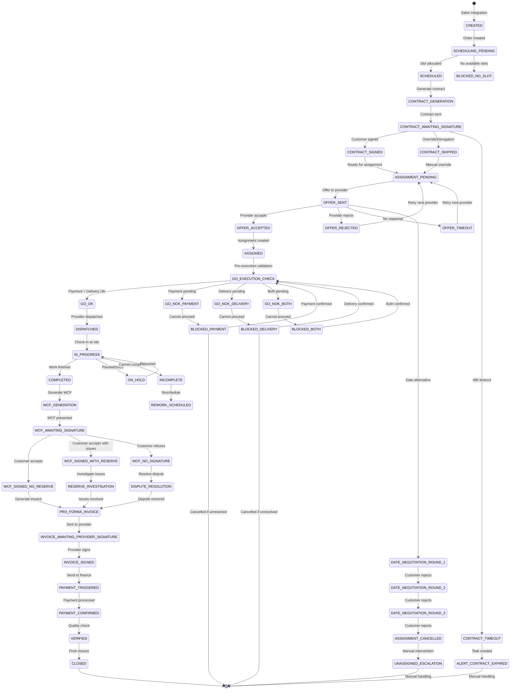
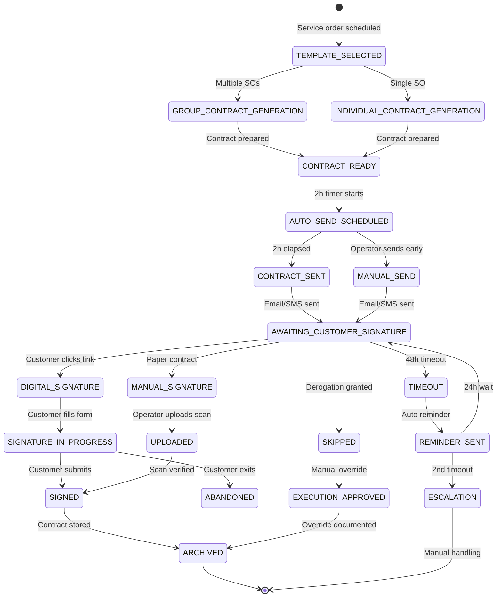
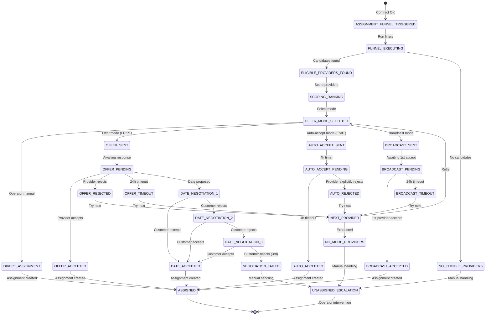
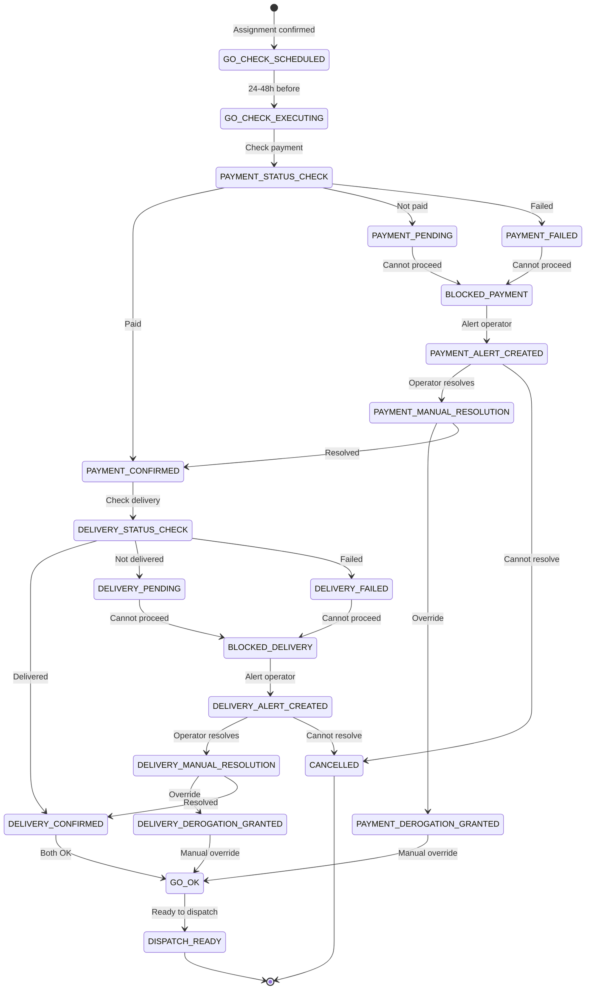
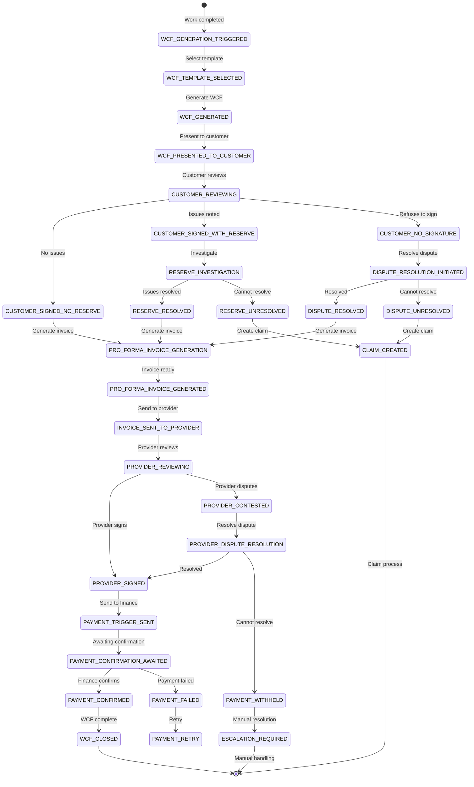

# Comprehensive State Machines Analysis - Yellow Grid Platform

**Document Version**: 1.0
**Created**: 2025-01-16
**Status**: Analysis - Comparing PRD 10-Step Workflow vs Existing Documentation

---

## Executive Summary

This document provides comprehensive state machine designs derived from the **10-step workflow in the PRD** and compares them against existing state machines documented in the engineering specifications.

**Key Finding**: The existing documentation has **gaps** in representing the complete end-to-end workflow, particularly around:
- **Go Execution** logic (payment + delivery checks)
- **WCF (Work Closing Form)** detailed states
- **Contract lifecycle** automation (2-hour auto-send)
- **Provider payment trigger** conditions

---

## Table of Contents

1. [Service Order Lifecycle State Machine (Complete)](#1-service-order-lifecycle-state-machine-complete)
2. [Contract Lifecycle State Machine](#2-contract-lifecycle-state-machine)
3. [Assignment/Dispatch State Machine](#3-assignmentdispatch-state-machine)
4. [Go Execution State Machine](#4-go-execution-state-machine)
5. [WCF (Work Closing Form) State Machine](#5-wcf-work-closing-form-state-machine)
6. [Gaps & Conflicts Analysis](#6-gaps--conflicts-analysis)
7. [Recommendations](#7-recommendations)

---

## 1. Service Order Lifecycle State Machine (Complete)

### 1.1 Comprehensive State Machine Based on PRD

This state machine integrates **ALL** states from the PRD's 10-step workflow, including integration, contract, assignment, execution, WCF, and payment.



### 1.2 State Descriptions

| **State** | **Description** | **Entry Condition** | **Exit Condition** |
|-----------|-----------------|---------------------|-------------------|
| **CREATED** | Service order created from sales | Sales system integration | Scheduling initiated |
| **SCHEDULING_PENDING** | Awaiting slot allocation | Order created | Slot allocated or no slots |
| **SCHEDULED** | Slot allocated | Slot allocated | Contract generation |
| **BLOCKED_NO_SLOT** | No available slots | No slots available | Manual intervention |
| **CONTRACT_GENERATION** | Generating contract | Scheduled | Contract sent |
| **CONTRACT_AWAITING_SIGNATURE** | Awaiting customer signature | Contract sent | Signed, skipped, or timeout |
| **CONTRACT_SIGNED** | Customer signed contract | Customer signed | Ready for assignment |
| **CONTRACT_SKIPPED** | Contract skipped (override) | Manual derogation | Ready for assignment |
| **CONTRACT_TIMEOUT** | Contract not signed in 48h | 48h timeout | Alert created |
| **ASSIGNMENT_PENDING** | Awaiting provider assignment | Contract OK | Offer sent |
| **OFFER_SENT** | Offer sent to provider | Assignment funnel executed | Accept, reject, timeout, negotiate |
| **OFFER_ACCEPTED** | Provider accepted offer | Provider accepts | Assignment created |
| **OFFER_REJECTED** | Provider rejected offer | Provider rejects | Retry next provider |
| **OFFER_TIMEOUT** | Offer timed out | Timeout (24h or 4h) | Retry next provider |
| **DATE_NEGOTIATION_ROUND_X** | Date negotiation in progress | Provider proposes date | Accept or reject |
| **ASSIGNMENT_CANCELLED** | Assignment cancelled after 3 rounds | 3 date rejections | Escalation |
| **ASSIGNED** | Provider assigned | Offer accepted | Go execution check |
| **GO_EXECUTION_CHECK** | Checking payment + delivery | Assigned | Go OK or Go NOK |
| **GO_OK** | Payment + Delivery confirmed | Both confirmed | Dispatch |
| **GO_NOK_PAYMENT** | Payment not confirmed | Payment pending | Blocked |
| **GO_NOK_DELIVERY** | Delivery not confirmed | Delivery pending | Blocked |
| **GO_NOK_BOTH** | Both not confirmed | Both pending | Blocked |
| **BLOCKED_PAYMENT** | Blocked due to payment | Payment pending | Payment confirmed or cancel |
| **BLOCKED_DELIVERY** | Blocked due to delivery | Delivery pending | Delivery confirmed or cancel |
| **BLOCKED_BOTH** | Blocked due to both | Both pending | Both confirmed or cancel |
| **DISPATCHED** | Provider dispatched to site | Go OK | Check-in |
| **IN_PROGRESS** | Work in progress | Check-in | Complete, hold, or incomplete |
| **COMPLETED** | Work finished | Check-out | WCF generation |
| **ON_HOLD** | Work paused | Issue/pause | Resume |
| **INCOMPLETE** | Cannot complete | Blocking issue | Reschedule |
| **REWORK_SCHEDULED** | Rework scheduled | Incomplete | New service order |
| **WCF_GENERATION** | Generating WCF | Work completed | WCF sent |
| **WCF_AWAITING_SIGNATURE** | Awaiting customer WCF signature | WCF sent | Signed, no signature |
| **WCF_SIGNED_NO_RESERVE** | WCF signed, no issues | Customer signs | Invoice generation |
| **WCF_SIGNED_WITH_RESERVE** | WCF signed with issues | Customer signs with reserve | Investigation |
| **WCF_NO_SIGNATURE** | Customer refused WCF | Customer refuses | Dispute |
| **RESERVE_INVESTIGATION** | Investigating WCF issues | Reserve raised | Resolved |
| **DISPUTE_RESOLUTION** | Resolving WCF dispute | Dispute raised | Resolved |
| **PRO_FORMA_INVOICE** | Pro forma invoice generated | WCF accepted | Sent to provider |
| **INVOICE_AWAITING_PROVIDER_SIGNATURE** | Awaiting provider signature | Invoice sent | Provider signs |
| **INVOICE_SIGNED** | Provider signed invoice | Provider signs | Payment triggered |
| **PAYMENT_TRIGGERED** | Payment sent to finance | Invoice signed | Payment confirmed |
| **PAYMENT_CONFIRMED** | Payment processed | Finance confirms | Quality check |
| **VERIFIED** | Quality verified | Payment confirmed | Final closure |
| **CLOSED** | Service order closed | Verified | Terminal state |

### 1.3 Transition Conditions

#### **Contract Transitions**
- **CONTRACT_GENERATION → CONTRACT_AWAITING_SIGNATURE**:
  - Condition: Contract generated successfully
  - Automation: Send email/SMS with signature link
  - Timeout: 48 hours

- **CONTRACT_AWAITING_SIGNATURE → CONTRACT_SIGNED**:
  - Condition: Customer completes e-signature
  - Automation: Trigger assignment funnel

- **CONTRACT_AWAITING_SIGNATURE → CONTRACT_SKIPPED**:
  - Condition: Operator override (derogation)
  - Approval: Manager approval required
  - Audit: Log reason and approver

- **CONTRACT_AWAITING_SIGNATURE → CONTRACT_TIMEOUT**:
  - Condition: 48 hours elapsed
  - Automation: Create task for operator
  - Action: Contact customer

#### **Assignment Transitions**
- **ASSIGNMENT_PENDING → OFFER_SENT**:
  - Condition: Assignment funnel executed
  - Automation: Send offer to top-ranked provider
  - Country-specific: Offer (FR/PL) or Auto-accept (ES/IT)

- **OFFER_SENT → OFFER_ACCEPTED**:
  - Condition: Provider accepts offer
  - Automation: Create assignment record
  - Notification: Notify customer and operator

- **OFFER_SENT → DATE_NEGOTIATION_ROUND_1**:
  - Condition: Provider proposes alternative date
  - Automation: Notify customer for approval
  - Limit: Max 3 rounds

- **DATE_NEGOTIATION_ROUND_3 → ASSIGNMENT_CANCELLED**:
  - Condition: Customer rejects 3rd alternative
  - Automation: Cancel assignment
  - Action: Escalate to operator

#### **Go Execution Transitions**
- **ASSIGNED → GO_EXECUTION_CHECK**:
  - Condition: Assignment confirmed
  - Automation: Check payment + delivery status
  - Timing: 24-48h before scheduled date

- **GO_EXECUTION_CHECK → GO_OK**:
  - Condition: Payment confirmed AND delivery confirmed
  - Automation: Send dispatch notification to provider

- **GO_EXECUTION_CHECK → GO_NOK_PAYMENT**:
  - Condition: Payment NOT confirmed
  - Automation: Block execution, create alert
  - Action: Contact customer/finance

- **GO_EXECUTION_CHECK → GO_NOK_DELIVERY**:
  - Condition: Delivery NOT confirmed
  - Automation: Block execution, create alert
  - Action: Contact logistics

- **BLOCKED_PAYMENT → GO_EXECUTION_CHECK**:
  - Condition: Payment confirmed (manual or automated)
  - Automation: Re-run Go check

#### **Execution Transitions**
- **DISPATCHED → IN_PROGRESS**:
  - Condition: Provider check-in at site
  - Automation: GPS verification
  - Tolerance: 15 minutes late

- **IN_PROGRESS → COMPLETED**:
  - Condition: Provider check-out with completion
  - Automation: Trigger WCF generation

- **IN_PROGRESS → INCOMPLETE**:
  - Condition: Provider check-out with incomplete status
  - Automation: Create task for operator
  - Action: Reschedule or cancel

#### **WCF Transitions**
- **WCF_GENERATION → WCF_AWAITING_SIGNATURE**:
  - Condition: WCF generated
  - Automation: Present to customer for signature
  - Timeout: 7 days

- **WCF_AWAITING_SIGNATURE → WCF_SIGNED_NO_RESERVE**:
  - Condition: Customer signs with no issues
  - Automation: Generate pro forma invoice

- **WCF_AWAITING_SIGNATURE → WCF_SIGNED_WITH_RESERVE**:
  - Condition: Customer signs with reserve (issues noted)
  - Automation: Create investigation task

- **WCF_AWAITING_SIGNATURE → WCF_NO_SIGNATURE**:
  - Condition: Customer refuses to sign
  - Automation: Create dispute resolution task

#### **Payment Transitions**
- **PRO_FORMA_INVOICE → INVOICE_AWAITING_PROVIDER_SIGNATURE**:
  - Condition: Pro forma invoice generated
  - Automation: Send to provider for signature

- **INVOICE_AWAITING_PROVIDER_SIGNATURE → INVOICE_SIGNED**:
  - Condition: Provider signs invoice
  - Automation: Trigger payment to finance

- **INVOICE_SIGNED → PAYMENT_TRIGGERED**:
  - Condition: Invoice signed
  - Automation: Send payment request to ERP/finance
  - Data: Service order ID, provider ID, amount, currency

- **PAYMENT_TRIGGERED → PAYMENT_CONFIRMED**:
  - Condition: Finance confirms payment processed
  - Automation: Notify provider and close service order

### 1.4 Exception States & Alerts

| **Exception State** | **Trigger** | **Alert Type** | **Action** |
|---------------------|-------------|----------------|------------|
| **BLOCKED_NO_SLOT** | No available slots | HIGH | Operator to adjust constraints |
| **CONTRACT_TIMEOUT** | 48h no signature | MEDIUM | Operator to contact customer |
| **ASSIGNMENT_CANCELLED** | 3 date rejections | HIGH | Operator to manually assign |
| **BLOCKED_PAYMENT** | Payment not confirmed | CRITICAL | Contact customer/finance |
| **BLOCKED_DELIVERY** | Delivery not confirmed | CRITICAL | Contact logistics |
| **INCOMPLETE** | Cannot complete work | HIGH | Reschedule or cancel |
| **WCF_NO_SIGNATURE** | Customer refuses WCF | HIGH | Dispute resolution |
| **RESERVE_INVESTIGATION** | WCF with reserve | MEDIUM | Investigate and resolve |

### 1.5 Automation Triggers

| **Automation** | **Trigger** | **Action** |
|----------------|-------------|------------|
| **Contract Auto-Send** | 2 hours after scheduled slot confirmed | Send contract email/SMS |
| **Contract Reminder** | 24 hours before timeout | Send reminder |
| **Go Execution Check** | 24-48h before scheduled date | Check payment + delivery |
| **Dispatch Notification** | Go OK confirmed | Notify provider to dispatch |
| **WCF Generation** | Work completed | Generate WCF from template |
| **Pro Forma Invoice** | WCF signed (no reserve) | Generate invoice |
| **Payment Trigger** | Provider signs invoice | Send to ERP/finance |

### 1.6 Comparison with Existing Documentation

**Reference**: `documentation/domain/03-project-service-order-domain.md`

**Existing State Machine (Lines 410-516)**:
```typescript
enum ServiceOrderState {
  Created = 'Created',
  Scheduled = 'Scheduled',
  Assigned = 'Assigned',
  Dispatched = 'Dispatched',
  InProgress = 'InProgress',
  OnHold = 'OnHold',
  Completed = 'Completed',
  Verified = 'Verified',
  Cancelled = 'Cancelled'
}
```

#### **Gaps Identified**:

1. **Missing Contract States**:
   - ❌ No `CONTRACT_GENERATION`
   - ❌ No `CONTRACT_AWAITING_SIGNATURE`
   - ❌ No `CONTRACT_SIGNED`
   - ❌ No `CONTRACT_SKIPPED`
   - ❌ No `CONTRACT_TIMEOUT`

2. **Missing Assignment States**:
   - ❌ No `ASSIGNMENT_PENDING`
   - ❌ No `OFFER_SENT`
   - ❌ No `OFFER_ACCEPTED` / `OFFER_REJECTED`
   - ❌ No `DATE_NEGOTIATION_ROUND_X`
   - ❌ No `ASSIGNMENT_CANCELLED`

3. **Missing Go Execution States**:
   - ❌ No `GO_EXECUTION_CHECK`
   - ❌ No `GO_OK` / `GO_NOK_PAYMENT` / `GO_NOK_DELIVERY`
   - ❌ No `BLOCKED_PAYMENT` / `BLOCKED_DELIVERY`

4. **Missing WCF States**:
   - ❌ No `WCF_GENERATION`
   - ❌ No `WCF_AWAITING_SIGNATURE`
   - ❌ No `WCF_SIGNED_NO_RESERVE` / `WCF_SIGNED_WITH_RESERVE`
   - ❌ No `WCF_NO_SIGNATURE`
   - ❌ No `RESERVE_INVESTIGATION`
   - ❌ No `DISPUTE_RESOLUTION`

5. **Missing Payment States**:
   - ❌ No `PRO_FORMA_INVOICE`
   - ❌ No `INVOICE_AWAITING_PROVIDER_SIGNATURE`
   - ❌ No `INVOICE_SIGNED`
   - ❌ No `PAYMENT_TRIGGERED`
   - ❌ No `PAYMENT_CONFIRMED`

**Impact**: The existing state machine is **too simplified** and does not represent the **complete end-to-end workflow** described in the PRD.

---

## 2. Contract Lifecycle State Machine

### 2.1 Comprehensive State Machine



### 2.2 Contract States

| **State** | **Description** | **Automation** |
|-----------|-----------------|----------------|
| **TEMPLATE_SELECTED** | Contract template selected | Auto: Based on service type + country |
| **GROUP_CONTRACT_GENERATION** | Generating group contract | Auto: For multiple SOs in project |
| **INDIVIDUAL_CONTRACT_GENERATION** | Generating individual contract | Auto: For single SO |
| **CONTRACT_READY** | Contract prepared | Auto: Start 2h timer |
| **AUTO_SEND_SCHEDULED** | Auto-send scheduled | Auto: 2h countdown |
| **CONTRACT_SENT** | Contract sent to customer | Auto: Email/SMS with link |
| **MANUAL_SEND** | Operator sent early | Manual: Operator override |
| **AWAITING_CUSTOMER_SIGNATURE** | Awaiting signature | Auto: 48h timeout |
| **DIGITAL_SIGNATURE** | Customer signing online | Manual: Customer action |
| **SIGNATURE_IN_PROGRESS** | Signature form open | Manual: Customer filling |
| **SIGNED** | Contract signed | Auto: Trigger assignment |
| **ABANDONED** | Customer abandoned | Auto: Reminder after 24h |
| **MANUAL_SIGNATURE** | Paper contract signed | Manual: Operator uploads |
| **UPLOADED** | Scan uploaded | Manual: Operator action |
| **SKIPPED** | Derogation granted | Manual: Manager approval |
| **TIMEOUT** | 48h timeout | Auto: Reminder sent |
| **REMINDER_SENT** | Reminder sent | Auto: 24h wait |
| **ESCALATION** | 2nd timeout | Auto: Task created |
| **EXECUTION_APPROVED** | Override approved | Manual: Manager approval |
| **ARCHIVED** | Contract stored | Auto: Legal retention |

### 2.3 Contract Automation Rules

#### **Auto-Send After 2h**
- **Trigger**: Service order scheduled + contract generated
- **Delay**: 2 hours after scheduling confirmed
- **Action**: Send email/SMS with e-signature link
- **Bypass**: Operator can manually send earlier

#### **Timeout & Reminders**
- **1st Timeout**: 48 hours after sent
- **Action**: Send reminder email/SMS
- **2nd Timeout**: 72 hours after sent (24h after reminder)
- **Action**: Create task for operator to contact customer

#### **Digital vs Manual Signature**
- **Digital**: Customer clicks link, signs online (default)
- **Manual**: Paper contract signed, operator uploads scan
- **Validation**: Manual signatures require manager approval

### 2.4 Comparison with Existing Documentation

**Reference**: `documentation/domain/07-contract-document-lifecycle.md`

**Existing Contract Status (Lines 77-90)**:
```typescript
enum ContractStatus {
  DRAFT = 'DRAFT',
  PENDING_REVIEW = 'PENDING_REVIEW',
  PENDING_APPROVAL = 'PENDING_APPROVAL',
  AWAITING_SIGNATURE = 'AWAITING_SIGNATURE',
  PARTIALLY_SIGNED = 'PARTIALLY_SIGNED',
  FULLY_EXECUTED = 'FULLY_EXECUTED',
  ACTIVE = 'ACTIVE',
  SUSPENDED = 'SUSPENDED',
  EXPIRED = 'EXPIRED',
  TERMINATED = 'TERMINATED',
  CANCELLED = 'CANCELLED',
  SUPERSEDED = 'SUPERSEDED'
}
```

#### **Gaps Identified**:

1. **Missing Auto-Send States**:
   - ❌ No `AUTO_SEND_SCHEDULED` (2h timer)
   - ❌ No `MANUAL_SEND` (operator override)

2. **Missing Signature Path States**:
   - ❌ No `DIGITAL_SIGNATURE` / `MANUAL_SIGNATURE`
   - ❌ No `SIGNATURE_IN_PROGRESS`
   - ❌ No `ABANDONED`
   - ❌ No `UPLOADED` (for manual scans)

3. **Missing Derogation States**:
   - ❌ No `SKIPPED` (derogation granted)
   - ❌ No `EXECUTION_APPROVED` (manual override)

4. **Missing Timeout/Reminder States**:
   - ❌ No `TIMEOUT` (48h)
   - ❌ No `REMINDER_SENT`
   - ❌ No `ESCALATION` (2nd timeout)

5. **Group vs Individual Contracts**:
   - ❌ No distinction between group and individual contracts
   - ❌ No `GROUP_CONTRACT_GENERATION` / `INDIVIDUAL_CONTRACT_GENERATION`

**Impact**: Existing documentation is **generic** and does not capture the **specific business rules** for pre-service contract automation.

---

## 3. Assignment/Dispatch State Machine

### 3.1 Comprehensive State Machine



### 3.2 Assignment States

| **State** | **Description** | **Automation** |
|-----------|-----------------|----------------|
| **ASSIGNMENT_FUNNEL_TRIGGERED** | Funnel execution started | Auto: After contract signed |
| **FUNNEL_EXECUTING** | Running filters | Auto: 6-step funnel |
| **ELIGIBLE_PROVIDERS_FOUND** | Candidates identified | Auto: Ranking |
| **NO_ELIGIBLE_PROVIDERS** | No candidates | Auto: Escalate |
| **SCORING_RANKING** | Scoring providers | Auto: Weighted algorithm |
| **OFFER_MODE_SELECTED** | Assignment mode chosen | Auto: Country config |
| **DIRECT_ASSIGNMENT** | Operator assigns | Manual: Operator action |
| **OFFER_SENT** | Offer sent (FR/PL) | Auto: 24h timeout |
| **AUTO_ACCEPT_SENT** | Offer sent (ES/IT) | Auto: 4h auto-accept |
| **BROADCAST_SENT** | Broadcast sent | Auto: 1st accept wins |
| **OFFER_PENDING** | Awaiting response | Auto: 24h timeout |
| **AUTO_ACCEPT_PENDING** | Awaiting auto-accept | Auto: 4h timeout |
| **BROADCAST_PENDING** | Awaiting 1st accept | Auto: 24h timeout |
| **OFFER_ACCEPTED** | Provider accepts | Manual: Provider action |
| **OFFER_REJECTED** | Provider rejects | Manual: Provider action |
| **OFFER_TIMEOUT** | No response | Auto: Retry next |
| **DATE_NEGOTIATION_X** | Date negotiation | Manual: Customer/provider |
| **AUTO_ACCEPTED** | Auto-accept triggered | Auto: 4h elapsed |
| **AUTO_REJECTED** | Provider rejects | Manual: Provider action |
| **BROADCAST_ACCEPTED** | 1st provider accepts | Manual: Provider action |
| **BROADCAST_TIMEOUT** | No accepts | Auto: Retry |
| **DATE_ACCEPTED** | Customer accepts date | Manual: Customer action |
| **NEGOTIATION_FAILED** | 3 rounds exhausted | Auto: Escalate |
| **ASSIGNED** | Assignment created | Auto: Trigger Go check |
| **NEXT_PROVIDER** | Retry next provider | Auto: Re-run funnel |
| **NO_MORE_PROVIDERS** | Exhausted candidates | Auto: Escalate |
| **UNASSIGNED_ESCALATION** | Manual intervention | Auto: Task created |

### 3.3 Assignment Automation Rules

#### **Country-Specific Modes**
- **France (FR)**: Offer mode (24h timeout, manual accept)
- **Poland (PL)**: Offer mode (24h timeout, manual accept)
- **Spain (ES)**: Auto-accept mode (4h timeout, auto-accept)
- **Italy (IT)**: Auto-accept mode (4h timeout, auto-accept)

#### **Date Negotiation Limits**
- **Max Rounds**: 3
- **Round 1**: Provider proposes → Customer accepts/rejects
- **Round 2**: Provider proposes → Customer accepts/rejects
- **Round 3**: Provider proposes → Customer accepts/rejects
- **After Round 3**: Assignment cancelled, escalate

#### **Retry Logic**
- **Offer Rejected**: Try next provider in ranked list
- **Timeout**: Try next provider in ranked list
- **No More Providers**: Escalate to operator

### 3.4 Comparison with Existing Documentation

**Reference**: `documentation/domain/05-assignment-dispatch-logic.md`

**Existing Assignment Flow (Lines 116-288)**:
- ✅ Funnel execution (6 filters)
- ✅ Scoring algorithm
- ✅ Assignment modes (direct, offer, auto-accept, broadcast)
- ⚠️ **Partial**: Date negotiation mentioned but not detailed
- ❌ **Missing**: Date negotiation state machine (3 rounds)
- ❌ **Missing**: Escalation states (no providers, timeout)

#### **Gaps Identified**:

1. **Missing Date Negotiation States**:
   - ❌ No `DATE_NEGOTIATION_1` / `DATE_NEGOTIATION_2` / `DATE_NEGOTIATION_3`
   - ❌ No `DATE_ACCEPTED` / `NEGOTIATION_FAILED`

2. **Missing Escalation States**:
   - ❌ No `NO_ELIGIBLE_PROVIDERS`
   - ❌ No `NO_MORE_PROVIDERS`
   - ❌ No `UNASSIGNED_ESCALATION`

3. **Missing Retry States**:
   - ❌ No `NEXT_PROVIDER`
   - ❌ No explicit retry logic after timeout/rejection

**Impact**: Existing documentation describes the **funnel logic** but does not provide a **complete state machine** for assignment lifecycle.

---

## 4. Go Execution State Machine

### 4.1 Comprehensive State Machine



### 4.2 Go Execution States

| **State** | **Description** | **Automation** |
|-----------|-----------------|----------------|
| **GO_CHECK_SCHEDULED** | Go check scheduled | Auto: After assignment |
| **GO_CHECK_EXECUTING** | Running checks | Auto: 24-48h before |
| **PAYMENT_STATUS_CHECK** | Checking payment | Auto: Query ERP/finance |
| **PAYMENT_CONFIRMED** | Payment confirmed | Auto: Proceed to delivery |
| **PAYMENT_PENDING** | Payment pending | Auto: Block execution |
| **PAYMENT_FAILED** | Payment failed | Auto: Block execution |
| **DELIVERY_STATUS_CHECK** | Checking delivery | Auto: Query logistics |
| **DELIVERY_CONFIRMED** | Delivery confirmed | Auto: Proceed to Go OK |
| **DELIVERY_PENDING** | Delivery pending | Auto: Block execution |
| **DELIVERY_FAILED** | Delivery failed | Auto: Block execution |
| **GO_OK** | Both confirmed | Auto: Dispatch |
| **BLOCKED_PAYMENT** | Blocked on payment | Auto: Alert created |
| **BLOCKED_DELIVERY** | Blocked on delivery | Auto: Alert created |
| **PAYMENT_ALERT_CREATED** | Payment alert | Auto: Task to operator |
| **DELIVERY_ALERT_CREATED** | Delivery alert | Auto: Task to operator |
| **PAYMENT_MANUAL_RESOLUTION** | Operator resolving | Manual: Operator action |
| **DELIVERY_MANUAL_RESOLUTION** | Operator resolving | Manual: Operator action |
| **PAYMENT_DEROGATION_GRANTED** | Payment override | Manual: Manager approval |
| **DELIVERY_DEROGATION_GRANTED** | Delivery override | Manual: Manager approval |
| **DISPATCH_READY** | Ready to dispatch | Auto: Notify provider |
| **CANCELLED** | Cannot resolve | Manual: Cancel order |

### 4.3 Go Execution Logic

#### **Payment Status Check**
- **Query**: ERP/finance system for payment confirmation
- **Expected**: Payment confirmed before scheduled date
- **Outcomes**:
  - ✅ **CONFIRMED**: Proceed to delivery check
  - ❌ **PENDING**: Block and alert
  - ❌ **FAILED**: Block and alert

#### **Delivery Status Check**
- **Query**: Logistics system for delivery confirmation
- **Expected**: Delivery confirmed before scheduled date
- **Outcomes**:
  - ✅ **CONFIRMED**: Proceed to Go OK
  - ❌ **PENDING**: Block and alert
  - ❌ **FAILED**: Block and alert

#### **Derogation (Manual Override)**
- **Scenario**: Payment or delivery cannot be confirmed
- **Action**: Manager grants derogation to proceed
- **Audit**: Log reason, approver, timestamp

### 4.4 Comparison with Existing Documentation

**Reference**: `documentation/domain/` (No dedicated Go Execution document)

#### **Gaps Identified**:

1. **Missing Go Execution Document**:
   - ❌ No dedicated state machine for Go Execution
   - ❌ No documentation of payment + delivery checks

2. **Missing States**:
   - ❌ No `GO_CHECK_SCHEDULED` / `GO_CHECK_EXECUTING`
   - ❌ No `PAYMENT_STATUS_CHECK` / `DELIVERY_STATUS_CHECK`
   - ❌ No `BLOCKED_PAYMENT` / `BLOCKED_DELIVERY`
   - ❌ No `PAYMENT_ALERT_CREATED` / `DELIVERY_ALERT_CREATED`
   - ❌ No `PAYMENT_DEROGATION_GRANTED` / `DELIVERY_DEROGATION_GRANTED`

3. **Missing Logic**:
   - ❌ No specification of when Go check runs (24-48h before)
   - ❌ No specification of derogation rules

**Impact**: Go Execution is **completely missing** from the existing documentation.

---

## 5. WCF (Work Closing Form) State Machine

### 5.1 Comprehensive State Machine



### 5.2 WCF States

| **State** | **Description** | **Automation** |
|-----------|-----------------|----------------|
| **WCF_GENERATION_TRIGGERED** | WCF generation started | Auto: After check-out |
| **WCF_TEMPLATE_SELECTED** | Template selected | Auto: Based on service type |
| **WCF_GENERATED** | WCF generated | Auto: Pre-filled data |
| **WCF_PRESENTED_TO_CUSTOMER** | WCF presented | Auto: Digital or paper |
| **CUSTOMER_REVIEWING** | Customer reviewing | Manual: Customer action |
| **CUSTOMER_SIGNED_NO_RESERVE** | Signed, no issues | Manual: Customer action |
| **CUSTOMER_SIGNED_WITH_RESERVE** | Signed with issues | Manual: Customer action |
| **CUSTOMER_NO_SIGNATURE** | Refused to sign | Manual: Customer action |
| **PRO_FORMA_INVOICE_GENERATION** | Generating invoice | Auto: Based on WCF |
| **RESERVE_INVESTIGATION** | Investigating issues | Manual: Operator action |
| **RESERVE_RESOLVED** | Issues resolved | Manual: Operator action |
| **RESERVE_UNRESOLVED** | Cannot resolve | Manual: Escalate |
| **DISPUTE_RESOLUTION_INITIATED** | Dispute started | Manual: Operator action |
| **DISPUTE_RESOLVED** | Dispute resolved | Manual: Operator action |
| **DISPUTE_UNRESOLVED** | Cannot resolve | Manual: Escalate |
| **CLAIM_CREATED** | Claim created | Auto: Claim process |
| **PRO_FORMA_INVOICE_GENERATED** | Invoice ready | Auto: Send to provider |
| **INVOICE_SENT_TO_PROVIDER** | Invoice sent | Auto: Email/SMS |
| **PROVIDER_REVIEWING** | Provider reviewing | Manual: Provider action |
| **PROVIDER_SIGNED** | Provider signed | Manual: Provider action |
| **PROVIDER_CONTESTED** | Provider disputes | Manual: Provider action |
| **PROVIDER_DISPUTE_RESOLUTION** | Resolving dispute | Manual: Operator action |
| **PAYMENT_TRIGGER_SENT** | Payment sent to finance | Auto: ERP integration |
| **PAYMENT_CONFIRMATION_AWAITED** | Awaiting confirmation | Auto: Query finance |
| **PAYMENT_CONFIRMED** | Payment confirmed | Auto: Close WCF |
| **PAYMENT_FAILED** | Payment failed | Auto: Retry |
| **PAYMENT_WITHHELD** | Payment withheld | Manual: Escalate |
| **PAYMENT_RETRY** | Retry payment | Auto: Retry logic |
| **WCF_CLOSED** | WCF complete | Auto: Final state |
| **ESCALATION_REQUIRED** | Manual resolution | Manual: Operator action |

### 5.3 WCF Acceptance Scenarios

#### **Scenario 1: No Reserve (Happy Path)**
1. Work completed → WCF generated
2. Customer signs with no issues
3. Pro forma invoice generated
4. Provider signs invoice
5. Payment triggered to finance
6. Payment confirmed
7. WCF closed

#### **Scenario 2: With Reserve (Issues Noted)**
1. Work completed → WCF generated
2. Customer signs but notes issues (reserve)
3. Investigation initiated
4. Issues resolved → Pro forma invoice generated
5. Provider signs invoice
6. Payment triggered to finance
7. Payment confirmed
8. WCF closed

#### **Scenario 3: No Signature (Customer Refuses)**
1. Work completed → WCF generated
2. Customer refuses to sign
3. Dispute resolution initiated
4. Dispute resolved → Pro forma invoice generated
5. Provider signs invoice
6. Payment triggered to finance
7. Payment confirmed
8. WCF closed

#### **Scenario 4: Provider Contest**
1. Work completed → WCF generated
2. Customer signs (no reserve)
3. Pro forma invoice generated
4. Provider contests invoice
5. Dispute resolution initiated
6. Dispute resolved → Provider signs
7. Payment triggered to finance
8. Payment confirmed
9. WCF closed

### 5.4 Comparison with Existing Documentation

**Reference**: `documentation/domain/07-contract-document-lifecycle.md`

**Existing WCF Status (Lines 791-802)**:
```typescript
enum WCFStatus {
  DRAFT = 'DRAFT',
  IN_PROGRESS = 'IN_PROGRESS',
  PENDING_SIGNATURE = 'PENDING_SIGNATURE',
  SIGNED = 'SIGNED',
  SUBMITTED = 'SUBMITTED',
  UNDER_REVIEW = 'UNDER_REVIEW',
  APPROVED = 'APPROVED',
  DISPUTED = 'DISPUTED',
  REVISED = 'REVISED',
  FINALIZED = 'FINALIZED',
  ARCHIVED = 'ARCHIVED'
}
```

#### **Gaps Identified**:

1. **Missing Customer Acceptance States**:
   - ❌ No `CUSTOMER_SIGNED_NO_RESERVE`
   - ❌ No `CUSTOMER_SIGNED_WITH_RESERVE`
   - ❌ No `CUSTOMER_NO_SIGNATURE`

2. **Missing Investigation States**:
   - ❌ No `RESERVE_INVESTIGATION`
   - ❌ No `RESERVE_RESOLVED` / `RESERVE_UNRESOLVED`

3. **Missing Dispute States**:
   - ❌ No `DISPUTE_RESOLUTION_INITIATED`
   - ❌ No `DISPUTE_RESOLVED` / `DISPUTE_UNRESOLVED`

4. **Missing Invoice States**:
   - ❌ No `PRO_FORMA_INVOICE_GENERATION`
   - ❌ No `PRO_FORMA_INVOICE_GENERATED`
   - ❌ No `INVOICE_SENT_TO_PROVIDER`

5. **Missing Provider States**:
   - ❌ No `PROVIDER_REVIEWING`
   - ❌ No `PROVIDER_SIGNED`
   - ❌ No `PROVIDER_CONTESTED`
   - ❌ No `PROVIDER_DISPUTE_RESOLUTION`

6. **Missing Payment States**:
   - ❌ No `PAYMENT_TRIGGER_SENT`
   - ❌ No `PAYMENT_CONFIRMATION_AWAITED`
   - ❌ No `PAYMENT_CONFIRMED`
   - ❌ No `PAYMENT_FAILED`
   - ❌ No `PAYMENT_WITHHELD`

**Impact**: Existing WCF states are **generic** and do not capture the **detailed workflow** from customer acceptance to provider payment.

---

## 6. Gaps & Conflicts Analysis

### 6.1 Summary of Gaps

| **State Machine** | **Existing Doc** | **Gaps Identified** | **Impact** |
|-------------------|------------------|---------------------|------------|
| **Service Order Lifecycle** | `03-project-service-order-domain.md` | ❌ 30+ missing states (contract, assignment, Go, WCF, payment) | **CRITICAL** - Cannot implement full workflow |
| **Contract Lifecycle** | `07-contract-document-lifecycle.md` | ❌ 15+ missing states (auto-send, derogation, timeout) | **HIGH** - Missing business rules |
| **Assignment/Dispatch** | `05-assignment-dispatch-logic.md` | ❌ 10+ missing states (date negotiation, escalation) | **MEDIUM** - Partial coverage |
| **Go Execution** | ❌ No dedicated doc | ❌ Completely missing | **CRITICAL** - No specification |
| **WCF** | `07-contract-document-lifecycle.md` | ❌ 20+ missing states (customer acceptance, provider invoice, payment) | **HIGH** - Incomplete workflow |

### 6.2 Critical Missing Features

1. **Go Execution Logic**:
   - ❌ No documentation of payment + delivery checks
   - ❌ No blocking conditions (Go NOK)
   - ❌ No derogation (manual override) rules

2. **Contract Auto-Send**:
   - ❌ No 2-hour auto-send timer
   - ❌ No timeout/reminder automation
   - ❌ No derogation workflow

3. **Date Negotiation**:
   - ❌ No 3-round limit
   - ❌ No escalation after 3 rounds
   - ❌ No state machine for negotiation

4. **WCF Payment Flow**:
   - ❌ No pro forma invoice generation
   - ❌ No provider invoice signing
   - ❌ No payment trigger to ERP/finance
   - ❌ No payment confirmation

5. **Task Management Automation**:
   - ❌ No automatic task creation for alerts
   - ❌ No task-to-state-machine linkage

### 6.3 Conflicts Identified

#### **Conflict 1: Service Order State Granularity**

**Existing**: 9 states (Created → Verified)
**PRD**: 40+ states (Created → Closed)

**Resolution**: Expand state machine to include **all** intermediate states.

#### **Conflict 2: Contract Signature**

**Existing**: `AWAITING_SIGNATURE` (generic)
**PRD**: `AWAITING_CUSTOMER_SIGNATURE` + `DIGITAL_SIGNATURE` + `MANUAL_SIGNATURE` + auto-send

**Resolution**: Add **detailed signature states** and **auto-send automation**.

#### **Conflict 3: WCF Acceptance**

**Existing**: `SIGNED` (generic)
**PRD**: `CUSTOMER_SIGNED_NO_RESERVE` vs `CUSTOMER_SIGNED_WITH_RESERVE` vs `CUSTOMER_NO_SIGNATURE`

**Resolution**: Add **3 customer acceptance paths**.

---

## 7. Recommendations

### 7.1 Immediate Actions

1. **Create Go Execution Domain Document**:
   - Document payment + delivery checks
   - Specify blocking conditions
   - Define derogation rules
   - Add state machine

2. **Update Service Order State Machine**:
   - Add contract states (5 states)
   - Add assignment states (10 states)
   - Add Go execution states (8 states)
   - Add WCF states (10 states)
   - Add payment states (5 states)

3. **Update Contract Lifecycle Document**:
   - Add auto-send automation (2h timer)
   - Add timeout/reminder logic
   - Add derogation workflow
   - Add group vs individual contract distinction

4. **Update Assignment Document**:
   - Add date negotiation state machine (3 rounds)
   - Add escalation states
   - Add retry logic

5. **Update WCF Document**:
   - Add customer acceptance states (3 paths)
   - Add provider invoice signing
   - Add payment trigger workflow
   - Add dispute resolution states

### 7.2 Architecture Decisions

#### **ADR-001: Service Order State Machine Granularity**

**Decision**: Expand service order state machine from **9 states to 40+ states** to represent complete workflow.

**Rationale**:
- PRD describes detailed 10-step workflow
- Existing 9-state machine is too simplified
- Need granular states for automation, alerts, and audit

**Consequences**:
- Database schema update required
- State transition validation logic more complex
- Better visibility and audit trail
- Easier automation and alert triggering

#### **ADR-002: Go Execution as Separate Domain**

**Decision**: Create **Go Execution** as a separate domain with dedicated state machine.

**Rationale**:
- Go Execution is a critical blocking condition
- Involves external systems (payment, logistics)
- Requires manual overrides (derogation)
- Complex logic (payment + delivery)

**Consequences**:
- New domain document required
- New service/module in architecture
- Integration with payment + logistics systems
- Clear separation of concerns

#### **ADR-003: Contract Auto-Send Automation**

**Decision**: Implement **2-hour auto-send timer** for contracts after scheduling.

**Rationale**:
- PRD specifies 2-hour delay
- Reduces operator workload
- Improves customer experience (immediate contract)
- Allows operator override (manual send)

**Consequences**:
- Scheduled job/cron required
- State machine update (auto-send states)
- Operator override logic
- Audit trail for manual sends

#### **ADR-004: Date Negotiation 3-Round Limit**

**Decision**: Enforce **3-round limit** for date negotiation between provider and customer.

**Rationale**:
- PRD specifies 3-round limit
- Prevents infinite negotiation loops
- Forces escalation to operator

**Consequences**:
- State machine update (3 negotiation states)
- Escalation after 3 rounds
- Task creation for operator

#### **ADR-005: WCF Customer Acceptance Paths**

**Decision**: Support **3 customer acceptance paths**: no reserve, with reserve, no signature.

**Rationale**:
- PRD specifies 3 scenarios
- Each path has different downstream actions
- Critical for payment trigger

**Consequences**:
- State machine update (3 acceptance states)
- Investigation workflow for reserves
- Dispute resolution workflow for refusals
- Payment trigger conditional on acceptance

### 7.3 Implementation Roadmap

#### **Phase 1: Critical Gaps (Weeks 1-4)**
1. Create Go Execution domain document
2. Update Service Order state machine
3. Update Contract auto-send logic
4. Update Assignment date negotiation

#### **Phase 2: WCF & Payment (Weeks 5-8)**
1. Update WCF state machine
2. Add customer acceptance paths
3. Add provider invoice signing
4. Add payment trigger workflow

#### **Phase 3: Automation & Alerts (Weeks 9-12)**
1. Implement auto-send automation
2. Implement Go execution checks
3. Implement timeout/reminder automation
4. Implement task creation for alerts

#### **Phase 4: Testing & Validation (Weeks 13-16)**
1. End-to-end workflow testing
2. State machine validation
3. Automation testing
4. Performance testing

---

## Appendix A: Complete State List

### Service Order Lifecycle (40+ states)

**Integration & Scheduling (5)**:
- CREATED
- SCHEDULING_PENDING
- SCHEDULED
- BLOCKED_NO_SLOT
- ALERT_CONTRACT_EXPIRED

**Contract (5)**:
- CONTRACT_GENERATION
- CONTRACT_AWAITING_SIGNATURE
- CONTRACT_SIGNED
- CONTRACT_SKIPPED
- CONTRACT_TIMEOUT

**Assignment (10)**:
- ASSIGNMENT_PENDING
- OFFER_SENT
- OFFER_ACCEPTED
- OFFER_REJECTED
- OFFER_TIMEOUT
- DATE_NEGOTIATION_ROUND_1
- DATE_NEGOTIATION_ROUND_2
- DATE_NEGOTIATION_ROUND_3
- ASSIGNED
- ASSIGNMENT_CANCELLED

**Go Execution (8)**:
- GO_EXECUTION_CHECK
- GO_OK
- GO_NOK_PAYMENT
- GO_NOK_DELIVERY
- GO_NOK_BOTH
- BLOCKED_PAYMENT
- BLOCKED_DELIVERY
- BLOCKED_BOTH

**Execution (5)**:
- DISPATCHED
- IN_PROGRESS
- COMPLETED
- ON_HOLD
- INCOMPLETE

**WCF (10)**:
- WCF_GENERATION
- WCF_AWAITING_SIGNATURE
- WCF_SIGNED_NO_RESERVE
- WCF_SIGNED_WITH_RESERVE
- WCF_NO_SIGNATURE
- RESERVE_INVESTIGATION
- DISPUTE_RESOLUTION
- PRO_FORMA_INVOICE
- INVOICE_AWAITING_PROVIDER_SIGNATURE
- INVOICE_SIGNED

**Payment (5)**:
- PAYMENT_TRIGGERED
- PAYMENT_CONFIRMED
- VERIFIED
- CLOSED
- UNASSIGNED_ESCALATION

---

## Appendix B: Automation Summary

| **Automation** | **Trigger** | **Action** | **Timeout** |
|----------------|-------------|------------|-------------|
| **Contract Auto-Send** | 2h after scheduling | Send contract email/SMS | N/A |
| **Contract Reminder** | 24h before timeout | Send reminder | 48h total |
| **Go Execution Check** | 24-48h before scheduled date | Check payment + delivery | N/A |
| **Dispatch Notification** | Go OK confirmed | Notify provider | N/A |
| **WCF Generation** | Work completed | Generate WCF | N/A |
| **Pro Forma Invoice** | WCF signed (no reserve) | Generate invoice | N/A |
| **Payment Trigger** | Provider signs invoice | Send to ERP/finance | N/A |
| **Offer Timeout (FR/PL)** | No response | Retry next provider | 24h |
| **Auto-Accept (ES/IT)** | No explicit reject | Auto-assign | 4h |
| **Date Negotiation Timeout** | No customer response | Escalate | 24h |

---

**Document End**
