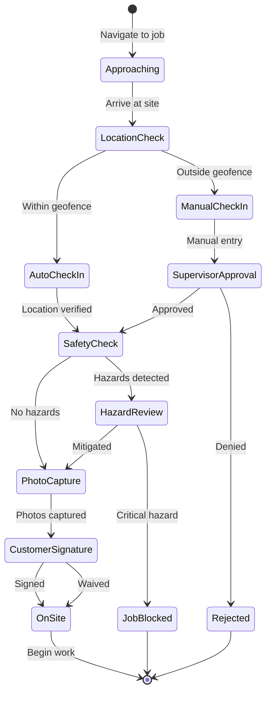
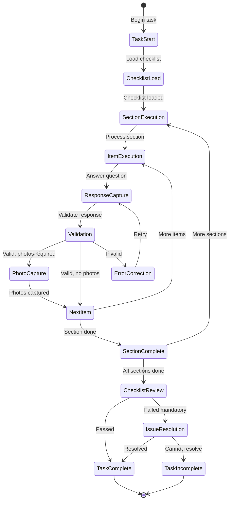
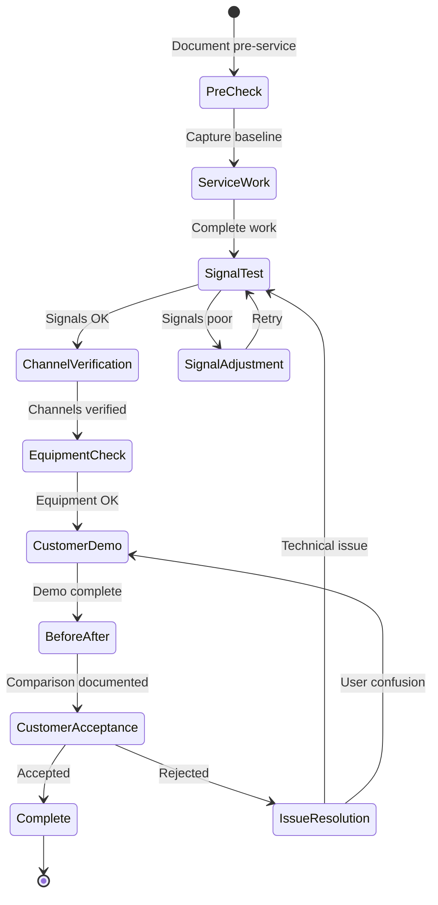
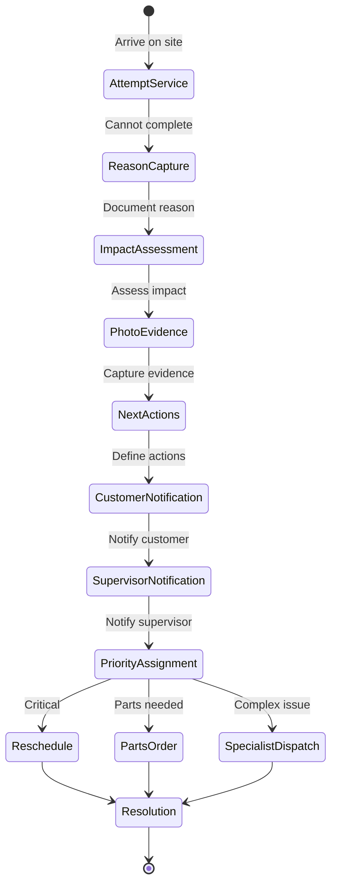
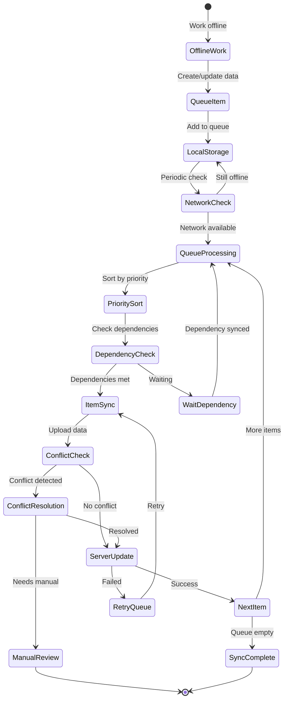
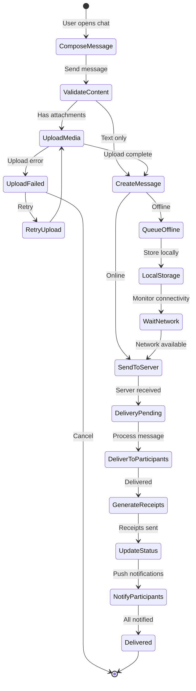
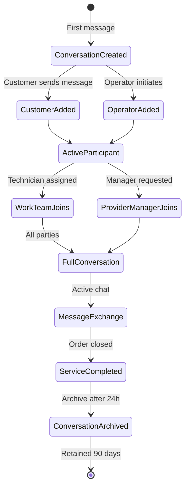

# Domain Model: Execution & Field Operations

## Overview

This domain manages the execution phase of field service operations, including technician check-in/check-out, task execution, checklist completion, television outcome documentation, incomplete job handling, and offline synchronization.

## Domain Models

### 1. Check-In/Check-Out

#### CheckIn Entity

```typescript
interface CheckIn {
  id: string;
  jobId: string;
  technicianId: string;
  scheduledArrivalWindow: TimeWindow;
  actualArrivalTime: DateTime;
  checkInTime: DateTime;
  checkInMethod: CheckInMethod;
  location: GeoLocation;
  locationAccuracy: number; // meters
  locationVerified: boolean;
  arrivalPhotos: Photo[];
  customerPresent: boolean;
  customerSignature?: Signature;
  siteAccessNotes?: string;
  safetyHazards: SafetyHazard[];
  status: CheckInStatus;
  metadata: {
    deviceId: string;
    appVersion: string;
    networkStatus: NetworkStatus;
    batteryLevel: number;
  };
  createdAt: DateTime;
  syncedAt?: DateTime;
}

enum CheckInMethod {
  GPS_AUTO = 'GPS_AUTO',
  MANUAL = 'MANUAL',
  QR_CODE = 'QR_CODE',
  NFC = 'NFC',
  BEACON = 'BEACON'
}

enum CheckInStatus {
  PENDING = 'PENDING',
  ON_SITE = 'ON_SITE',
  VERIFIED = 'VERIFIED',
  REJECTED = 'REJECTED'
}

interface TimeWindow {
  start: DateTime;
  end: DateTime;
  timezone: string;
}

interface GeoLocation {
  latitude: number;
  longitude: number;
  altitude?: number;
  accuracy: number;
  timestamp: DateTime;
}

interface SafetyHazard {
  type: HazardType;
  description: string;
  severity: 'LOW' | 'MEDIUM' | 'HIGH' | 'CRITICAL';
  mitigationActions: string[];
  reportedAt: DateTime;
}

enum HazardType {
  ELECTRICAL = 'ELECTRICAL',
  STRUCTURAL = 'STRUCTURAL',
  CHEMICAL = 'CHEMICAL',
  BIOLOGICAL = 'BIOLOGICAL',
  ENVIRONMENTAL = 'ENVIRONMENTAL',
  EQUIPMENT = 'EQUIPMENT',
  ACCESS = 'ACCESS'
}
```

#### CheckOut Entity

```typescript
interface CheckOut {
  id: string;
  jobId: string;
  checkInId: string;
  technicianId: string;
  checkOutTime: DateTime;
  completionStatus: CompletionStatus;
  workPerformed: WorkSummary;
  materialsUsed: MaterialUsage[];
  timeOnSite: Duration;
  departurePhotos: Photo[];
  customerSignature?: Signature;
  customerFeedback?: CustomerFeedback;
  nextSteps: NextStep[];
  location: GeoLocation;
  status: CheckOutStatus;
  createdAt: DateTime;
  syncedAt?: DateTime;
}

enum CompletionStatus {
  COMPLETED = 'COMPLETED',
  PARTIALLY_COMPLETED = 'PARTIALLY_COMPLETED',
  INCOMPLETE = 'INCOMPLETE',
  CANCELLED = 'CANCELLED',
  REQUIRES_FOLLOWUP = 'REQUIRES_FOLLOWUP'
}

interface WorkSummary {
  description: string;
  tasksCompleted: string[];
  tasksIncomplete: string[];
  issuesEncountered: Issue[];
  resolutionNotes: string;
}

interface MaterialUsage {
  materialId: string;
  materialName: string;
  quantity: number;
  unit: string;
  serialNumbers?: string[];
  installed: boolean;
  removed: boolean;
}

interface CustomerFeedback {
  rating?: number; // 1-5
  comments?: string;
  concerns?: string[];
  satisfactionLevel: 'VERY_SATISFIED' | 'SATISFIED' | 'NEUTRAL' | 'DISSATISFIED' | 'VERY_DISSATISFIED';
}

interface NextStep {
  action: string;
  assignee?: string;
  dueDate?: DateTime;
  priority: Priority;
  type: 'FOLLOWUP' | 'INSPECTION' | 'REPAIR' | 'QUOTE' | 'CALLBACK';
}

enum CheckOutStatus {
  PENDING = 'PENDING',
  COMPLETED = 'COMPLETED',
  VERIFIED = 'VERIFIED',
  REJECTED = 'REJECTED'
}
```

### 2. Task Execution & Checklists

#### TaskExecution Entity

```typescript
interface TaskExecution {
  id: string;
  jobId: string;
  taskId: string;
  technicianId: string;
  taskType: TaskType;
  description: string;
  status: TaskExecutionStatus;
  startTime?: DateTime;
  endTime?: DateTime;
  duration?: Duration;
  checklistId?: string;
  checklistCompleted: boolean;
  checklistResults?: ChecklistResults;
  measurements: Measurement[];
  photos: Photo[];
  notes: string;
  issues: Issue[];
  approvals: Approval[];
  metadata: ExecutionMetadata;
  createdAt: DateTime;
  updatedAt: DateTime;
  syncedAt?: DateTime;
}

enum TaskType {
  INSTALLATION = 'INSTALLATION',
  REPAIR = 'REPAIR',
  INSPECTION = 'INSPECTION',
  MAINTENANCE = 'MAINTENANCE',
  DIAGNOSTIC = 'DIAGNOSTIC',
  REMOVAL = 'REMOVAL',
  TESTING = 'TESTING',
  CALIBRATION = 'CALIBRATION'
}

enum TaskExecutionStatus {
  NOT_STARTED = 'NOT_STARTED',
  IN_PROGRESS = 'IN_PROGRESS',
  PAUSED = 'PAUSED',
  COMPLETED = 'COMPLETED',
  FAILED = 'FAILED',
  SKIPPED = 'SKIPPED',
  BLOCKED = 'BLOCKED'
}

interface ExecutionMetadata {
  toolsUsed: string[];
  partsUsed: string[];
  safetyEquipment: string[];
  environmentalConditions: {
    temperature?: number;
    humidity?: number;
    weather?: string;
  };
  complications?: string[];
}
```

#### Checklist Entity

```typescript
interface Checklist {
  id: string;
  name: string;
  version: string;
  taskType: TaskType;
  serviceType: ServiceType;
  sections: ChecklistSection[];
  mandatory: boolean;
  requiredForCompletion: boolean;
  estimatedDuration: Duration;
  status: ChecklistStatus;
  createdAt: DateTime;
  updatedAt: DateTime;
}

interface ChecklistSection {
  id: string;
  name: string;
  order: number;
  items: ChecklistItem[];
  conditional?: ConditionalLogic;
  mandatory: boolean;
}

interface ChecklistItem {
  id: string;
  order: number;
  type: ChecklistItemType;
  question: string;
  description?: string;
  responseType: ResponseType;
  validationRules: ValidationRule[];
  mandatory: boolean;
  failureAction?: FailureAction;
  photosRequired: boolean;
  minPhotos?: number;
  maxPhotos?: number;
  conditional?: ConditionalLogic;
  helpText?: string;
  referenceLinks?: string[];
}

enum ChecklistItemType {
  VISUAL_INSPECTION = 'VISUAL_INSPECTION',
  MEASUREMENT = 'MEASUREMENT',
  TEST = 'TEST',
  VERIFICATION = 'VERIFICATION',
  SAFETY_CHECK = 'SAFETY_CHECK',
  COMPLIANCE_CHECK = 'COMPLIANCE_CHECK',
  CUSTOMER_CONFIRMATION = 'CUSTOMER_CONFIRMATION'
}

enum ResponseType {
  BOOLEAN = 'BOOLEAN', // Yes/No
  CHOICE = 'CHOICE', // Single select
  MULTI_CHOICE = 'MULTI_CHOICE', // Multiple select
  NUMERIC = 'NUMERIC', // Number input
  TEXT = 'TEXT', // Free text
  MEASUREMENT = 'MEASUREMENT', // With units
  PHOTO = 'PHOTO', // Photo capture
  SIGNATURE = 'SIGNATURE', // Signature capture
  DATE_TIME = 'DATE_TIME', // Date/time picker
  RATING = 'RATING' // 1-5 stars
}

interface ValidationRule {
  type: 'REQUIRED' | 'RANGE' | 'PATTERN' | 'CUSTOM';
  parameters: Record<string, any>;
  errorMessage: string;
}

interface FailureAction {
  action: 'BLOCK_COMPLETION' | 'FLAG_FOR_REVIEW' | 'CREATE_ISSUE' | 'NOTIFY_SUPERVISOR';
  escalationLevel: EscalationLevel;
  notifyRoles: Role[];
  createFollowupTask: boolean;
}

interface ConditionalLogic {
  condition: string; // Expression: "item_123 == 'YES' && measurement_456 > 100"
  showIf: boolean;
  requiredIf: boolean;
}

enum ChecklistStatus {
  DRAFT = 'DRAFT',
  ACTIVE = 'ACTIVE',
  DEPRECATED = 'DEPRECATED',
  ARCHIVED = 'ARCHIVED'
}
```

#### ChecklistResults Entity

```typescript
interface ChecklistResults {
  id: string;
  checklistId: string;
  checklistVersion: string;
  jobId: string;
  taskExecutionId: string;
  technicianId: string;
  startTime: DateTime;
  endTime?: DateTime;
  status: ChecklistResultStatus;
  sectionResults: SectionResult[];
  overallScore?: number;
  passed: boolean;
  issues: ChecklistIssue[];
  photos: Photo[];
  signatures: Signature[];
  completedBy: string;
  reviewedBy?: string;
  reviewedAt?: DateTime;
  createdAt: DateTime;
  syncedAt?: DateTime;
}

interface SectionResult {
  sectionId: string;
  sectionName: string;
  itemResults: ItemResult[];
  completed: boolean;
  score?: number;
  passed: boolean;
}

interface ItemResult {
  itemId: string;
  question: string;
  response: ChecklistResponse;
  passed: boolean;
  mandatory: boolean;
  skipped: boolean;
  skipReason?: string;
  photos: Photo[];
  notes?: string;
  completedAt: DateTime;
  completedBy: string;
}

interface ChecklistResponse {
  type: ResponseType;
  value: any; // Type depends on ResponseType
  unit?: string; // For measurements
  confidence?: number; // 0-1 for AI-assisted responses
  source: 'MANUAL' | 'AI_ASSISTED' | 'SENSOR' | 'IMPORTED';
}

interface ChecklistIssue {
  itemId: string;
  severity: IssueSeverity;
  description: string;
  actionTaken?: string;
  requiresFollowup: boolean;
  escalated: boolean;
}

enum ChecklistResultStatus {
  IN_PROGRESS = 'IN_PROGRESS',
  COMPLETED = 'COMPLETED',
  INCOMPLETE = 'INCOMPLETE',
  FAILED = 'FAILED',
  UNDER_REVIEW = 'UNDER_REVIEW',
  APPROVED = 'APPROVED',
  REJECTED = 'REJECTED'
}
```

### 3. Television Outcomes

#### TVOutcome Entity

```typescript
interface TVOutcome {
  id: string;
  jobId: string;
  checklistResultsId?: string;
  technicianId: string;
  serviceType: ServiceType;
  outcomeType: TVOutcomeType;
  preServiceStatus: TVStatus;
  postServiceStatus: TVStatus;
  channelsVerified: ChannelVerification[];
  signalMeasurements: SignalMeasurement[];
  equipmentInstalled: EquipmentInstallation[];
  equipmentRemoved: EquipmentRemoval[];
  customerDemonstration: CustomerDemonstration;
  issuesResolved: Issue[];
  issuesOutstanding: Issue[];
  photos: Photo[];
  beforeAfterComparison: BeforeAfterComparison;
  customerAcceptance: CustomerAcceptance;
  notes: string;
  verifiedAt: DateTime;
  verifiedBy: string;
  createdAt: DateTime;
  syncedAt?: DateTime;
}

enum TVOutcomeType {
  NEW_INSTALLATION = 'NEW_INSTALLATION',
  REPAIR_COMPLETE = 'REPAIR_COMPLETE',
  UPGRADE_COMPLETE = 'UPGRADE_COMPLETE',
  MAINTENANCE_COMPLETE = 'MAINTENANCE_COMPLETE',
  PARTIAL_COMPLETION = 'PARTIAL_COMPLETION',
  NO_FAULT_FOUND = 'NO_FAULT_FOUND',
  UNABLE_TO_COMPLETE = 'UNABLE_TO_COMPLETE'
}

interface TVStatus {
  operational: boolean;
  channelCount: number;
  hdChannels: number;
  sdChannels: number;
  signalQuality: 'EXCELLENT' | 'GOOD' | 'FAIR' | 'POOR' | 'NO_SIGNAL';
  issues: string[];
  timestamp: DateTime;
}

interface ChannelVerification {
  channelNumber: string;
  channelName: string;
  verified: boolean;
  signalStrength: number; // 0-100
  signalQuality: number; // 0-100
  pictureQuality: 'EXCELLENT' | 'GOOD' | 'ACCEPTABLE' | 'POOR';
  audioQuality: 'EXCELLENT' | 'GOOD' | 'ACCEPTABLE' | 'POOR';
  issues?: string[];
  screenshot?: Photo;
}

interface SignalMeasurement {
  measurementType: 'RF_LEVEL' | 'SNR' | 'BER' | 'MER' | 'C/N';
  value: number;
  unit: string;
  location: string; // "At tap", "At amplifier", etc.
  acceptable: boolean;
  timestamp: DateTime;
  equipment?: string;
}

interface EquipmentInstallation {
  equipmentType: EquipmentType;
  make: string;
  model: string;
  serialNumber: string;
  location: string;
  configured: boolean;
  tested: boolean;
  photos: Photo[];
  installationNotes?: string;
}

interface EquipmentRemoval {
  equipmentType: EquipmentType;
  make?: string;
  model?: string;
  serialNumber?: string;
  reason: string;
  returned: boolean;
  returnedTo?: string;
  condition: 'WORKING' | 'FAULTY' | 'DAMAGED' | 'OBSOLETE';
}

interface CustomerDemonstration {
  demonstrated: boolean;
  topics: DemonstrationTopic[];
  customerUnderstands: boolean;
  trainingMaterialProvided: string[];
  questionsAsked: string[];
  customerSignature?: Signature;
  completedAt?: DateTime;
}

enum DemonstrationTopic {
  BASIC_OPERATION = 'BASIC_OPERATION',
  CHANNEL_GUIDE = 'CHANNEL_GUIDE',
  DVR_FUNCTIONS = 'DVR_FUNCTIONS',
  ON_DEMAND = 'ON_DEMAND',
  PARENTAL_CONTROLS = 'PARENTAL_CONTROLS',
  TROUBLESHOOTING = 'TROUBLESHOOTING',
  REMOTE_CONTROL = 'REMOTE_CONTROL',
  VOICE_COMMANDS = 'VOICE_COMMANDS'
}

interface BeforeAfterComparison {
  channelsBefore: number;
  channelsAfter: number;
  signalQualityBefore: string;
  signalQualityAfter: string;
  issuesBefore: string[];
  issuesAfter: string[];
  improvementNotes: string;
}

interface CustomerAcceptance {
  accepted: boolean;
  signature: Signature;
  satisfactionRating: number; // 1-5
  comments?: string;
  concerns?: string[];
  acceptedAt: DateTime;
}
```

### 4. Incomplete Jobs

#### IncompleteJob Entity

```typescript
interface IncompleteJob {
  id: string;
  jobId: string;
  technicianId: string;
  scheduledDate: DateTime;
  attemptedDate: DateTime;
  incompleteReason: IncompleteReason;
  reasonCategory: IncompleteCategory;
  reasonDetails: string;
  completionPercentage: number; // 0-100
  tasksCompleted: string[];
  tasksIncomplete: string[];
  materialsUsed: MaterialUsage[];
  materialsRequired: MaterialRequirement[];
  timeOnSite: Duration;
  blockingIssues: BlockingIssue[];
  customerImpact: CustomerImpact;
  nextActions: NextAction[];
  reschedulingRequired: boolean;
  estimatedCompletionDate?: DateTime;
  priority: Priority;
  escalated: boolean;
  escalationLevel?: EscalationLevel;
  photos: Photo[];
  notes: string;
  customerNotified: boolean;
  customerNotificationMethod?: CommunicationMethod;
  supervisorNotified: boolean;
  status: IncompleteJobStatus;
  resolution?: IncompleteResolution;
  createdAt: DateTime;
  updatedAt: DateTime;
  syncedAt?: DateTime;
}

enum IncompleteReason {
  // Customer-related
  CUSTOMER_NOT_HOME = 'CUSTOMER_NOT_HOME',
  CUSTOMER_REFUSED_SERVICE = 'CUSTOMER_REFUSED_SERVICE',
  CUSTOMER_CANCELLED = 'CUSTOMER_CANCELLED',
  CUSTOMER_RESCHEDULED = 'CUSTOMER_RESCHEDULED',
  SITE_ACCESS_DENIED = 'SITE_ACCESS_DENIED',

  // Technical
  PARTS_NOT_AVAILABLE = 'PARTS_NOT_AVAILABLE',
  EQUIPMENT_MALFUNCTION = 'EQUIPMENT_MALFUNCTION',
  WRONG_EQUIPMENT = 'WRONG_EQUIPMENT',
  TECHNICAL_COMPLEXITY = 'TECHNICAL_COMPLEXITY',
  REQUIRES_SPECIALIST = 'REQUIRES_SPECIALIST',

  // Site conditions
  UNSAFE_CONDITIONS = 'UNSAFE_CONDITIONS',
  WEATHER_CONDITIONS = 'WEATHER_CONDITIONS',
  POWER_OUTAGE = 'POWER_OUTAGE',
  SITE_NOT_READY = 'SITE_NOT_READY',

  // Service provider
  TECH_TIME_CONSTRAINT = 'TECH_TIME_CONSTRAINT',
  TECH_EMERGENCY = 'TECH_EMERGENCY',
  DISPATCH_ERROR = 'DISPATCH_ERROR',

  // Other
  PERMIT_REQUIRED = 'PERMIT_REQUIRED',
  ADDITIONAL_WORK_REQUIRED = 'ADDITIONAL_WORK_REQUIRED',
  OTHER = 'OTHER'
}

enum IncompleteCategory {
  CUSTOMER_RELATED = 'CUSTOMER_RELATED',
  TECHNICAL = 'TECHNICAL',
  SITE_CONDITIONS = 'SITE_CONDITIONS',
  SERVICE_PROVIDER = 'SERVICE_PROVIDER',
  REGULATORY = 'REGULATORY'
}

interface BlockingIssue {
  type: string;
  description: string;
  severity: IssueSeverity;
  canBeResolvedRemotely: boolean;
  resolutionSteps: string[];
  estimatedResolutionTime?: Duration;
  assignedTo?: string;
}

interface CustomerImpact {
  serviceOutage: boolean;
  degradedService: boolean;
  impactDescription: string;
  estimatedDuration?: Duration;
  compensationOffered?: string;
  customerSatisfaction: 'SATISFIED' | 'NEUTRAL' | 'DISSATISFIED' | 'ANGRY';
}

interface NextAction {
  action: string;
  actionType: 'RESCHEDULE' | 'DISPATCH_SPECIALIST' | 'ORDER_PARTS' | 'CUSTOMER_FOLLOWUP' | 'SUPERVISOR_REVIEW';
  assignee?: string;
  dueDate?: DateTime;
  priority: Priority;
  dependencies: string[];
  status: 'PENDING' | 'IN_PROGRESS' | 'COMPLETED';
}

interface MaterialRequirement {
  materialId?: string;
  materialName: string;
  quantity: number;
  unit: string;
  urgent: boolean;
  estimatedDelivery?: DateTime;
  orderedFrom?: string;
  orderStatus?: OrderStatus;
}

enum IncompleteJobStatus {
  REPORTED = 'REPORTED',
  UNDER_REVIEW = 'UNDER_REVIEW',
  RESCHEDULED = 'RESCHEDULED',
  PARTS_ORDERED = 'PARTS_ORDERED',
  AWAITING_CUSTOMER = 'AWAITING_CUSTOMER',
  ESCALATED = 'ESCALATED',
  RESOLVED = 'RESOLVED',
  CANCELLED = 'CANCELLED'
}

interface IncompleteResolution {
  resolvedAt: DateTime;
  resolvedBy: string;
  resolutionType: 'COMPLETED' | 'RESCHEDULED' | 'CANCELLED' | 'TRANSFERRED';
  completionJobId?: string;
  resolutionNotes: string;
  customerNotified: boolean;
}
```

### 5. Offline Synchronization

#### OfflineQueue Entity

```typescript
interface OfflineQueue {
  id: string;
  deviceId: string;
  technicianId: string;
  items: OfflineQueueItem[];
  totalSize: number; // bytes
  status: QueueStatus;
  lastSyncAttempt?: DateTime;
  lastSuccessfulSync?: DateTime;
  syncErrors: SyncError[];
  createdAt: DateTime;
  updatedAt: DateTime;
}

interface OfflineQueueItem {
  id: string;
  queueId: string;
  entityType: EntityType;
  entityId: string;
  operation: CRUDOperation;
  data: Record<string, any>;
  priority: SyncPriority;
  dependencies: string[]; // Other queue item IDs that must sync first
  retryCount: number;
  maxRetries: number;
  size: number; // bytes
  attachments: OfflineAttachment[];
  checksum: string;
  status: QueueItemStatus;
  error?: SyncError;
  createdAt: DateTime;
  syncedAt?: DateTime;
}

enum EntityType {
  CHECK_IN = 'CHECK_IN',
  CHECK_OUT = 'CHECK_OUT',
  TASK_EXECUTION = 'TASK_EXECUTION',
  CHECKLIST_RESULTS = 'CHECKLIST_RESULTS',
  TV_OUTCOME = 'TV_OUTCOME',
  INCOMPLETE_JOB = 'INCOMPLETE_JOB',
  PHOTO = 'PHOTO',
  SIGNATURE = 'SIGNATURE',
  MEASUREMENT = 'MEASUREMENT',
  NOTE = 'NOTE',
  TIME_ENTRY = 'TIME_ENTRY',
  MATERIAL_USAGE = 'MATERIAL_USAGE'
}

enum CRUDOperation {
  CREATE = 'CREATE',
  UPDATE = 'UPDATE',
  DELETE = 'DELETE',
  PATCH = 'PATCH'
}

enum SyncPriority {
  CRITICAL = 'CRITICAL', // Safety issues, customer complaints
  HIGH = 'HIGH', // Job completion, check-out
  MEDIUM = 'MEDIUM', // Photos, signatures
  LOW = 'LOW', // Notes, metadata
  BACKGROUND = 'BACKGROUND' // Analytics, logs
}

enum QueueItemStatus {
  PENDING = 'PENDING',
  SYNCING = 'SYNCING',
  SYNCED = 'SYNCED',
  FAILED = 'FAILED',
  CONFLICT = 'CONFLICT',
  SKIPPED = 'SKIPPED'
}

interface OfflineAttachment {
  id: string;
  type: 'PHOTO' | 'VIDEO' | 'AUDIO' | 'DOCUMENT' | 'SIGNATURE';
  filename: string;
  localPath: string;
  size: number;
  mimeType: string;
  checksum: string;
  compressed: boolean;
  uploaded: boolean;
  uploadedUrl?: string;
}

interface SyncError {
  code: string;
  message: string;
  details?: Record<string, any>;
  recoverable: boolean;
  retryAfter?: DateTime;
  occurredAt: DateTime;
}

enum QueueStatus {
  IDLE = 'IDLE',
  SYNCING = 'SYNCING',
  PAUSED = 'PAUSED',
  ERROR = 'ERROR'
}
```

#### SyncStrategy Entity

```typescript
interface SyncStrategy {
  id: string;
  deviceId: string;
  networkType: NetworkType;
  batteryLevel: number;
  autoSyncEnabled: boolean;
  syncConditions: SyncCondition[];
  priorityRules: PriorityRule[];
  compressionEnabled: boolean;
  batchSize: number;
  maxRetries: number;
  retryBackoff: 'LINEAR' | 'EXPONENTIAL';
  photoQuality: 'ORIGINAL' | 'HIGH' | 'MEDIUM' | 'LOW';
  photoCompressionRatio: number;
  videoEnabled: boolean;
  maxVideoSize: number; // MB
  conflictResolution: ConflictResolutionStrategy;
  updatedAt: DateTime;
}

enum NetworkType {
  WIFI = 'WIFI',
  CELLULAR_5G = 'CELLULAR_5G',
  CELLULAR_4G = 'CELLULAR_4G',
  CELLULAR_3G = 'CELLULAR_3G',
  OFFLINE = 'OFFLINE'
}

interface SyncCondition {
  type: 'NETWORK' | 'BATTERY' | 'TIME' | 'QUEUE_SIZE' | 'PRIORITY';
  operator: 'EQUALS' | 'GREATER_THAN' | 'LESS_THAN' | 'IN' | 'NOT_IN';
  value: any;
  required: boolean;
}

interface PriorityRule {
  entityType: EntityType;
  condition?: string;
  priority: SyncPriority;
  maxAge?: Duration; // Auto-escalate priority if older than this
}

enum ConflictResolutionStrategy {
  SERVER_WINS = 'SERVER_WINS',
  CLIENT_WINS = 'CLIENT_WINS',
  NEWER_WINS = 'NEWER_WINS',
  MERGE = 'MERGE',
  MANUAL = 'MANUAL'
}
```

#### SyncConflict Entity

```typescript
interface SyncConflict {
  id: string;
  queueItemId: string;
  entityType: EntityType;
  entityId: string;
  localVersion: Record<string, any>;
  serverVersion: Record<string, any>;
  localTimestamp: DateTime;
  serverTimestamp: DateTime;
  conflictFields: ConflictField[];
  resolutionStrategy: ConflictResolutionStrategy;
  resolution?: ConflictResolution;
  status: ConflictStatus;
  createdAt: DateTime;
  resolvedAt?: DateTime;
}

interface ConflictField {
  field: string;
  localValue: any;
  serverValue: any;
  canMerge: boolean;
}

interface ConflictResolution {
  strategy: ConflictResolutionStrategy;
  resolvedBy: 'SYSTEM' | 'USER';
  userId?: string;
  mergedValue?: Record<string, any>;
  notes?: string;
  resolvedAt: DateTime;
}

enum ConflictStatus {
  DETECTED = 'DETECTED',
  PENDING_REVIEW = 'PENDING_REVIEW',
  RESOLVED = 'RESOLVED',
  IGNORED = 'IGNORED'
}
```

### 6. Chat & Messaging

The chat system enables real-time 4-party communication for service orders between Customer, Operator (Control Tower), Work Team (Technicians), and Provider Manager.

#### ServiceOrderConversation Entity

```typescript
interface ServiceOrderConversation {
  id: string;
  serviceOrderId: string;
  status: ConversationStatus;
  participants: ConversationParticipant[];
  messageCount: number;
  unreadCounts: Record<string, number>; // participantId -> unread count
  lastMessageAt?: DateTime;
  lastMessagePreview?: string;
  metadata: {
    createdByParticipantType: ParticipantType;
    urgencyLevel?: UrgencyLevel;
    tags?: string[];
  };
  createdAt: DateTime;
  updatedAt: DateTime;
}

enum ConversationStatus {
  ACTIVE = 'ACTIVE',
  ARCHIVED = 'ARCHIVED',
  CLOSED = 'CLOSED'
}

enum UrgencyLevel {
  LOW = 'LOW',
  NORMAL = 'NORMAL',
  HIGH = 'HIGH',
  URGENT = 'URGENT'
}
```

#### ConversationParticipant Entity

```typescript
interface ConversationParticipant {
  id: string;
  conversationId: string;
  participantType: ParticipantType;
  userId?: string;           // For OPERATOR, PROVIDER_MANAGER
  workTeamId?: string;       // For WORK_TEAM
  customerId?: string;       // For CUSTOMER
  displayName: string;
  avatarUrl?: string;
  role: ParticipantRole;
  permissions: ParticipantPermissions;
  lastSeenAt?: DateTime;
  lastReadMessageId?: string;
  notificationPreferences: NotificationPreferences;
  status: ParticipantStatus;
  joinedAt: DateTime;
  leftAt?: DateTime;
}

enum ParticipantType {
  CUSTOMER = 'CUSTOMER',
  OPERATOR = 'OPERATOR',
  WORK_TEAM = 'WORK_TEAM',
  PROVIDER_MANAGER = 'PROVIDER_MANAGER',
  SYSTEM = 'SYSTEM'
}

enum ParticipantRole {
  OWNER = 'OWNER',
  PARTICIPANT = 'PARTICIPANT',
  OBSERVER = 'OBSERVER'
}

interface ParticipantPermissions {
  canSendMessages: boolean;
  canSendMedia: boolean;
  canSendFiles: boolean;
  canViewHistory: boolean;
  canMuteConversation: boolean;
}

enum ParticipantStatus {
  ACTIVE = 'ACTIVE',
  MUTED = 'MUTED',
  LEFT = 'LEFT',
  REMOVED = 'REMOVED'
}

interface NotificationPreferences {
  pushEnabled: boolean;
  emailEnabled: boolean;
  smsEnabled: boolean;
  quietHoursStart?: string; // HH:MM format
  quietHoursEnd?: string;
}
```

#### ServiceOrderMessage Entity

```typescript
interface ServiceOrderMessage {
  id: string;
  conversationId: string;
  senderId: string;
  senderType: ParticipantType;
  senderDisplayName: string;
  content: MessageContent;
  messageType: MessageType;
  replyToMessageId?: string;
  mentions: MessageMention[];
  reactions: MessageReaction[];
  status: MessageStatus;
  statusHistory: MessageStatusEntry[];
  deliveredTo: DeliveryReceipt[];
  readBy: ReadReceipt[];
  metadata: {
    deviceId?: string;
    platform?: 'WEB' | 'IOS' | 'ANDROID';
    clientMessageId?: string;
    offlineQueued?: boolean;
  };
  createdAt: DateTime;
  updatedAt: DateTime;
  deletedAt?: DateTime;
}

interface MessageContent {
  text?: string;
  mediaUrl?: string;
  mediaType?: MediaType;
  mediaThumbnailUrl?: string;
  mediaSize?: number;
  mediaDuration?: number; // for audio/video
  fileName?: string;
  fileSize?: number;
  location?: GeoLocation;
}

enum MessageType {
  TEXT = 'TEXT',
  IMAGE = 'IMAGE',
  VIDEO = 'VIDEO',
  AUDIO = 'AUDIO',
  FILE = 'FILE',
  LOCATION = 'LOCATION',
  SYSTEM = 'SYSTEM'
}

enum MediaType {
  IMAGE_JPEG = 'IMAGE_JPEG',
  IMAGE_PNG = 'IMAGE_PNG',
  IMAGE_WEBP = 'IMAGE_WEBP',
  VIDEO_MP4 = 'VIDEO_MP4',
  VIDEO_MOV = 'VIDEO_MOV',
  AUDIO_MP3 = 'AUDIO_MP3',
  AUDIO_M4A = 'AUDIO_M4A',
  PDF = 'PDF',
  DOC = 'DOC',
  DOCX = 'DOCX',
  XLS = 'XLS',
  XLSX = 'XLSX'
}

enum MessageStatus {
  SENDING = 'SENDING',
  SENT = 'SENT',
  DELIVERED = 'DELIVERED',
  READ = 'READ',
  FAILED = 'FAILED',
  DELETED = 'DELETED'
}

interface MessageStatusEntry {
  status: MessageStatus;
  timestamp: DateTime;
  reason?: string;
}

interface MessageMention {
  participantId: string;
  participantType: ParticipantType;
  displayName: string;
  startIndex: number;
  endIndex: number;
}

interface MessageReaction {
  participantId: string;
  emoji: string;
  createdAt: DateTime;
}

interface DeliveryReceipt {
  participantId: string;
  deliveredAt: DateTime;
}

interface ReadReceipt {
  participantId: string;
  readAt: DateTime;
}
```

#### SystemMessage Entity

```typescript
interface SystemMessage {
  id: string;
  conversationId: string;
  eventType: SystemEventType;
  eventData: Record<string, any>;
  localizedContent: Record<string, string>; // locale -> translated text
  triggerParticipantId?: string;
  affectedParticipantIds?: string[];
  createdAt: DateTime;
}

enum SystemEventType {
  CONVERSATION_CREATED = 'CONVERSATION_CREATED',
  PARTICIPANT_JOINED = 'PARTICIPANT_JOINED',
  PARTICIPANT_LEFT = 'PARTICIPANT_LEFT',
  PARTICIPANT_REMOVED = 'PARTICIPANT_REMOVED',
  SERVICE_ORDER_STATUS_CHANGED = 'SERVICE_ORDER_STATUS_CHANGED',
  APPOINTMENT_SCHEDULED = 'APPOINTMENT_SCHEDULED',
  APPOINTMENT_RESCHEDULED = 'APPOINTMENT_RESCHEDULED',
  TECHNICIAN_ASSIGNED = 'TECHNICIAN_ASSIGNED',
  TECHNICIAN_EN_ROUTE = 'TECHNICIAN_EN_ROUTE',
  TECHNICIAN_ARRIVED = 'TECHNICIAN_ARRIVED',
  WORK_COMPLETED = 'WORK_COMPLETED',
  CONVERSATION_CLOSED = 'CONVERSATION_CLOSED'
}
```

#### TypingIndicator Entity (Real-time)

```typescript
interface TypingIndicator {
  conversationId: string;
  participantId: string;
  participantType: ParticipantType;
  displayName: string;
  isTyping: boolean;
  startedAt: DateTime;
  expiresAt: DateTime; // Auto-clear after 10 seconds
}
```

## Business Rules & Constraints

### Check-In Rules

1. **Location Verification**
   - GPS accuracy must be within 50 meters for auto check-in
   - Manual check-in requires supervisor approval if >500m from job site
   - Geofence radius configurable per service area (default 100m)

2. **Timing Rules**
   - Cannot check-in more than 30 minutes before scheduled window
   - Late arrival (>15 min) triggers automatic customer notification
   - Multiple check-ins for same job blocked within 15-minute window

3. **Safety Requirements**
   - Critical safety hazards block job start until supervisor review
   - Safety equipment verification mandatory for high-risk jobs
   - Site photos required for all electrical and structural work

### Check-Out Rules

1. **Completion Requirements**
   - All mandatory checklist items must be completed
   - Customer signature required for completed jobs (unless waived)
   - Before/after photos mandatory for installations and repairs

2. **Material Documentation**
   - Serial numbers required for all installed equipment
   - Removed equipment must be documented with condition
   - Material variances >10% trigger supervisor review

3. **Incomplete Job Handling**
   - Incomplete jobs require reason code and next actions
   - Customer notification mandatory within 1 hour
   - Rescheduling must occur within 24 hours for critical jobs

### Checklist Rules

1. **Version Control**
   - Active checklists cannot be modified
   - Version increment required for any changes
   - Legacy checklist results remain valid after deprecation

2. **Mandatory Items**
   - Mandatory items cannot be skipped
   - Failed mandatory items with BLOCK_COMPLETION prevent job closure
   - Conditional mandatory items enforced when conditions met

3. **Response Validation**
   - Numeric responses validated against min/max ranges
   - Pattern validation for text responses (email, phone, etc.)
   - Photo requirements enforced (count, resolution, file size)

### TV Outcome Rules

1. **Verification Requirements**
   - Minimum 10 channels verified for new installations
   - Signal measurements required at tap and equipment
   - Customer demonstration mandatory for all installations

2. **Acceptance Criteria**
   - Signal quality must meet minimum thresholds (configurable)
   - HD channels must be properly configured
   - Picture and audio quality verified per channel

3. **Documentation**
   - Before/after comparison required for all service types
   - Channel lineup screenshots required
   - Equipment installation photos from multiple angles

### Offline Sync Rules

1. **Priority Handling**
   - CRITICAL items sync immediately when network available
   - HIGH priority items sync before MEDIUM/LOW
   - Photo compression applied based on network type

2. **Conflict Resolution**
   - NEWER_WINS default for non-critical fields
   - MANUAL resolution for customer-facing data
   - SERVER_WINS for pricing and inventory

3. **Data Integrity**
   - Checksums validated before and after sync
   - Dependencies synced in correct order
   - Failed items retry with exponential backoff

### Chat & Messaging Rules

1. **Conversation Management**
   - One conversation per service order (auto-created on first message)
   - Conversation remains active until service order is closed
   - Archived conversations can be accessed for 90 days after closure
   - System messages cannot be deleted or edited

2. **Participant Rules**
   - Customer automatically added when sending first message
   - Operator added when control tower engages with order
   - Work Team added when technician is assigned
   - Provider Manager can join any conversation for their provider
   - Only OWNER role can remove participants

3. **Message Handling**
   - Text messages limited to 4000 characters
   - Media uploads limited to 25MB per file
   - Maximum 10 files per message
   - Messages can be deleted within 24 hours (soft delete)
   - Edited messages show edit history

4. **Delivery & Read Receipts**
   - Delivery receipts sent immediately upon server receipt
   - Read receipts triggered when message is viewed for 2+ seconds
   - Unread counts updated in real-time
   - Batch delivery receipts for offline sync

5. **Notifications**
   - Push notifications for new messages (unless muted)
   - Quiet hours respected per participant preferences
   - Urgent messages bypass quiet hours for operators
   - SMS fallback after 5 minutes of unread urgent messages

## Workflows

### Check-In Workflow



### Task Execution Workflow



### TV Outcome Verification Workflow



### Incomplete Job Workflow



### Offline Sync Workflow



### Chat Message Workflow



### Chat Participant Lifecycle



## Validation & Error Handling

### Check-In Validation

```typescript
interface CheckInValidation {
  validateLocation(): ValidationResult {
    // Verify GPS accuracy
    if (accuracy > 50 && method === 'GPS_AUTO') {
      return { valid: false, error: 'GPS accuracy insufficient for auto check-in' };
    }

    // Verify within geofence
    const distance = calculateDistance(location, jobSite);
    if (distance > geofenceRadius && method === 'GPS_AUTO') {
      return { valid: false, error: 'Outside geofence, manual check-in required' };
    }

    // Verify timing
    if (now < scheduledWindow.start - 30_MINUTES) {
      return { valid: false, error: 'Too early for check-in' };
    }

    return { valid: true };
  }

  validateSafety(): ValidationResult {
    const criticalHazards = safetyHazards.filter(h => h.severity === 'CRITICAL');
    if (criticalHazards.length > 0) {
      return {
        valid: false,
        error: 'Critical safety hazards require supervisor approval',
        requiresEscalation: true
      };
    }

    return { valid: true };
  }
}
```

### Checklist Validation

```typescript
interface ChecklistValidation {
  validateResponse(item: ChecklistItem, response: ChecklistResponse): ValidationResult {
    // Check required
    if (item.mandatory && !response.value) {
      return { valid: false, error: 'Response required for mandatory item' };
    }

    // Validate by type
    switch (response.type) {
      case 'NUMERIC':
        return this.validateNumeric(item, response);
      case 'MEASUREMENT':
        return this.validateMeasurement(item, response);
      case 'PHOTO':
        return this.validatePhoto(item, response);
      default:
        return { valid: true };
    }
  }

  validateNumeric(item: ChecklistItem, response: ChecklistResponse): ValidationResult {
    const rangeRule = item.validationRules.find(r => r.type === 'RANGE');
    if (rangeRule) {
      const { min, max } = rangeRule.parameters;
      if (response.value < min || response.value > max) {
        return {
          valid: false,
          error: `Value must be between ${min} and ${max}`
        };
      }
    }

    return { valid: true };
  }

  validatePhoto(item: ChecklistItem, response: ChecklistResponse): ValidationResult {
    if (item.photosRequired && response.value.length < (item.minPhotos || 1)) {
      return {
        valid: false,
        error: `Minimum ${item.minPhotos} photo(s) required`
      };
    }

    if (item.maxPhotos && response.value.length > item.maxPhotos) {
      return {
        valid: false,
        error: `Maximum ${item.maxPhotos} photo(s) allowed`
      };
    }

    return { valid: true };
  }
}
```

### Sync Validation

```typescript
interface SyncValidation {
  validateQueueItem(item: OfflineQueueItem): ValidationResult {
    // Verify checksum
    const calculatedChecksum = calculateChecksum(item.data);
    if (calculatedChecksum !== item.checksum) {
      return {
        valid: false,
        error: 'Data integrity check failed',
        recoverable: false
      };
    }

    // Verify dependencies
    const unresolvedDeps = item.dependencies.filter(depId => {
      const dep = queue.find(i => i.id === depId);
      return dep?.status !== 'SYNCED';
    });

    if (unresolvedDeps.length > 0) {
      return {
        valid: false,
        error: 'Unresolved dependencies',
        recoverable: true,
        retryAfter: 60_SECONDS
      };
    }

    return { valid: true };
  }

  validateNetworkConditions(strategy: SyncStrategy): ValidationResult {
    const conditions = strategy.syncConditions.filter(c => c.required);

    for (const condition of conditions) {
      if (!this.evaluateCondition(condition)) {
        return {
          valid: false,
          error: `Sync condition not met: ${condition.type}`,
          recoverable: true
        };
      }
    }

    return { valid: true };
  }
}
```

## Error Handling

### Error Types

```typescript
enum FieldOperationError {
  // Check-in errors
  LOCATION_ACCURACY_INSUFFICIENT = 'LOCATION_ACCURACY_INSUFFICIENT',
  OUTSIDE_GEOFENCE = 'OUTSIDE_GEOFENCE',
  TOO_EARLY_FOR_CHECKIN = 'TOO_EARLY_FOR_CHECKIN',
  CRITICAL_SAFETY_HAZARD = 'CRITICAL_SAFETY_HAZARD',

  // Checklist errors
  MANDATORY_ITEM_INCOMPLETE = 'MANDATORY_ITEM_INCOMPLETE',
  VALIDATION_FAILED = 'VALIDATION_FAILED',
  PHOTO_REQUIREMENT_NOT_MET = 'PHOTO_REQUIREMENT_NOT_MET',

  // Sync errors
  DATA_INTEGRITY_FAILURE = 'DATA_INTEGRITY_FAILURE',
  NETWORK_UNAVAILABLE = 'NETWORK_UNAVAILABLE',
  SYNC_CONFLICT = 'SYNC_CONFLICT',
  DEPENDENCY_UNRESOLVED = 'DEPENDENCY_UNRESOLVED',
  SERVER_REJECTION = 'SERVER_REJECTION',

  // General
  INSUFFICIENT_PERMISSIONS = 'INSUFFICIENT_PERMISSIONS',
  RESOURCE_NOT_FOUND = 'RESOURCE_NOT_FOUND',
  OPERATION_TIMEOUT = 'OPERATION_TIMEOUT'
}

interface ErrorHandler {
  handle(error: FieldOperationError, context: ErrorContext): ErrorResolution {
    switch (error) {
      case 'LOCATION_ACCURACY_INSUFFICIENT':
        return {
          action: 'RETRY',
          message: 'Waiting for better GPS signal...',
          retryStrategy: 'EXPONENTIAL_BACKOFF',
          maxRetries: 5,
          userAction: 'Move to open area for better GPS reception'
        };

      case 'CRITICAL_SAFETY_HAZARD':
        return {
          action: 'ESCALATE',
          message: 'Critical safety hazard detected',
          escalateTo: 'SUPERVISOR',
          blockProgress: true,
          notificationRequired: true
        };

      case 'SYNC_CONFLICT':
        return {
          action: 'RESOLVE',
          message: 'Data conflict detected',
          resolutionStrategy: context.strategy.conflictResolution,
          requiresUserInput: context.strategy.conflictResolution === 'MANUAL'
        };

      default:
        return {
          action: 'FAIL',
          message: 'Operation failed',
          logError: true,
          notifySupport: true
        };
    }
  }
}
```

## Implementation Considerations

### Performance Optimization

1. **Local Data Storage**
   - SQLite for structured offline data
   - IndexedDB for photos/attachments
   - LRU cache for frequently accessed checklists

2. **Photo Optimization**
   - Progressive compression based on network
   - Thumbnail generation for previews
   - Lazy loading for photo galleries

3. **Sync Optimization**
   - Batch uploads (max 10 items per request)
   - Delta sync for large entities
   - Background sync when app inactive

### Security

1. **Data Protection**
   - Encrypt local database with device key
   - Secure photo storage with encryption at rest
   - Clear sensitive data on logout

2. **Network Security**
   - TLS 1.3 for all API calls
   - Certificate pinning for production
   - API request signing with HMAC

### Accessibility

1. **Checklist UI**
   - Voice input for responses
   - Large touch targets for field use
   - High contrast mode for outdoor visibility

2. **Offline Indicators**
   - Clear sync status indicators
   - Pending item counters
   - Network quality indicators

### Testing Strategy

1. **Unit Tests**
   - Validation logic
   - Conflict resolution
   - Checksum calculation

2. **Integration Tests**
   - Check-in/check-out flows
   - Checklist completion
   - Offline sync scenarios

3. **Field Tests**
   - GPS accuracy in various conditions
   - Photo quality and compression
   - Battery usage during sync

## API Contracts

### Check-In API

```typescript
POST /api/v1/check-ins
Request: CheckInRequest
Response: CheckInResponse

interface CheckInRequest {
  jobId: string;
  location: GeoLocation;
  checkInMethod: CheckInMethod;
  photos?: Photo[];
  safetyHazards?: SafetyHazard[];
  notes?: string;
}

interface CheckInResponse {
  checkInId: string;
  status: CheckInStatus;
  verificationRequired: boolean;
  jobDetails: JobDetails;
  checklists: Checklist[];
  materials: Material[];
}
```

### Sync API

```typescript
POST /api/v1/sync/batch
Request: SyncBatchRequest
Response: SyncBatchResponse

interface SyncBatchRequest {
  deviceId: string;
  items: OfflineQueueItem[];
  lastSyncTimestamp?: DateTime;
}

interface SyncBatchResponse {
  results: SyncItemResult[];
  conflicts: SyncConflict[];
  serverTimestamp: DateTime;
  nextSyncRecommended?: DateTime;
}

interface SyncItemResult {
  queueItemId: string;
  status: 'SUCCESS' | 'CONFLICT' | 'ERROR';
  entityId?: string;
  error?: SyncError;
}
```

## Metrics & Monitoring

### Key Metrics

1. **Check-In Metrics**
   - Average check-in time
   - Location verification success rate
   - Manual check-in rate

2. **Checklist Metrics**
   - Completion time by checklist type
   - Failed item rate
   - Photo capture rate

3. **Sync Metrics**
   - Sync success rate
   - Average sync latency
   - Conflict rate
   - Queue size over time

4. **Incomplete Job Metrics**
   - Incomplete rate by reason
   - Average resolution time
   - Customer impact score

### Monitoring Alerts

- Critical safety hazards reported
- Sync failures exceeding threshold
- Incomplete job spike detection
- Location verification failures
