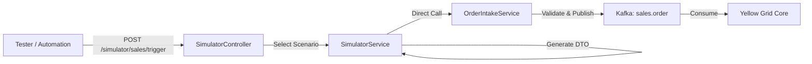

# Sales System Simulator & Integration Documentation

## Overview

The Sales System Simulator provides a mechanism to inject mock sales orders and updates into the Yellow Grid platform, mimicking the behavior of upstream systems like Pyxis and Tempo. This allows for end-to-end testing of the integration layer and downstream BPMN processes without relying on external system connectivity.

## Architecture

The simulator is implemented as a module within the `api` service. It bypasses HTTP overhead by directly injecting formatted DTOs into the `OrderIntakeService`, ensuring that the simulator exercises the exact same validation and mapping logic as real external requests.



## Simulator Usage

**Endpoint:** `POST /api/v1/simulator/sales/trigger`

### Request Payload
```json
{
  "scenario": "STANDARD_INSTALLATION",
  "count": 1,
  "overrides": {
    "customer": {
      "email": "custom.email@example.com"
    }
  }
}
```

| Field | Type | Description |
|-------|------|-------------|
| `scenario` | Enum | The type of order/event to simulate. |
| `count` | Number | Number of events to generate (1-100). |
| `overrides` | Object | Optional deep-merge overrides for the generated payload. |

### Supported Scenarios

| Scenario ID | Description | Event Type |
|-------------|-------------|------------|
| `STANDARD_INSTALLATION` | Standard product installation (Fiber, Furniture, etc.) | `OrderIntake` |
| `EMERGENCY_REPAIR` | High-priority repair request | `OrderIntake` |
| `VIP_MAINTENANCE` | Maintenance for VIP customers | `OrderIntake` |
| `PROJECT_ROLLOUT` | Batched orders for a project | `OrderIntake` |
| `UPDATE_DELIVERY_DATE` | Updates the max delivery date for an existing order | `UpdateDeliveryDate` |

---

## Direct Integration API

For external systems (or manual testing via Postman), the platform exposes a compliant endpoint.

### Endpoint
**POST** `/api/v1/integrations/sales/orders/intake`

### Data Contract (Polymorphic)

The endpoint accepts two types of payloads, discriminated by the `eventType` field (implicit for Order Intake, explicit for Updates).

#### 1. Order Intake (Adeo / Pyxis Standard)
Used for creating new service orders.

**Avro Schema:** `SalesOrder` (com.adeo.salesintegration.schemas)

**Sample JSON:**
```json
{
  "items": [
    {
      "id": "49008265",
      "itemNumber": "0",
      "description": "INSTALACIÓN MUEBLE",
      "quantity": 1,
      "unitPrice": 29.99,
      "vatRate": 21,
      "expectedDate": "2025-12-16T01:01:00.000+0000"
    }
  ],
  "order": {
    "id": "725926",
    "businessUnitId": "002",
    "storeId": "011",
    "creationDate": "2025-12-16T15:36:02.281Z",
    "scheduledDate": "2025-12-16T23:59:59",
    "channel": "STORE"
  },
  "system": "Pyxis Order",
  "version": 1,
  "customer": {
    "email": "demo@example.com",
    "phone": "+34913834252",
    "firstName": "Demo",
    "lastName": "User"
  },
  "address": {
    "streetName": "9 Av. de Jaume III",
    "postalCode": "07012",
    "city": "Palma",
    "country": "ES"
  }
}
```

#### 2. Update Delivery Date
Used for updating the delivery scheduling of an existing order.

**Avro Schema:** `UpdateDeliveryDate` (com.adeo.salesintegration.schemas)

**Sample JSON:**
```json
{
  "eventType": "UpdateDeliveryDate",
  "businessUnitIdentifier": "005",
  "storeIdentifier": "007",
  "customerOrderNumber": "25349L602",
  "maxDeliveryDate": "2026-01-09T22:00:00Z",
  "saleSystem": "Tempo",
  "itemDeliveryDates": [
    {
      "lineItemId": "69d58aff-088e-4dbc-bb19-28112b653f3a",
      "itemMaxDeliveryDate": "2026-01-09T07:00:00Z"
    }
  ]
}
```
