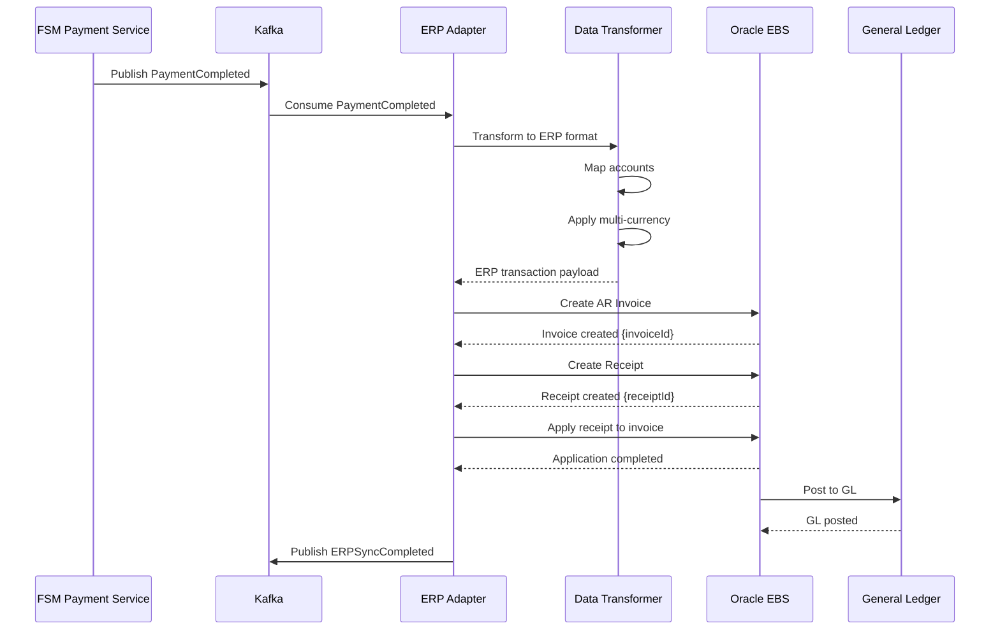

# ERP Integration (Oracle E-Business Suite)

## Overview

The Field Service Management system integrates with Oracle E-Business Suite (EBS) for financial operations, including invoicing, payment processing, revenue recognition, and general ledger posting. This integration ensures accurate financial records and compliance with accounting standards.

## Integration Architecture

```
┌─────────────────┐         ┌──────────────────┐         ┌─────────────────┐
│   FSM System    │────────>│  ERP Integration │────────>│  Oracle EBS     │
│                 │<────────│     Adapter      │<────────│                 │
└─────────────────┘         └──────────────────┘         └─────────────────┘
        │                            │                            │
        │                            │                            │
        v                            v                            v
   ┌─────────┐              ┌──────────────┐           ┌──────────────────┐
   │  Kafka  │              │ Oracle Queue │           │ Oracle Database  │
   │ Events  │              │ (AQ/JMS)     │           │                  │
   └─────────┘              └──────────────┘           └──────────────────┘
```

## Integration Flows

### 1. Payment-Ready Events

When a payment is completed in FSM, a payment-ready event is sent to Oracle EBS for processing.



### Payment-Ready Event Schema

```typescript
interface PaymentReadyEvent {
  eventId: string;
  correlationId: string;
  timestamp: string;

  paymentId: string;
  orderId: string;
  customerId: string;
  tenantId: string;

  transactionDetails: {
    transactionId: string;
    transactionDate: string;
    paymentMethod: 'CREDIT_CARD' | 'DEBIT_CARD' | 'ACH' | 'WIRE_TRANSFER' | 'CASH' | 'CHECK';

    amounts: {
      subtotal: string;
      tax: string;
      total: string;
      currency: string;
    };

    processingFee: {
      amount: string;
      currency: string;
    };

    netAmount: {
      amount: string;
      currency: string;
    };
  };

  lineItems: Array<{
    lineNumber: number;
    productId: string;
    productName: string;
    description: string;
    quantity: number;
    unitPrice: string;
    taxAmount: string;
    lineTotal: string;
    revenueAccountCode: string;
    taxAccountCode: string;
  }>;

  customer: {
    customerId: string;
    customerNumber: string;
    name: string;
    email: string;
    billingAddress: {
      street: string;
      city: string;
      state: string;
      postalCode: string;
      country: string;
    };
  };

  accountingMetadata: {
    businessUnit: string;
    legalEntity: string;
    operatingUnit: string;
    revenueRecognitionRule?: string;
    taxJurisdiction: string;
  };

  multiCurrencyData?: {
    baseCurrency: string;
    exchangeRate: string;
    exchangeRateType: string;
    exchangeRateDate: string;
    baseAmounts: {
      subtotal: string;
      tax: string;
      total: string;
    };
  };
}
```

### ERP Adapter Implementation

```typescript
class OracleERPAdapter implements IntegrationAdapter<PaymentReadyEvent, ERPSyncResponse> {
  readonly adapterId = 'oracle-erp';
  readonly version = '3.0.0';

  constructor(
    private oracleClient: OracleEBSClient,
    private dataTransformer: ERPDataTransformer,
    private accountMapper: AccountMapper,
    private circuitBreaker: CircuitBreaker,
    private retryStrategy: RetryStrategy,
    private logger: Logger
  ) {}

  async execute(
    event: PaymentReadyEvent,
    context: IntegrationContext
  ): Promise<ERPSyncResponse> {
    const idempotencyKey = this.generateIdempotencyKey(event);

    return this.retryStrategy.execute(async () => {
      return this.circuitBreaker.execute(async () => {
        // Transform FSM data to Oracle format
        const erpData = await this.transformToERPFormat(event);

        // Create AR Invoice in Oracle
        const invoice = await this.createARInvoice(erpData, context);

        // Create Receipt
        const receipt = await this.createReceipt(erpData, invoice, context);

        // Apply receipt to invoice
        await this.applyReceipt(receipt.receiptId, invoice.invoiceId, context);

        // Verify GL posting
        await this.verifyGLPosting(invoice.invoiceId, context);

        this.logger.info('ERP sync completed', {
          paymentId: event.paymentId,
          invoiceId: invoice.invoiceId,
          receiptId: receipt.receiptId
        });

        return {
          success: true,
          invoiceId: invoice.invoiceId,
          invoiceNumber: invoice.invoiceNumber,
          receiptId: receipt.receiptId,
          receiptNumber: receipt.receiptNumber,
          glBatchId: invoice.glBatchId,
          syncedAt: new Date().toISOString()
        };
      });
    }, this.isRetryableError);
  }

  private async transformToERPFormat(
    event: PaymentReadyEvent
  ): Promise<OracleARTransaction> {
    // Map FSM accounts to Oracle GL accounts
    const accountMappings = await this.accountMapper.mapAccounts({
      tenantId: event.tenantId,
      lineItems: event.lineItems,
      businessUnit: event.accountingMetadata.businessUnit
    });

    // Handle multi-currency if present
    const currencyInfo = event.multiCurrencyData
      ? {
          currency: event.transactionDetails.amounts.currency,
          exchangeRate: event.multiCurrencyData.exchangeRate,
          exchangeRateType: event.multiCurrencyData.exchangeRateType,
          exchangeRateDate: event.multiCurrencyData.exchangeRateDate
        }
      : {
          currency: event.transactionDetails.amounts.currency,
          exchangeRate: '1',
          exchangeRateType: 'Corporate',
          exchangeRateDate: event.transactionDetails.transactionDate
        };

    return {
      transactionType: 'INVOICE',
      transactionDate: event.transactionDetails.transactionDate,
      businessUnit: event.accountingMetadata.businessUnit,
      legalEntity: event.accountingMetadata.legalEntity,
      operatingUnit: event.accountingMetadata.operatingUnit,

      customer: {
        customerNumber: event.customer.customerNumber,
        customerName: event.customer.name,
        billToAddress: event.customer.billingAddress
      },

      currency: currencyInfo,

      lines: event.lineItems.map((item, index) => ({
        lineNumber: item.lineNumber,
        lineType: 'LINE',
        description: item.description,
        quantity: item.quantity,
        unitPrice: item.unitPrice,
        amount: item.lineTotal,
        revenueAccount: accountMappings[index].revenueAccount,
        taxAccount: accountMappings[index].taxAccount,
        taxCode: this.determineTaxCode(event.accountingMetadata.taxJurisdiction),
        taxAmount: item.taxAmount,
        revenueRecognitionRule: event.accountingMetadata.revenueRecognitionRule || 'IMMEDIATE'
      })),

      reference: {
        fsmPaymentId: event.paymentId,
        fsmOrderId: event.orderId,
        correlationId: event.correlationId
      }
    };
  }

  private async createARInvoice(
    data: OracleARTransaction,
    context: IntegrationContext
  ): Promise<OracleInvoiceResponse> {
    this.logger.info('Creating AR Invoice in Oracle', {
      correlationId: context.correlationId,
      customerNumber: data.customer.customerNumber
    });

    const response = await this.oracleClient.post(
      '/fscmRestApi/resources/11.13.18.05/receivablesInvoices',
      {
        headers: {
          'Content-Type': 'application/json',
          'X-Correlation-ID': context.correlationId
        },
        body: {
          BusinessUnit: data.businessUnit,
          TransactionType: data.transactionType,
          TransactionDate: data.transactionDate,
          BillToCustomerNumber: data.customer.customerNumber,
          InvoiceCurrencyCode: data.currency.currency,
          ConversionRateType: data.currency.exchangeRateType,
          ConversionRate: data.currency.exchangeRate,
          ConversionDate: data.currency.exchangeRateDate,

          receivablesInvoiceLines: data.lines.map(line => ({
            LineNumber: line.lineNumber,
            LineType: line.lineType,
            Description: line.description,
            Quantity: line.quantity,
            UnitSellingPrice: line.unitPrice,
            LineAmount: line.amount,
            RevenueAccount: line.revenueAccount,
            TaxClassificationCode: line.taxCode,
            RevenueRecognitionRule: line.revenueRecognitionRule
          })),

          DFF: [
            { _FLEX_Context: 'FSM Integration' },
            { fsmPaymentId: data.reference.fsmPaymentId },
            { fsmOrderId: data.reference.fsmOrderId }
          ]
        }
      }
    );

    return {
      invoiceId: response.data.CustomerTransactionId,
      invoiceNumber: response.data.TransactionNumber,
      glBatchId: response.data.GLBatchId,
      status: response.data.Status
    };
  }

  private async createReceipt(
    data: OracleARTransaction,
    invoice: OracleInvoiceResponse,
    context: IntegrationContext
  ): Promise<OracleReceiptResponse> {
    this.logger.info('Creating Receipt in Oracle', {
      correlationId: context.correlationId,
      invoiceId: invoice.invoiceId
    });

    // Map payment method to Oracle receipt method
    const receiptMethod = this.mapPaymentMethod(data.reference.fsmPaymentId);

    const response = await this.oracleClient.post(
      '/fscmRestApi/resources/11.13.18.05/standardReceipts',
      {
        headers: {
          'Content-Type': 'application/json',
          'X-Correlation-ID': context.correlationId
        },
        body: {
          BusinessUnit: data.businessUnit,
          ReceiptNumber: `FSM-${data.reference.fsmPaymentId}`,
          ReceiptDate: data.transactionDate,
          ReceiptAmount: data.lines.reduce((sum, line) =>
            sum + parseFloat(line.amount), 0
          ),
          CurrencyCode: data.currency.currency,
          ReceiptMethod: receiptMethod,
          CustomerNumber: data.customer.customerNumber,
          RemittanceBank: this.getRemittanceBank(data.businessUnit),

          DFF: [
            { _FLEX_Context: 'FSM Integration' },
            { fsmPaymentId: data.reference.fsmPaymentId }
          ]
        }
      }
    );

    return {
      receiptId: response.data.ReceiptId,
      receiptNumber: response.data.ReceiptNumber,
      status: response.data.Status
    };
  }

  private async applyReceipt(
    receiptId: string,
    invoiceId: string,
    context: IntegrationContext
  ): Promise<void> {
    this.logger.info('Applying receipt to invoice', {
      correlationId: context.correlationId,
      receiptId,
      invoiceId
    });

    await this.oracleClient.post(
      '/fscmRestApi/resources/11.13.18.05/receiptApplications',
      {
        headers: {
          'Content-Type': 'application/json',
          'X-Correlation-ID': context.correlationId
        },
        body: {
          ReceiptId: receiptId,
          InvoiceId: invoiceId,
          ApplicationDate: new Date().toISOString(),
          ApplicationAmount: 'FULL' // Apply full receipt amount
        }
      }
    );
  }

  private async verifyGLPosting(
    invoiceId: string,
    context: IntegrationContext
  ): Promise<void> {
    this.logger.info('Verifying GL posting', {
      correlationId: context.correlationId,
      invoiceId
    });

    // Wait for GL posting to complete (async in Oracle)
    let attempts = 0;
    const maxAttempts = 10;

    while (attempts < maxAttempts) {
      const response = await this.oracleClient.get(
        `/fscmRestApi/resources/11.13.18.05/receivablesInvoices/${invoiceId}`,
        {
          headers: {
            'X-Correlation-ID': context.correlationId
          }
        }
      );

      if (response.data.GLPostedStatus === 'POSTED') {
        this.logger.info('GL posting verified', {
          invoiceId,
          glBatchId: response.data.GLBatchId
        });
        return;
      }

      attempts++;
      await this.sleep(2000); // Wait 2 seconds between checks
    }

    throw new Error(`GL posting verification timeout for invoice ${invoiceId}`);
  }

  validate(event: PaymentReadyEvent): ValidationResult {
    const errors: ValidationError[] = [];

    if (!event.paymentId) {
      errors.push({ field: 'paymentId', message: 'Payment ID is required' });
    }

    if (!event.customer?.customerNumber) {
      errors.push({ field: 'customer.customerNumber', message: 'Customer number is required' });
    }

    if (!event.lineItems || event.lineItems.length === 0) {
      errors.push({ field: 'lineItems', message: 'At least one line item is required' });
    }

    // Validate line totals match transaction total
    const lineTotal = event.lineItems.reduce((sum, item) =>
      sum + parseFloat(item.lineTotal), 0
    );

    const transactionTotal = parseFloat(event.transactionDetails.amounts.total);

    if (Math.abs(lineTotal - transactionTotal) > 0.01) {
      errors.push({
        field: 'lineItems',
        message: 'Line items total does not match transaction total'
      });
    }

    return {
      isValid: errors.length === 0,
      errors
    };
  }

  transform(externalResponse: unknown): ERPSyncResponse {
    return externalResponse as ERPSyncResponse;
  }

  async healthCheck(): Promise<HealthStatus> {
    try {
      const start = Date.now();

      // Test Oracle connectivity
      await this.oracleClient.get('/fscmRestApi/resources/11.13.18.05/healthcheck');

      const latency = Date.now() - start;

      return {
        status: latency < 2000 ? 'healthy' : 'degraded',
        latency,
        lastChecked: new Date()
      };
    } catch (error) {
      return {
        status: 'unhealthy',
        latency: 0,
        lastChecked: new Date(),
        details: {
          error: (error as Error).message
        }
      };
    }
  }

  private generateIdempotencyKey(event: PaymentReadyEvent): string {
    return createHash('sha256')
      .update(`${event.paymentId}-${event.tenantId}`)
      .digest('hex');
  }

  private determineTaxCode(jurisdiction: string): string {
    const taxCodeMap: Record<string, string> = {
      'US-CA': 'US_CA_SALES_TAX',
      'US-NY': 'US_NY_SALES_TAX',
      'US-TX': 'US_TX_SALES_TAX',
      'CA-ON': 'CA_ON_HST',
      'CA-BC': 'CA_BC_GST_PST'
    };

    return taxCodeMap[jurisdiction] || 'DEFAULT_TAX';
  }

  private mapPaymentMethod(paymentId: string): string {
    // In production, this would query the payment details
    return 'CREDIT_CARD';
  }

  private getRemittanceBank(businessUnit: string): string {
    const bankMap: Record<string, string> = {
      'BU_US_WEST': 'BANK_OF_AMERICA_CA',
      'BU_US_EAST': 'CHASE_NY',
      'BU_CANADA': 'RBC_TORONTO'
    };

    return bankMap[businessUnit] || 'DEFAULT_BANK';
  }

  private isRetryableError(error: Error): boolean {
    const retryableCodes = [
      'ORA-00054', // Resource busy
      'ORA-20001', // Temporary lock
      'NETWORK_ERROR',
      'TIMEOUT'
    ];

    return retryableCodes.some(code =>
      (error as any).code?.includes(code) || error.message.includes(code)
    );
  }

  private sleep(ms: number): Promise<void> {
    return new Promise(resolve => setTimeout(resolve, ms));
  }
}
```

## Multi-Currency Support

### Exchange Rate Management

```typescript
class ExchangeRateService {
  constructor(
    private oracleClient: OracleEBSClient,
    private cache: CacheService
  ) {}

  async getExchangeRate(
    fromCurrency: string,
    toCurrency: string,
    date: string,
    rateType: string = 'Corporate'
  ): Promise<ExchangeRateInfo> {
    if (fromCurrency === toCurrency) {
      return {
        rate: '1',
        rateType,
        effectiveDate: date,
        source: 'IDENTITY'
      };
    }

    const cacheKey = `exchange-rate:${fromCurrency}:${toCurrency}:${date}:${rateType}`;
    const cached = await this.cache.get(cacheKey);

    if (cached) {
      return JSON.parse(cached);
    }

    const response = await this.oracleClient.get(
      `/fscmRestApi/resources/11.13.18.05/currencyConversionRates`,
      {
        params: {
          q: `FromCurrency='${fromCurrency}' AND ToCurrency='${toCurrency}' AND ` +
             `ConversionDate='${date}' AND ConversionType='${rateType}'`
        }
      }
    );

    if (!response.data.items || response.data.items.length === 0) {
      throw new Error(
        `No exchange rate found for ${fromCurrency} to ${toCurrency} on ${date}`
      );
    }

    const rateInfo: ExchangeRateInfo = {
      rate: response.data.items[0].ConversionRate,
      rateType,
      effectiveDate: date,
      source: 'ORACLE_GL'
    };

    // Cache for 1 hour
    await this.cache.setex(cacheKey, 3600, JSON.stringify(rateInfo));

    return rateInfo;
  }
}
```

### Multi-Currency Transaction Example

```typescript
interface MultiCurrencyTransaction {
  transactionCurrency: string;
  baseCurrency: string;
  amounts: {
    transaction: {
      subtotal: string;
      tax: string;
      total: string;
    };
    base: {
      subtotal: string;
      tax: string;
      total: string;
    };
  };
  exchangeRate: string;
  exchangeRateDate: string;
  exchangeRateType: string;
}

async function handleMultiCurrencyPayment(
  payment: PaymentReadyEvent
): Promise<MultiCurrencyTransaction> {
  const exchangeRateService = new ExchangeRateService(oracleClient, cache);

  // Get base currency for tenant (e.g., USD for US operations)
  const baseCurrency = await getBaseCurrency(payment.tenantId);

  if (payment.transactionDetails.amounts.currency === baseCurrency) {
    // No conversion needed
    return {
      transactionCurrency: baseCurrency,
      baseCurrency,
      amounts: {
        transaction: payment.transactionDetails.amounts,
        base: payment.transactionDetails.amounts
      },
      exchangeRate: '1',
      exchangeRateDate: payment.transactionDetails.transactionDate,
      exchangeRateType: 'Corporate'
    };
  }

  // Get exchange rate from Oracle
  const rateInfo = await exchangeRateService.getExchangeRate(
    payment.transactionDetails.amounts.currency,
    baseCurrency,
    payment.transactionDetails.transactionDate
  );

  // Convert amounts to base currency
  const rate = parseFloat(rateInfo.rate);
  const baseAmounts = {
    subtotal: (parseFloat(payment.transactionDetails.amounts.subtotal) * rate).toFixed(2),
    tax: (parseFloat(payment.transactionDetails.amounts.tax) * rate).toFixed(2),
    total: (parseFloat(payment.transactionDetails.amounts.total) * rate).toFixed(2)
  };

  return {
    transactionCurrency: payment.transactionDetails.amounts.currency,
    baseCurrency,
    amounts: {
      transaction: payment.transactionDetails.amounts,
      base: baseAmounts
    },
    exchangeRate: rateInfo.rate,
    exchangeRateDate: rateInfo.effectiveDate,
    exchangeRateType: rateInfo.rateType
  };
}
```

## Account Mapping

### GL Account Mapping Service

```typescript
class AccountMapper {
  constructor(
    private configService: ConfigService,
    private cache: CacheService
  ) {}

  async mapAccounts(params: {
    tenantId: string;
    lineItems: Array<{
      productId: string;
      revenueAccountCode: string;
      taxAccountCode: string;
    }>;
    businessUnit: string;
  }): Promise<Array<{
    revenueAccount: string;
    taxAccount: string;
    costOfSalesAccount?: string;
  }>> {
    const mappings = await Promise.all(
      params.lineItems.map(async (item) => {
        const cacheKey = `account-mapping:${params.tenantId}:${params.businessUnit}:${item.productId}`;
        const cached = await this.cache.get(cacheKey);

        if (cached) {
          return JSON.parse(cached);
        }

        // Get account mapping from configuration
        const config = await this.configService.getAccountMapping({
          tenantId: params.tenantId,
          businessUnit: params.businessUnit,
          productId: item.productId
        });

        const mapping = {
          revenueAccount: this.buildAccountCode({
            company: config.company,
            department: config.department,
            account: item.revenueAccountCode,
            subAccount: config.revenueSubAccount
          }),
          taxAccount: this.buildAccountCode({
            company: config.company,
            department: config.department,
            account: item.taxAccountCode,
            subAccount: config.taxSubAccount
          }),
          costOfSalesAccount: config.trackCOGS ? this.buildAccountCode({
            company: config.company,
            department: config.department,
            account: config.cogsAccount,
            subAccount: config.cogsSubAccount
          }) : undefined
        };

        // Cache for 24 hours
        await this.cache.setex(cacheKey, 86400, JSON.stringify(mapping));

        return mapping;
      })
    );

    return mappings;
  }

  private buildAccountCode(segments: {
    company: string;
    department: string;
    account: string;
    subAccount?: string;
  }): string {
    const parts = [
      segments.company,
      segments.department,
      segments.account
    ];

    if (segments.subAccount) {
      parts.push(segments.subAccount);
    }

    return parts.join('-');
  }
}
```

## Error Handling

### Oracle-Specific Errors

```typescript
class OracleErrorHandler {
  handle(error: OracleError): void {
    const errorHandlers: Record<string, () => void> = {
      // Duplicate invoice number
      'ORA-00001': () => {
        throw new DuplicateInvoiceError(
          'Invoice already exists in Oracle',
          error
        );
      },

      // Resource busy (row locked)
      'ORA-00054': () => {
        throw new RetryableError(
          'Resource is temporarily locked, retry',
          error
        );
      },

      // Invalid GL account
      'ORA-20100': () => {
        throw new ConfigurationError(
          'Invalid GL account configuration',
          error
        );
      },

      // Customer not found
      'ORA-20200': () => {
        throw new CustomerNotFoundError(
          'Customer does not exist in Oracle',
          error
        );
      },

      // Invalid currency
      'ORA-20300': () => {
        throw new CurrencyError(
          'Invalid or inactive currency',
          error
        );
      }
    };

    const handler = errorHandlers[error.code];
    if (handler) {
      handler();
    } else {
      throw new UnknownOracleError(
        `Unknown Oracle error: ${error.code} - ${error.message}`,
        error
      );
    }
  }
}
```

## Reconciliation

### Daily Reconciliation Process

```typescript
class ERPReconciliationService {
  constructor(
    private fsmDatabase: Database,
    private oracleClient: OracleEBSClient,
    private alerting: AlertingService,
    private logger: Logger
  ) {}

  async performDailyReconciliation(date: string): Promise<ReconciliationReport> {
    this.logger.info('Starting daily reconciliation', { date });

    // Get all payments from FSM for the date
    const fsmPayments = await this.fsmDatabase.query(
      `SELECT payment_id, order_id, amount, currency, created_at
       FROM payments
       WHERE DATE(created_at) = $1
       AND status = 'COMPLETED'`,
      [date]
    );

    // Get corresponding invoices from Oracle
    const oracleInvoices = await this.getOracleInvoices(date);

    // Match FSM payments to Oracle invoices
    const matchResults = this.matchPaymentsToInvoices(
      fsmPayments.rows,
      oracleInvoices
    );

    // Identify discrepancies
    const discrepancies = this.findDiscrepancies(matchResults);

    // Generate report
    const report: ReconciliationReport = {
      date,
      totalFSMPayments: fsmPayments.rows.length,
      totalOracleInvoices: oracleInvoices.length,
      matched: matchResults.matched.length,
      unmatched: matchResults.unmatched.length,
      discrepancies: discrepancies.length,
      details: {
        matched: matchResults.matched,
        unmatched: matchResults.unmatched,
        discrepancies
      }
    };

    // Alert if discrepancies found
    if (discrepancies.length > 0) {
      await this.alerting.sendAlert({
        severity: 'high',
        title: 'ERP Reconciliation Discrepancies Found',
        description: `Found ${discrepancies.length} discrepancies for ${date}`,
        metadata: report
      });
    }

    this.logger.info('Daily reconciliation completed', report);

    return report;
  }

  private async getOracleInvoices(date: string): Promise<OracleInvoice[]> {
    const response = await this.oracleClient.get(
      '/fscmRestApi/resources/11.13.18.05/receivablesInvoices',
      {
        params: {
          q: `TransactionDate='${date}' AND DFF.fsmPaymentId IS NOT NULL`,
          fields: 'CustomerTransactionId,TransactionNumber,InvoiceAmount,DFF'
        }
      }
    );

    return response.data.items;
  }

  private matchPaymentsToInvoices(
    fsmPayments: any[],
    oracleInvoices: OracleInvoice[]
  ): {
    matched: Array<{ fsmPayment: any; oracleInvoice: OracleInvoice }>;
    unmatched: Array<{ fsmPayment?: any; oracleInvoice?: OracleInvoice }>;
  } {
    const matched: Array<{ fsmPayment: any; oracleInvoice: OracleInvoice }> = [];
    const unmatchedFSM: any[] = [];
    const unmatchedOracle: OracleInvoice[] = [...oracleInvoices];

    for (const fsmPayment of fsmPayments) {
      const oracleInvoice = unmatchedOracle.find(inv =>
        inv.DFF?.fsmPaymentId === fsmPayment.payment_id
      );

      if (oracleInvoice) {
        matched.push({ fsmPayment, oracleInvoice });
        unmatchedOracle.splice(unmatchedOracle.indexOf(oracleInvoice), 1);
      } else {
        unmatchedFSM.push(fsmPayment);
      }
    }

    const unmatched = [
      ...unmatchedFSM.map(p => ({ fsmPayment: p })),
      ...unmatchedOracle.map(i => ({ oracleInvoice: i }))
    ];

    return { matched, unmatched };
  }

  private findDiscrepancies(
    matchResults: {
      matched: Array<{ fsmPayment: any; oracleInvoice: OracleInvoice }>;
    }
  ): Discrepancy[] {
    const discrepancies: Discrepancy[] = [];

    for (const match of matchResults.matched) {
      const fsmAmount = parseFloat(match.fsmPayment.amount);
      const oracleAmount = parseFloat(match.oracleInvoice.InvoiceAmount);

      if (Math.abs(fsmAmount - oracleAmount) > 0.01) {
        discrepancies.push({
          type: 'AMOUNT_MISMATCH',
          fsmPaymentId: match.fsmPayment.payment_id,
          oracleInvoiceId: match.oracleInvoice.CustomerTransactionId,
          fsmAmount: fsmAmount.toFixed(2),
          oracleAmount: oracleAmount.toFixed(2),
          difference: (fsmAmount - oracleAmount).toFixed(2)
        });
      }
    }

    return discrepancies;
  }
}
```

## Monitoring

### Key Metrics

1. **Sync Success Rate**: Percentage of successful ERP syncs
2. **Sync Latency**: Time from payment completion to GL posting
3. **Reconciliation Accuracy**: Percentage of matched transactions
4. **Error Rate by Type**: Oracle errors categorized
5. **GL Posting Lag**: Time to GL posting completion

### Alerts

- **Sync Failure**: ERP sync failed after all retries
- **Reconciliation Mismatch**: Daily reconciliation found discrepancies
- **GL Posting Delay**: GL posting not completed within SLA
- **Invalid Account Mapping**: Account mapping configuration error

## Next Steps

- [E-Signature Integration](./05-e-signature-integration.md)
- [Communication Gateways](./06-communication-gateways.md)
- [Master Data Integration](./07-master-data-integration.md)
