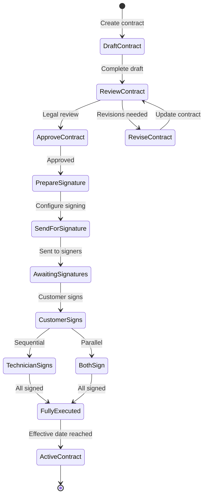
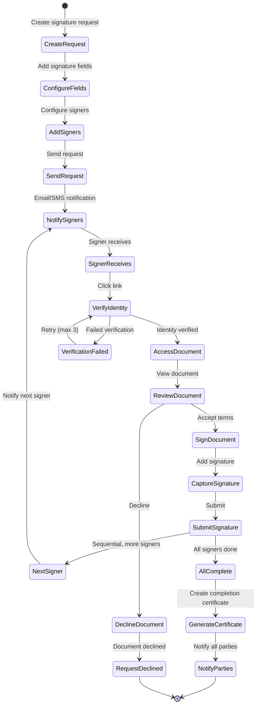
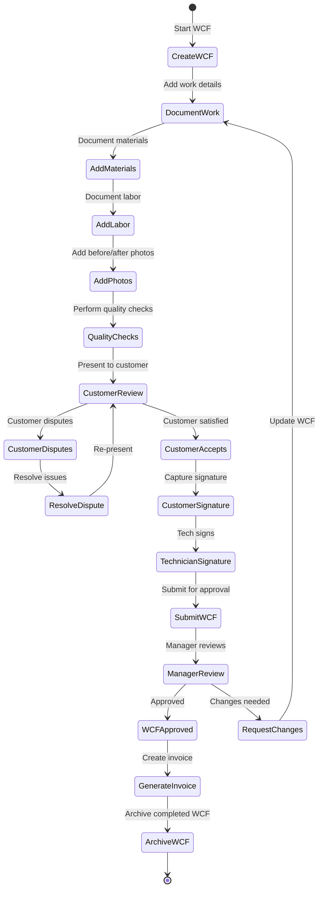
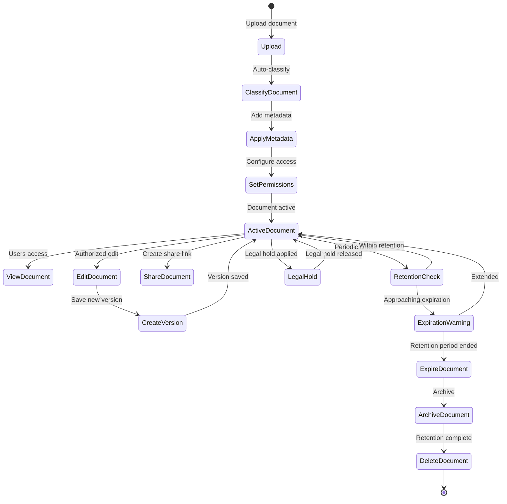

# Domain Model: Contract & Document Lifecycle

## Overview

This domain manages the complete lifecycle of service contracts and documents, including pre-service contracts, Work Completion Forms (WCF), electronic signatures, document storage, versioning, and compliance tracking.

## Domain Models

### 1. Service Contracts

#### ServiceContract Entity

```typescript
interface ServiceContract {
  id: string;
  contractNumber: string;
  contractType: ContractType;
  version: number;
  status: ContractStatus;

  // Parties
  customer: ContractParty;
  serviceProvider: ContractParty;
  technician?: ContractParty;

  // Service details
  serviceDetails: ServiceDetails;
  scopeOfWork: ScopeOfWork[];
  pricing: PricingDetails;

  // Terms & conditions
  terms: ContractTerms;
  specialConditions: SpecialCondition[];
  cancellationPolicy: CancellationPolicy;
  liabilityLimits: LiabilityLimits;

  // Timeline
  effectiveDate: DateTime;
  expirationDate?: DateTime;
  autoRenew: boolean;
  renewalTerms?: RenewalTerms;

  // Compliance
  regulatoryCompliance: RegulatoryCompliance[];
  insuranceRequirements: InsuranceRequirement[];

  // Signatures
  signatures: ContractSignature[];
  allPartiesSigned: boolean;
  fullyExecutedDate?: DateTime;

  // Related documents
  attachments: DocumentReference[];
  relatedContracts: string[]; // Parent/child contracts

  // Audit
  createdBy: string;
  createdAt: DateTime;
  updatedBy: string;
  updatedAt: DateTime;
  approvedBy?: string;
  approvedAt?: DateTime;
}

enum ContractType {
  PRE_SERVICE = 'PRE_SERVICE',
  MAINTENANCE_AGREEMENT = 'MAINTENANCE_AGREEMENT',
  INSTALLATION = 'INSTALLATION',
  REPAIR = 'REPAIR',
  EMERGENCY_SERVICE = 'EMERGENCY_SERVICE',
  WARRANTY = 'WARRANTY',
  EXTENDED_WARRANTY = 'EXTENDED_WARRANTY',
  SERVICE_LEVEL_AGREEMENT = 'SERVICE_LEVEL_AGREEMENT',
  MASTER_SERVICE_AGREEMENT = 'MASTER_SERVICE_AGREEMENT'
}

enum ContractStatus {
  DRAFT = 'DRAFT',
  PENDING_REVIEW = 'PENDING_REVIEW',
  PENDING_APPROVAL = 'PENDING_APPROVAL',
  AWAITING_SIGNATURE = 'AWAITING_SIGNATURE',
  PARTIALLY_SIGNED = 'PARTIALLY_SIGNED',
  FULLY_EXECUTED = 'FULLY_EXECUTED',
  ACTIVE = 'ACTIVE',
  SUSPENDED = 'SUSPENDED',
  EXPIRED = 'EXPIRED',
  TERMINATED = 'TERMINATED',
  CANCELLED = 'CANCELLED',
  SUPERSEDED = 'SUPERSEDED'
}

interface ContractParty {
  partyType: 'CUSTOMER' | 'SERVICE_PROVIDER' | 'TECHNICIAN' | 'THIRD_PARTY';
  entityType: 'INDIVIDUAL' | 'BUSINESS' | 'ORGANIZATION';
  entityId: string;
  name: string;
  legalName?: string;
  contactInfo: ContactInfo;
  address: Address;
  taxId?: string;
  licenseNumber?: string;
  insuranceInfo?: InsuranceInfo;
  authorized: boolean;
  authorizedSignatory?: AuthorizedSignatory;
}

interface AuthorizedSignatory {
  name: string;
  title: string;
  email: string;
  phone: string;
  verificationMethod: 'EMAIL' | 'SMS' | 'ID_VERIFICATION' | 'NOTARY';
  verified: boolean;
  verifiedAt?: DateTime;
}

interface ServiceDetails {
  serviceType: ServiceType;
  description: string;
  location: Address;
  accessRequirements: string[];
  specialInstructions?: string;
  equipmentInvolved: EquipmentReference[];
  estimatedDuration: Duration;
  schedulingConstraints?: SchedulingConstraint[];
}

interface ScopeOfWork {
  id: string;
  category: string;
  description: string;
  deliverables: string[];
  exclusions: string[];
  requirements: Requirement[];
  acceptanceCriteria: AcceptanceCriteria[];
  estimatedCost: Money;
}

interface Requirement {
  type: 'MANDATORY' | 'OPTIONAL' | 'CONDITIONAL';
  description: string;
  condition?: string;
  verificationMethod: string;
}

interface AcceptanceCriteria {
  criterion: string;
  measurementMethod: string;
  acceptableRange?: string;
  mustPass: boolean;
}

interface PricingDetails {
  currency: string;
  totalAmount: Money;
  breakdown: PriceBreakdown[];
  paymentTerms: PaymentTerms;
  taxDetails: TaxDetails;
  discounts: Discount[];
  additionalCharges: AdditionalCharge[];
}

interface PriceBreakdown {
  category: string;
  description: string;
  quantity: number;
  unitPrice: Money;
  totalPrice: Money;
  taxable: boolean;
}

interface PaymentTerms {
  method: PaymentMethod[];
  schedule: PaymentSchedule[];
  dueDate?: DateTime;
  lateFeePolicy?: LateFeePolicty;
  refundPolicy?: RefundPolicy;
}

interface PaymentSchedule {
  installmentNumber: number;
  dueDate: DateTime;
  amount: Money;
  description: string;
  status: 'PENDING' | 'PAID' | 'OVERDUE' | 'WAIVED';
  paidDate?: DateTime;
}

interface TaxDetails {
  taxRate: number;
  taxAmount: Money;
  taxType: string;
  taxId?: string;
  exemptionStatus?: TaxExemption;
}

interface Discount {
  type: 'PERCENTAGE' | 'FIXED_AMOUNT' | 'PROMOTIONAL';
  code?: string;
  description: string;
  amount: Money;
  conditions?: string[];
  validUntil?: DateTime;
}

interface ContractTerms {
  generalTerms: string;
  serviceTerms: string;
  privacyPolicy: string;
  dataUsageConsent: DataUsageConsent;
  intellectualProperty?: string;
  confidentiality?: ConfidentialityClause;
  disputeResolution: DisputeResolution;
  governingLaw: GoverningLaw;
  severability: boolean;
  entireAgreement: boolean;
}

interface DataUsageConsent {
  consentGiven: boolean;
  purposes: string[];
  dataTypes: string[];
  thirdPartySharing: boolean;
  retentionPeriod: Duration;
  rightToWithdraw: boolean;
  consentDate?: DateTime;
}

interface DisputeResolution {
  method: 'MEDIATION' | 'ARBITRATION' | 'LITIGATION';
  venue: string;
  governingRules?: string;
  arbitrator?: string;
  mediator?: string;
}

interface GoverningLaw {
  jurisdiction: string;
  state?: string;
  country: string;
  specificStatutes?: string[];
}

interface SpecialCondition {
  id: string;
  title: string;
  description: string;
  requiresAcceptance: boolean;
  acceptedBy?: string[];
  acceptedAt?: DateTime;
}

interface CancellationPolicy {
  allowCancellation: boolean;
  cancellationPeriod: Duration; // Notice period required
  cancellationFee?: CancellationFee;
  refundPolicy: RefundPolicy;
  exceptions?: string[];
}

interface CancellationFee {
  type: 'PERCENTAGE' | 'FIXED_AMOUNT' | 'TIERED';
  amount: Money;
  tiers?: FeeTier[];
}

interface FeeTier {
  threshold: Duration; // Time before service
  fee: Money;
}

interface RefundPolicy {
  eligibleForRefund: boolean;
  refundAmount: 'FULL' | 'PARTIAL' | 'NONE';
  partialPercentage?: number;
  processingTime: Duration;
  conditions: string[];
}

interface LiabilityLimits {
  maxLiability: Money;
  exclusions: string[];
  indemnification: IndemnificationClause[];
  insuranceRequired: boolean;
  minimumCoverage?: Money;
}

interface IndemnificationClause {
  party: 'CUSTOMER' | 'SERVICE_PROVIDER';
  scope: string;
  conditions: string[];
  limitations?: string[];
}

interface RenewalTerms {
  autoRenew: boolean;
  renewalPeriod: Duration;
  noticeRequired: Duration;
  priceAdjustment?: PriceAdjustment;
  termsChangeAllowed: boolean;
}

interface PriceAdjustment {
  type: 'FIXED_PERCENTAGE' | 'CPI_INDEXED' | 'RENEGOTIATE';
  percentage?: number;
  cap?: Money;
}

interface RegulatoryCompliance {
  regulation: string;
  jurisdiction: string;
  complianceDate: DateTime;
  certificateNumber?: string;
  verificationMethod: string;
  renewalDate?: DateTime;
}

interface InsuranceRequirement {
  type: 'GENERAL_LIABILITY' | 'WORKERS_COMP' | 'PROFESSIONAL_LIABILITY' | 'VEHICLE';
  minimumCoverage: Money;
  policyNumber?: string;
  provider?: string;
  expirationDate?: DateTime;
  verified: boolean;
}
```

#### ContractSignature Entity

```typescript
interface ContractSignature {
  id: string;
  contractId: string;
  contractVersion: number;

  // Signer information
  signerType: 'CUSTOMER' | 'SERVICE_PROVIDER' | 'TECHNICIAN' | 'WITNESS' | 'NOTARY';
  signerId: string;
  signerName: string;
  signerEmail: string;
  signerPhone?: string;
  signerTitle?: string;
  signerAuthority: string; // What authority they have to sign

  // Signature details
  signatureType: SignatureType;
  signatureData: SignatureData;
  signatureImage?: string; // Base64 encoded image

  // Verification
  verificationMethod: VerificationMethod;
  verificationData: VerificationData;
  verified: boolean;
  verifiedAt?: DateTime;
  verifiedBy?: string;

  // Legal
  ipAddress: string;
  userAgent: string;
  deviceInfo: DeviceInfo;
  location?: GeoLocation;
  consentText: string;
  consentGiven: boolean;

  // Timestamps
  requestedAt: DateTime;
  signedAt?: DateTime;
  expiresAt?: DateTime;

  // Status
  status: SignatureStatus;
  declinedReason?: string;

  // Audit trail
  auditTrail: SignatureAuditEvent[];
}

enum SignatureType {
  ELECTRONIC = 'ELECTRONIC', // E-signature (typed name)
  DIGITAL = 'DIGITAL', // Digital signature with certificate
  BIOMETRIC = 'BIOMETRIC', // Handwritten on device
  CLICK_WRAP = 'CLICK_WRAP', // "I agree" checkbox
  WET_SIGNATURE = 'WET_SIGNATURE', // Scanned physical signature
  NOTARIZED = 'NOTARIZED' // Notarized signature
}

interface SignatureData {
  type: SignatureType;
  data: any; // Type-specific signature data
  certificate?: DigitalCertificate; // For digital signatures
  biometricData?: BiometricData; // For biometric signatures
  timestamp: DateTime;
  timezone: string;
}

interface DigitalCertificate {
  certificateId: string;
  issuer: string;
  subject: string;
  serialNumber: string;
  validFrom: DateTime;
  validTo: DateTime;
  publicKey: string;
  algorithm: string;
  fingerprint: string;
}

interface BiometricData {
  points: Point[]; // Signature stroke points
  pressure: number[]; // Pressure data
  velocity: number[]; // Stroke velocity
  acceleration: number[]; // Stroke acceleration
  duration: Duration;
  boundingBox: BoundingBox;
}

interface Point {
  x: number;
  y: number;
  timestamp: number;
}

enum VerificationMethod {
  EMAIL = 'EMAIL',
  SMS = 'SMS',
  TWO_FACTOR = 'TWO_FACTOR',
  ID_VERIFICATION = 'ID_VERIFICATION',
  KNOWLEDGE_BASED = 'KNOWLEDGE_BASED', // KBA questions
  BIOMETRIC = 'BIOMETRIC',
  NOTARY = 'NOTARY',
  NONE = 'NONE'
}

interface VerificationData {
  method: VerificationMethod;
  code?: string; // For email/SMS verification
  answers?: Record<string, string>; // For KBA
  idDocument?: IDDocument; // For ID verification
  notaryInfo?: NotaryInfo; // For notarized signatures
  timestamp: DateTime;
}

interface IDDocument {
  type: 'DRIVERS_LICENSE' | 'PASSPORT' | 'NATIONAL_ID' | 'OTHER';
  number: string;
  issuingAuthority: string;
  issueDate: DateTime;
  expirationDate: DateTime;
  verified: boolean;
  verificationMethod: string;
}

interface NotaryInfo {
  notaryName: string;
  notaryLicense: string;
  notaryState: string;
  notaryExpiration: DateTime;
  notarySeal?: string; // Base64 image
  notarySignature?: string; // Base64 image
  witnessCount: number;
  witnesses?: Witness[];
}

interface Witness {
  name: string;
  address: Address;
  signature: string; // Base64 image
  witnessedAt: DateTime;
}

enum SignatureStatus {
  PENDING = 'PENDING',
  SENT = 'SENT',
  VIEWED = 'VIEWED',
  SIGNED = 'SIGNED',
  VERIFIED = 'VERIFIED',
  DECLINED = 'DECLINED',
  EXPIRED = 'EXPIRED',
  VOIDED = 'VOIDED'
}

interface SignatureAuditEvent {
  eventType: SignatureEventType;
  timestamp: DateTime;
  userId?: string;
  ipAddress: string;
  description: string;
  metadata?: Record<string, any>;
}

enum SignatureEventType {
  REQUEST_CREATED = 'REQUEST_CREATED',
  REQUEST_SENT = 'REQUEST_SENT',
  DOCUMENT_VIEWED = 'DOCUMENT_VIEWED',
  VERIFICATION_STARTED = 'VERIFICATION_STARTED',
  VERIFICATION_COMPLETED = 'VERIFICATION_COMPLETED',
  SIGNATURE_ADDED = 'SIGNATURE_ADDED',
  SIGNATURE_VERIFIED = 'SIGNATURE_VERIFIED',
  SIGNATURE_DECLINED = 'SIGNATURE_DECLINED',
  REMINDER_SENT = 'REMINDER_SENT',
  EXPIRED = 'EXPIRED',
  VOIDED = 'VOIDED'
}
```

### 2. Work Completion Forms (WCF)

#### WorkCompletionForm Entity

```typescript
interface WorkCompletionForm {
  id: string;
  wcfNumber: string;
  version: number;

  // Job reference
  jobId: string;
  jobNumber: string;
  contractId?: string;

  // Parties
  customer: WCFParty;
  technician: WCFParty;
  serviceProvider: WCFParty;

  // Work performed
  serviceDate: DateTime;
  serviceLocation: Address;
  workPerformed: WorkPerformedDetails;

  // Materials & equipment
  materialsUsed: MaterialLineItem[];
  equipmentInstalled: EquipmentLineItem[];
  equipmentRemoved: EquipmentLineItem[];

  // Labor & time
  laborDetails: LaborDetails[];
  totalLaborHours: number;

  // Pricing
  pricing: WCFPricing;

  // Quality & compliance
  qualityChecks: QualityCheck[];
  complianceCertifications: ComplianceCertification[];

  // Customer acceptance
  customerAcceptance: CustomerAcceptance;
  customerSignature?: ContractSignature;
  technicianSignature?: ContractSignature;

  // Photos & documentation
  beforePhotos: Photo[];
  afterPhotos: Photo[];
  additionalDocuments: DocumentReference[];

  // Warranty & guarantees
  warranty: WarrantyInfo;
  guarantees: GuaranteeInfo[];

  // Follow-up
  followUpRequired: boolean;
  followUpActions: FollowUpAction[];

  // Status
  status: WCFStatus;
  submittedAt?: DateTime;
  approvedAt?: DateTime;
  approvedBy?: string;

  // Audit
  createdBy: string;
  createdAt: DateTime;
  updatedBy: string;
  updatedAt: DateTime;
}

interface WCFParty {
  type: 'CUSTOMER' | 'TECHNICIAN' | 'SERVICE_PROVIDER';
  id: string;
  name: string;
  contactInfo: ContactInfo;
  licenseNumber?: string;
  certifications?: string[];
}

interface WorkPerformedDetails {
  summary: string;
  detailedDescription: string;
  tasksCompleted: TaskCompletion[];
  issuesFound: IssueFound[];
  issuesResolved: IssueResolution[];
  additionalWorkPerformed?: string;
  workNotPerformed?: string;
  reasonsNotPerformed?: string[];
}

interface TaskCompletion {
  taskId: string;
  taskName: string;
  description: string;
  completed: boolean;
  completionDate: DateTime;
  notes?: string;
  verificationMethod?: string;
}

interface IssueFound {
  id: string;
  category: string;
  severity: IssueSeverity;
  description: string;
  location: string;
  discoveredAt: DateTime;
  photos: Photo[];
  resolved: boolean;
  resolutionId?: string;
}

interface IssueResolution {
  id: string;
  issueId?: string;
  description: string;
  action: string;
  materialsUsed: string[];
  timeSpent: Duration;
  resolvedAt: DateTime;
  verifiedBy?: string;
}

interface MaterialLineItem {
  id: string;
  materialId?: string;
  materialCode?: string;
  description: string;
  category: string;
  quantity: number;
  unit: string;
  unitPrice: Money;
  totalPrice: Money;
  serialNumbers?: string[];
  warrantyPeriod?: Duration;
  suppliedBy: 'CUSTOMER' | 'SERVICE_PROVIDER' | 'THIRD_PARTY';
  billable: boolean;
  approved: boolean;
}

interface EquipmentLineItem {
  id: string;
  equipmentType: EquipmentType;
  make: string;
  model: string;
  serialNumber: string;
  description: string;
  location: string;
  condition: EquipmentCondition;
  photos: Photo[];
  warrantyInfo?: WarrantyInfo;
  installationDate?: DateTime;
  removalDate?: DateTime;
  billable: boolean;
  unitPrice?: Money;
  totalPrice?: Money;
}

enum EquipmentCondition {
  NEW = 'NEW',
  EXCELLENT = 'EXCELLENT',
  GOOD = 'GOOD',
  FAIR = 'FAIR',
  POOR = 'POOR',
  DEFECTIVE = 'DEFECTIVE',
  BEYOND_REPAIR = 'BEYOND_REPAIR'
}

interface LaborDetails {
  technicianId: string;
  technicianName: string;
  role: string;
  startTime: DateTime;
  endTime: DateTime;
  duration: Duration;
  breakTime?: Duration;
  netDuration: Duration;
  hourlyRate?: Money;
  totalCost?: Money;
  overtimeHours?: number;
  overtimeRate?: Money;
  billable: boolean;
  approved: boolean;
}

interface WCFPricing {
  laborCost: Money;
  materialsCost: Money;
  equipmentCost: Money;
  subtotal: Money;
  tax: Money;
  totalCost: Money;
  customerPortion: Money;
  warranty Coverage: Money;
  insuranceCoverage: Money;
  discounts: Discount[];
  additionalCharges: AdditionalCharge[];
  paymentStatus: PaymentStatus;
}

enum PaymentStatus {
  NOT_INVOICED = 'NOT_INVOICED',
  INVOICED = 'INVOICED',
  PARTIALLY_PAID = 'PARTIALLY_PAID',
  PAID = 'PAID',
  OVERDUE = 'OVERDUE',
  DISPUTED = 'DISPUTED',
  WRITTEN_OFF = 'WRITTEN_OFF'
}

interface QualityCheck {
  checkType: string;
  description: string;
  passed: boolean;
  measuredValue?: any;
  expectedValue?: any;
  notes?: string;
  performedBy: string;
  performedAt: DateTime;
}

interface ComplianceCertification {
  certificationType: string;
  regulatoryBody: string;
  certificateNumber?: string;
  issuedDate?: DateTime;
  expirationDate?: DateTime;
  scope: string;
  verified: boolean;
}

interface CustomerAcceptance {
  accepted: boolean;
  acceptedDate?: DateTime;
  satisfactionRating?: number; // 1-5
  feedback?: string;
  concerns?: string[];
  disputedItems?: DisputedItem[];
  signature?: ContractSignature;
}

interface DisputedItem {
  itemType: 'LABOR' | 'MATERIAL' | 'EQUIPMENT' | 'CHARGE' | 'QUALITY';
  itemId: string;
  description: string;
  reason: string;
  proposedResolution?: string;
  status: 'OPEN' | 'UNDER_REVIEW' | 'RESOLVED' | 'ESCALATED';
  resolvedAt?: DateTime;
  resolution?: string;
}

interface WarrantyInfo {
  provided: boolean;
  type: 'MANUFACTURER' | 'SERVICE_PROVIDER' | 'EXTENDED';
  duration: Duration;
  startDate: DateTime;
  endDate: DateTime;
  coverage: string[];
  exclusions: string[];
  terms: string;
  claimProcess: string;
  warrantyDocument?: DocumentReference;
}

interface GuaranteeInfo {
  type: string;
  description: string;
  duration: Duration;
  conditions: string[];
  validUntil: DateTime;
}

interface FollowUpAction {
  id: string;
  actionType: 'INSPECTION' | 'SERVICE' | 'CALLBACK' | 'QUOTE' | 'OTHER';
  description: string;
  dueDate?: DateTime;
  assignedTo?: string;
  priority: Priority;
  status: 'PENDING' | 'SCHEDULED' | 'COMPLETED' | 'CANCELLED';
}

enum WCFStatus {
  DRAFT = 'DRAFT',
  IN_PROGRESS = 'IN_PROGRESS',
  PENDING_SIGNATURE = 'PENDING_SIGNATURE',
  SIGNED = 'SIGNED',
  SUBMITTED = 'SUBMITTED',
  UNDER_REVIEW = 'UNDER_REVIEW',
  APPROVED = 'APPROVED',
  DISPUTED = 'DISPUTED',
  REVISED = 'REVISED',
  FINALIZED = 'FINALIZED',
  ARCHIVED = 'ARCHIVED'
}
```

### 3. Document Management

#### Document Entity

```typescript
interface Document {
  id: string;
  documentNumber: string;
  version: number;
  versionHistory: DocumentVersion[];

  // Classification
  documentType: DocumentType;
  category: DocumentCategory;
  subCategory?: string;
  tags: string[];

  // Content
  title: string;
  description?: string;
  fileName: string;
  fileSize: number;
  mimeType: string;
  fileExtension: string;
  pageCount?: number;

  // Storage
  storage: DocumentStorage;

  // Security
  accessControl: AccessControl;
  encryption: EncryptionInfo;

  // Relationships
  relatedTo: DocumentRelation[];
  parentDocumentId?: string;
  childDocuments: string[];

  // Metadata
  metadata: DocumentMetadata;
  customFields: Record<string, any>;

  // Lifecycle
  status: DocumentStatus;
  retentionPolicy: RetentionPolicy;
  expirationDate?: DateTime;

  // Compliance
  complianceInfo: ComplianceInfo;
  legalHold: boolean;
  legalHoldReason?: string;

  // Audit
  createdBy: string;
  createdAt: DateTime;
  updatedBy: string;
  updatedAt: DateTime;
  auditTrail: DocumentAuditEvent[];
}

enum DocumentType {
  CONTRACT = 'CONTRACT',
  WCF = 'WCF',
  INVOICE = 'INVOICE',
  QUOTE = 'QUOTE',
  RECEIPT = 'RECEIPT',
  PERMIT = 'PERMIT',
  LICENSE = 'LICENSE',
  CERTIFICATE = 'CERTIFICATE',
  PHOTO = 'PHOTO',
  VIDEO = 'VIDEO',
  DIAGRAM = 'DIAGRAM',
  REPORT = 'REPORT',
  CHECKLIST = 'CHECKLIST',
  CORRESPONDENCE = 'CORRESPONDENCE',
  POLICY = 'POLICY',
  PROCEDURE = 'PROCEDURE',
  MANUAL = 'MANUAL',
  OTHER = 'OTHER'
}

enum DocumentCategory {
  LEGAL = 'LEGAL',
  FINANCIAL = 'FINANCIAL',
  TECHNICAL = 'TECHNICAL',
  OPERATIONAL = 'OPERATIONAL',
  COMPLIANCE = 'COMPLIANCE',
  CUSTOMER_FACING = 'CUSTOMER_FACING',
  INTERNAL = 'INTERNAL'
}

interface DocumentStorage {
  storageType: StorageType;
  storagePath: string;
  storageRegion?: string;
  url?: string;
  gcsBucket?: string;
  gcsObjectPath?: string;
  checksum: string;
  checksumAlgorithm: 'MD5' | 'SHA256' | 'SHA512';
  compressed: boolean;
  compressionRatio?: number;
}

enum StorageType {
  LOCAL = 'LOCAL',
  GCS = 'GCS',  // Google Cloud Storage
  DATABASE = 'DATABASE'
}

interface AccessControl {
  visibility: 'PUBLIC' | 'PRIVATE' | 'RESTRICTED' | 'CONFIDENTIAL';
  permissions: Permission[];
  shareLinks: ShareLink[];
  downloadAllowed: boolean;
  printAllowed: boolean;
  copyAllowed: boolean;
  watermarkRequired: boolean;
}

interface Permission {
  principalType: 'USER' | 'ROLE' | 'GROUP' | 'ORGANIZATION';
  principalId: string;
  accessLevel: 'VIEW' | 'EDIT' | 'DELETE' | 'ADMIN';
  grantedBy: string;
  grantedAt: DateTime;
  expiresAt?: DateTime;
}

interface ShareLink {
  id: string;
  token: string;
  url: string;
  password?: string;
  expiresAt?: DateTime;
  maxDownloads?: number;
  downloadCount: number;
  createdBy: string;
  createdAt: DateTime;
  accessLog: AccessLogEntry[];
}

interface AccessLogEntry {
  accessedAt: DateTime;
  ipAddress: string;
  userAgent: string;
  userId?: string;
  action: 'VIEW' | 'DOWNLOAD' | 'PRINT';
}

interface EncryptionInfo {
  encrypted: boolean;
  algorithm?: string;
  keyId?: string;
  encryptedAt?: DateTime;
}

interface DocumentRelation {
  relatedDocumentId: string;
  relationType: DocumentRelationType;
  description?: string;
  createdAt: DateTime;
}

enum DocumentRelationType {
  SUPERSEDES = 'SUPERSEDES',
  SUPERSEDED_BY = 'SUPERSEDED_BY',
  AMENDS = 'AMENDS',
  AMENDED_BY = 'AMENDED_BY',
  ATTACHMENT = 'ATTACHMENT',
  ATTACHED_TO = 'ATTACHED_TO',
  REFERENCE = 'REFERENCE',
  REFERENCED_BY = 'REFERENCED_BY',
  RELATED = 'RELATED'
}

interface DocumentMetadata {
  author?: string;
  subject?: string;
  keywords: string[];
  language: string;
  documentDate?: DateTime;
  effectiveDate?: DateTime;
  expirationDate?: DateTime;
  jurisdiction?: string;
  department?: string;
  project?: string;
  customer?: string;
  contractor?: string;
}

enum DocumentStatus {
  DRAFT = 'DRAFT',
  PENDING_REVIEW = 'PENDING_REVIEW',
  APPROVED = 'APPROVED',
  ACTIVE = 'ACTIVE',
  SUPERSEDED = 'SUPERSEDED',
  EXPIRED = 'EXPIRED',
  ARCHIVED = 'ARCHIVED',
  DELETED = 'DELETED'
}

interface RetentionPolicy {
  policyId: string;
  policyName: string;
  retentionPeriod: Duration;
  retentionStartDate: DateTime;
  retentionEndDate: DateTime;
  disposeAfter: boolean;
  disposalMethod?: 'DELETE' | 'ARCHIVE' | 'SHRED';
  legalRequirement?: string;
}

interface ComplianceInfo {
  regulatoryFrameworks: string[];
  complianceDate: DateTime;
  reviewDate?: DateTime;
  reviewedBy?: string;
  attestations: Attestation[];
}

interface Attestation {
  type: string;
  attestedBy: string;
  attestedAt: DateTime;
  statement: string;
  signature?: string;
}

interface DocumentAuditEvent {
  eventId: string;
  eventType: DocumentEventType;
  userId: string;
  userName: string;
  timestamp: DateTime;
  ipAddress: string;
  userAgent: string;
  changes?: Record<string, ChangeDetail>;
  description: string;
}

enum DocumentEventType {
  CREATED = 'CREATED',
  UPLOADED = 'UPLOADED',
  VIEWED = 'VIEWED',
  DOWNLOADED = 'DOWNLOADED',
  PRINTED = 'PRINTED',
  EDITED = 'EDITED',
  VERSIONED = 'VERSIONED',
  SHARED = 'SHARED',
  UNSHARED = 'UNSHARED',
  PERMISSIONS_CHANGED = 'PERMISSIONS_CHANGED',
  MOVED = 'MOVED',
  RENAMED = 'RENAMED',
  DELETED = 'DELETED',
  RESTORED = 'RESTORED',
  ARCHIVED = 'ARCHIVED',
  COMPLIANCE_CHECK = 'COMPLIANCE_CHECK'
}

interface ChangeDetail {
  field: string;
  oldValue: any;
  newValue: any;
}

interface DocumentVersion {
  versionNumber: number;
  versionLabel?: string;
  documentId: string;
  fileName: string;
  fileSize: number;
  checksum: string;
  storage: DocumentStorage;
  changes: string;
  createdBy: string;
  createdAt: DateTime;
  isCurrent: boolean;
}
```

### 4. E-Signature Workflow

#### SignatureRequest Entity

```typescript
interface SignatureRequest {
  id: string;
  requestNumber: string;

  // Document to sign
  documentId: string;
  documentType: DocumentType;
  documentTitle: string;

  // Requestor
  requestedBy: string;
  requestedByName: string;
  requestedByOrganization: string;
  requestedAt: DateTime;

  // Signers
  signers: RequiredSigner[];
  signingOrder: SigningOrder;
  allowParallelSigning: boolean;

  // Workflow
  currentStep: number;
  totalSteps: number;
  status: SignatureRequestStatus;

  // Settings
  settings: SignatureRequestSettings;

  // Completion
  completedAt?: DateTime;
  completionCertificate?: DocumentReference;

  // Audit
  auditTrail: SignatureRequestAudit[];

  createdAt: DateTime;
  updatedAt: DateTime;
}

interface RequiredSigner {
  id: string;
  order: number;
  signerType: 'CUSTOMER' | 'TECHNICIAN' | 'MANAGER' | 'WITNESS' | 'NOTARY';
  signerId?: string;
  signerName: string;
  signerEmail: string;
  signerPhone?: string;
  role: string;

  // Requirements
  signatureType: SignatureType;
  verificationMethod: VerificationMethod;
  fieldsToSign: SignatureField[];

  // Status
  status: SignerStatus;
  sentAt?: DateTime;
  viewedAt?: DateTime;
  signedAt?: DateTime;
  declinedAt?: DateTime;
  declinedReason?: string;

  // Reminders
  remindersSent: number;
  lastReminderAt?: DateTime;

  // Delegation
  canDelegate: boolean;
  delegatedTo?: DelegatedSigner;

  signature?: ContractSignature;
}

interface SignatureField {
  id: string;
  type: 'SIGNATURE' | 'INITIAL' | 'DATE' | 'TEXT' | 'CHECKBOX';
  label: string;
  required: boolean;
  page: number;
  position: FieldPosition;
  size: FieldSize;
  value?: any;
  completedAt?: DateTime;
}

interface FieldPosition {
  x: number;
  y: number;
}

interface FieldSize {
  width: number;
  height: number;
}

enum SigningOrder {
  SEQUENTIAL = 'SEQUENTIAL', // One at a time in order
  PARALLEL = 'PARALLEL', // All at once
  MIXED = 'MIXED' // Some sequential, some parallel
}

enum SignatureRequestStatus {
  DRAFT = 'DRAFT',
  SENT = 'SENT',
  IN_PROGRESS = 'IN_PROGRESS',
  COMPLETED = 'COMPLETED',
  DECLINED = 'DECLINED',
  CANCELLED = 'CANCELLED',
  EXPIRED = 'EXPIRED',
  VOIDED = 'VOIDED'
}

interface SignatureRequestSettings {
  expirationDate?: DateTime;
  reminderSchedule?: ReminderSchedule;
  requireAllSigners: boolean;
  allowDecline: boolean;
  allowDelegation: boolean;
  enableAuditTrail: boolean;
  sendCompletionEmail: boolean;
  sendCompletionCertificate: boolean;
  securityOptions: SecurityOptions;
  brandingOptions?: BrandingOptions;
}

interface ReminderSchedule {
  enabled: boolean;
  frequency: Duration;
  maxReminders: number;
  customMessage?: string;
}

interface SecurityOptions {
  requirePassword: boolean;
  password?: string;
  requireIPVerification: boolean;
  allowedIPs?: string[];
  requireDeviceVerification: boolean;
  sessionTimeout?: Duration;
  preventForwarding: boolean;
  watermark: boolean;
}

interface BrandingOptions {
  logo?: string;
  primaryColor?: string;
  secondaryColor?: string;
  emailTemplate?: string;
  customDomain?: string;
}

interface DelegatedSigner {
  delegatedBy: string;
  delegatedTo: string;
  delegatedToName: string;
  delegatedToEmail: string;
  delegatedAt: DateTime;
  reason: string;
  notified: boolean;
}

enum SignerStatus {
  PENDING = 'PENDING',
  SENT = 'SENT',
  VIEWED = 'VIEWED',
  IN_PROGRESS = 'IN_PROGRESS',
  SIGNED = 'SIGNED',
  DECLINED = 'DECLINED',
  DELEGATED = 'DELEGATED',
  EXPIRED = 'EXPIRED'
}

interface SignatureRequestAudit {
  eventType: string;
  timestamp: DateTime;
  userId?: string;
  signerId?: string;
  ipAddress: string;
  details: string;
  metadata?: Record<string, any>;
}
```

## Business Rules & Constraints

### Contract Rules

1. **Contract Creation**
   - All parties must be verified before contract creation
   - Service details must include valid location and scope of work
   - Pricing must be approved before contract can be sent for signature
   - Regulatory compliance requirements must be met for contract type

2. **Contract Execution**
   - All required signatures must be obtained for contract to be fully executed
   - Signature order must be enforced if sequential signing required
   - Signers must complete verification before signing
   - Contracts cannot be modified after first signature (new version required)

3. **Contract Lifecycle**
   - Active contracts cannot be deleted (must be terminated or cancelled)
   - Terminated contracts cannot be reactivated (new contract required)
   - Auto-renewal requires customer notification within notice period
   - Contract amendments must reference original contract and version

### Signature Rules

1. **Signature Verification**
   - Email/SMS verification code valid for 15 minutes
   - KBA questions randomized from approved question bank
   - Failed verification attempts locked after 3 tries
   - Biometric signatures require minimum stroke count and duration

2. **Signature Validity**
   - Digital signatures must use valid, non-expired certificates
   - Notarized signatures require valid notary license
   - IP address must match allowed regions (if configured)
   - Signature timestamps must be synchronized with trusted time source

3. **Signature Security**
   - Signature images encrypted at rest
   - Signature data HMAC signed for tamper detection
   - Audit trail immutable (append-only)
   - Voided signatures cannot be restored

### WCF Rules

1. **WCF Completion**
   - All work performed must be documented with details
   - Material serial numbers required for installed equipment
   - Before/after photos mandatory for visible work
   - Customer signature required before WCF submission (unless waived)

2. **WCF Approval**
   - Manager approval required if total cost exceeds authorized amount
   - Disputed items must be resolved before finalization
   - Quality checks must pass for compliance-regulated work
   - Warranty information required for equipment installations

3. **WCF Billing**
   - Pricing must match original quote within variance threshold
   - Additional charges require customer approval
   - Labor hours validated against time tracking
   - Tax calculations verified before invoicing

### Document Rules

1. **Document Storage**
   - Documents encrypted in transit and at rest
   - Checksums verified on upload and download
   - Retention policy applied at creation
   - Legal hold prevents deletion regardless of retention period

2. **Document Access**
   - Access permissions inherited from parent unless overridden
   - Share links expire after configured period or max downloads
   - Watermarks applied to confidential documents
   - Download/print restrictions enforced by viewer

3. **Document Versioning**
   - Major versions created for significant changes
   - Minor versions for editorial changes
   - Previous versions retained per retention policy
   - Version history immutable

## Workflows

### Pre-Service Contract Workflow



### E-Signature Workflow



### WCF Creation and Approval Workflow



### Document Lifecycle Workflow



## Validation & Error Handling

### Contract Validation

```typescript
interface ContractValidation {
  validateContract(contract: ServiceContract): ValidationResult {
    const errors: ValidationError[] = [];

    // Validate parties
    if (!contract.customer || !contract.serviceProvider) {
      errors.push({ field: 'parties', message: 'All parties must be specified' });
    }

    // Validate service details
    if (!contract.serviceDetails.serviceType) {
      errors.push({ field: 'serviceType', message: 'Service type is required' });
    }

    // Validate pricing
    if (contract.pricing.totalAmount.amount <= 0) {
      errors.push({ field: 'pricing', message: 'Total amount must be greater than zero' });
    }

    // Validate terms
    if (!contract.terms.generalTerms || contract.terms.generalTerms.length === 0) {
      errors.push({ field: 'terms', message: 'General terms are required' });
    }

    // Validate dates
    if (contract.expirationDate && contract.expirationDate <= contract.effectiveDate) {
      errors.push({ field: 'dates', message: 'Expiration date must be after effective date' });
    }

    return {
      valid: errors.length === 0,
      errors
    };
  }

  validateSignatureReadiness(contract: ServiceContract): ValidationResult {
    const errors: ValidationError[] = [];

    // Contract must be approved
    if (contract.status !== 'PENDING_APPROVAL' && contract.status !== 'AWAITING_SIGNATURE') {
      errors.push({ field: 'status', message: 'Contract must be approved before signing' });
    }

    // All required fields completed
    if (!this.validateContract(contract).valid) {
      errors.push({ field: 'contract', message: 'Contract validation failed' });
    }

    // Signers configured
    if (!contract.signatures || contract.signatures.length === 0) {
      errors.push({ field: 'signatures', message: 'No signers configured' });
    }

    return {
      valid: errors.length === 0,
      errors
    };
  }
}
```

### Signature Validation

```typescript
interface SignatureValidation {
  validateSignature(signature: ContractSignature): ValidationResult {
    const errors: ValidationError[] = [];

    // Verify signer authority
    if (!signature.signerAuthority) {
      errors.push({ field: 'authority', message: 'Signer authority not specified' });
    }

    // Validate signature data
    if (!signature.signatureData || !signature.signatureData.data) {
      errors.push({ field: 'signatureData', message: 'Signature data missing' });
    }

    // Verify timestamp
    const now = new Date();
    if (signature.signedAt && signature.signedAt > now) {
      errors.push({ field: 'timestamp', message: 'Signature timestamp cannot be in future' });
    }

    // Check expiration
    if (signature.expiresAt && now > signature.expiresAt) {
      errors.push({ field: 'expiration', message: 'Signature request has expired' });
    }

    // Validate verification
    if (signature.verificationMethod !== 'NONE' && !signature.verified) {
      errors.push({ field: 'verification', message: 'Signature verification incomplete' });
    }

    // Validate digital signature
    if (signature.signatureType === 'DIGITAL') {
      const certValidation = this.validateCertificate(signature.signatureData.certificate);
      if (!certValidation.valid) {
        errors.push(...certValidation.errors);
      }
    }

    // Validate biometric signature
    if (signature.signatureType === 'BIOMETRIC') {
      const bioValidation = this.validateBiometricData(signature.signatureData.biometricData);
      if (!bioValidation.valid) {
        errors.push(...bioValidation.errors);
      }
    }

    return {
      valid: errors.length === 0,
      errors
    };
  }

  validateCertificate(cert?: DigitalCertificate): ValidationResult {
    if (!cert) {
      return { valid: false, errors: [{ field: 'certificate', message: 'Certificate required for digital signature' }] };
    }

    const now = new Date();
    if (now < cert.validFrom || now > cert.validTo) {
      return { valid: false, errors: [{ field: 'certificate', message: 'Certificate not valid at current time' }] };
    }

    return { valid: true, errors: [] };
  }

  validateBiometricData(bioData?: BiometricData): ValidationResult {
    if (!bioData) {
      return { valid: false, errors: [{ field: 'biometric', message: 'Biometric data required' }] };
    }

    if (bioData.points.length < 10) {
      return { valid: false, errors: [{ field: 'biometric', message: 'Insufficient signature points' }] };
    }

    if (bioData.duration < 500) { // milliseconds
      return { valid: false, errors: [{ field: 'biometric', message: 'Signature drawn too quickly' }] };
    }

    return { valid: true, errors: [] };
  }
}
```

### WCF Validation

```typescript
interface WCFValidation {
  validateWCF(wcf: WorkCompletionForm): ValidationResult {
    const errors: ValidationError[] = [];

    // Work performed required
    if (!wcf.workPerformed || !wcf.workPerformed.summary) {
      errors.push({ field: 'workPerformed', message: 'Work summary is required' });
    }

    // Materials validation
    for (const material of wcf.materialsUsed) {
      if (material.quantity <= 0) {
        errors.push({ field: 'materials', message: `Invalid quantity for ${material.description}` });
      }
      if (material.unitPrice.amount < 0) {
        errors.push({ field: 'materials', message: `Invalid price for ${material.description}` });
      }
    }

    // Equipment validation
    for (const equipment of wcf.equipmentInstalled) {
      if (!equipment.serialNumber) {
        errors.push({ field: 'equipment', message: `Serial number required for ${equipment.description}` });
      }
      if (equipment.photos.length === 0) {
        errors.push({ field: 'equipment', message: `Photos required for ${equipment.description}` });
      }
    }

    // Labor validation
    if (wcf.laborDetails.length === 0) {
      errors.push({ field: 'labor', message: 'Labor details are required' });
    }

    for (const labor of wcf.laborDetails) {
      if (labor.duration <= 0) {
        errors.push({ field: 'labor', message: `Invalid duration for ${labor.technicianName}` });
      }
    }

    // Photos validation
    if (wcf.beforePhotos.length === 0 || wcf.afterPhotos.length === 0) {
      errors.push({ field: 'photos', message: 'Before and after photos are required' });
    }

    // Customer acceptance
    if (wcf.status === 'FINALIZED' && !wcf.customerSignature) {
      errors.push({ field: 'signature', message: 'Customer signature required for finalization' });
    }

    return {
      valid: errors.length === 0,
      errors
    };
  }

  validatePricing(wcf: WorkCompletionForm): ValidationResult {
    const errors: ValidationError[] = [];

    // Calculate expected totals
    const expectedMaterialsCost = wcf.materialsUsed
      .reduce((sum, m) => sum + m.totalPrice.amount, 0);

    const expectedLaborCost = wcf.laborDetails
      .reduce((sum, l) => sum + (l.totalCost?.amount || 0), 0);

    // Verify pricing
    if (Math.abs(wcf.pricing.materialsCost.amount - expectedMaterialsCost) > 0.01) {
      errors.push({ field: 'pricing', message: 'Materials cost mismatch' });
    }

    if (Math.abs(wcf.pricing.laborCost.amount - expectedLaborCost) > 0.01) {
      errors.push({ field: 'pricing', message: 'Labor cost mismatch' });
    }

    const expectedSubtotal = wcf.pricing.laborCost.amount +
                             wcf.pricing.materialsCost.amount +
                             wcf.pricing.equipmentCost.amount;

    if (Math.abs(wcf.pricing.subtotal.amount - expectedSubtotal) > 0.01) {
      errors.push({ field: 'pricing', message: 'Subtotal calculation error' });
    }

    return {
      valid: errors.length === 0,
      errors
    };
  }
}
```

### Document Validation

```typescript
interface DocumentValidation {
  validateUpload(file: File, documentType: DocumentType): ValidationResult {
    const errors: ValidationError[] = [];

    // File size limits
    const maxSize = this.getMaxFileSize(documentType);
    if (file.size > maxSize) {
      errors.push({ field: 'size', message: `File size exceeds maximum of ${maxSize} bytes` });
    }

    // MIME type validation
    const allowedTypes = this.getAllowedMimeTypes(documentType);
    if (!allowedTypes.includes(file.type)) {
      errors.push({ field: 'mimeType', message: `File type ${file.type} not allowed` });
    }

    // File name validation
    if (file.name.length > 255) {
      errors.push({ field: 'filename', message: 'Filename too long (max 255 characters)' });
    }

    if (/[<>:"|?*]/.test(file.name)) {
      errors.push({ field: 'filename', message: 'Filename contains invalid characters' });
    }

    return {
      valid: errors.length === 0,
      errors
    };
  }

  validateAccess(document: Document, userId: string, action: string): ValidationResult {
    // Check if user has permission
    const permission = document.accessControl.permissions.find(
      p => p.principalId === userId && this.hasAccess(p.accessLevel, action)
    );

    if (!permission) {
      return {
        valid: false,
        errors: [{ field: 'access', message: 'Insufficient permissions' }]
      };
    }

    // Check if permission expired
    if (permission.expiresAt && new Date() > permission.expiresAt) {
      return {
        valid: false,
        errors: [{ field: 'access', message: 'Permission has expired' }]
      };
    }

    return { valid: true, errors: [] };
  }

  validateRetention(document: Document): ValidationResult {
    const now = new Date();

    // Check legal hold
    if (document.legalHold) {
      return {
        valid: false,
        errors: [{ field: 'retention', message: 'Document under legal hold, cannot be deleted' }]
      };
    }

    // Check retention period
    if (now < document.retentionPolicy.retentionEndDate) {
      return {
        valid: false,
        errors: [{ field: 'retention', message: 'Retention period not yet expired' }]
      };
    }

    return { valid: true, errors: [] };
  }
}
```

## Error Handling

### Error Types

```typescript
enum ContractDocumentError {
  // Contract errors
  INVALID_CONTRACT_STATE = 'INVALID_CONTRACT_STATE',
  MISSING_REQUIRED_PARTY = 'MISSING_REQUIRED_PARTY',
  PRICING_VALIDATION_FAILED = 'PRICING_VALIDATION_FAILED',
  SIGNATURE_ORDER_VIOLATION = 'SIGNATURE_ORDER_VIOLATION',
  CONTRACT_EXPIRED = 'CONTRACT_EXPIRED',

  // Signature errors
  SIGNATURE_VERIFICATION_FAILED = 'SIGNATURE_VERIFICATION_FAILED',
  CERTIFICATE_INVALID = 'CERTIFICATE_INVALID',
  SIGNATURE_EXPIRED = 'SIGNATURE_EXPIRED',
  INSUFFICIENT_SIGNATURE_DATA = 'INSUFFICIENT_SIGNATURE_DATA',
  DUPLICATE_SIGNATURE = 'DUPLICATE_SIGNATURE',

  // WCF errors
  INCOMPLETE_WORK_DOCUMENTATION = 'INCOMPLETE_WORK_DOCUMENTATION',
  MISSING_REQUIRED_PHOTOS = 'MISSING_REQUIRED_PHOTOS',
  PRICING_MISMATCH = 'PRICING_MISMATCH',
  CUSTOMER_SIGNATURE_REQUIRED = 'CUSTOMER_SIGNATURE_REQUIRED',
  DISPUTED_ITEMS_UNRESOLVED = 'DISPUTED_ITEMS_UNRESOLVED',

  // Document errors
  FILE_TOO_LARGE = 'FILE_TOO_LARGE',
  UNSUPPORTED_FILE_TYPE = 'UNSUPPORTED_FILE_TYPE',
  CHECKSUM_VERIFICATION_FAILED = 'CHECKSUM_VERIFICATION_FAILED',
  INSUFFICIENT_PERMISSIONS = 'INSUFFICIENT_PERMISSIONS',
  DOCUMENT_LOCKED = 'DOCUMENT_LOCKED',
  RETENTION_POLICY_VIOLATION = 'RETENTION_POLICY_VIOLATION',

  // General
  RESOURCE_NOT_FOUND = 'RESOURCE_NOT_FOUND',
  OPERATION_NOT_ALLOWED = 'OPERATION_NOT_ALLOWED',
  STORAGE_FAILURE = 'STORAGE_FAILURE'
}
```

## Implementation Considerations

### Security

1. **Document Encryption**
   - AES-256 encryption for documents at rest
   - TLS 1.3 for documents in transit
   - Key rotation every 90 days
   - Separate encryption keys per customer

2. **Signature Security**
   - HMAC signing of signature data
   - Tamper-evident audit trail
   - Secure key storage (HSM or KMS)
   - Certificate validation against CRL/OCSP

3. **Access Control**
   - Role-based access control (RBAC)
   - Principle of least privilege
   - Automatic permission expiration
   - Activity logging for all access

### Performance

1. **Document Storage**
   - CDN for frequently accessed documents
   - Lazy loading for document lists
   - Thumbnail generation for PDFs
   - Progressive loading for large files

2. **Signature Processing**
   - Async signature verification
   - Batch processing for multiple signatures
   - Caching of verification results
   - Background certificate validation

### Compliance

1. **E-SIGN Act & UETA**
   - Intent to sign captured
   - Association with record maintained
   - Audit trail preserved
   - Consent to electronic records

2. **GDPR & Privacy**
   - Right to access documents
   - Right to erasure (after retention)
   - Data portability support
   - Privacy policy acceptance

3. **Industry Standards**
   - ISO 27001 for information security
   - SOC 2 Type II compliance
   - PCI DSS for payment documents
   - HIPAA for healthcare documents

## API Contracts

### Contract API

```typescript
POST /api/v1/contracts
Request: CreateContractRequest
Response: ContractResponse

GET /api/v1/contracts/{id}/signatures
Response: SignatureResponse[]

POST /api/v1/contracts/{id}/execute
Response: ExecutedContractResponse
```

### Signature API

```typescript
POST /api/v1/signature-requests
Request: CreateSignatureRequestRequest
Response: SignatureRequestResponse

POST /api/v1/signatures/{id}/sign
Request: SignatureRequest
Response: SignatureResponse

GET /api/v1/signatures/{id}/verify
Response: VerificationResponse
```

### WCF API

```typescript
POST /api/v1/wcf
Request: CreateWCFRequest
Response: WCFResponse

POST /api/v1/wcf/{id}/submit
Response: SubmissionResponse

GET /api/v1/wcf/{id}/pdf
Response: PDF file
```

### Document API

```typescript
POST /api/v1/documents/upload
Request: Multipart file upload
Response: DocumentResponse

GET /api/v1/documents/{id}/download
Response: File stream

POST /api/v1/documents/{id}/share
Request: CreateShareLinkRequest
Response: ShareLinkResponse
```

## Metrics & Monitoring

### Key Metrics

1. **Contract Metrics**
   - Contract creation to execution time
   - Signature completion rate
   - Contract amendment rate
   - Expiration and renewal rate

2. **Signature Metrics**
   - Signature request to completion time
   - Verification success rate
   - Decline rate
   - Reminder effectiveness

3. **WCF Metrics**
   - WCF completion time
   - Customer acceptance rate
   - Dispute rate
   - Approval cycle time

4. **Document Metrics**
   - Upload success rate
   - Access frequency
   - Storage costs
   - Retention compliance rate
