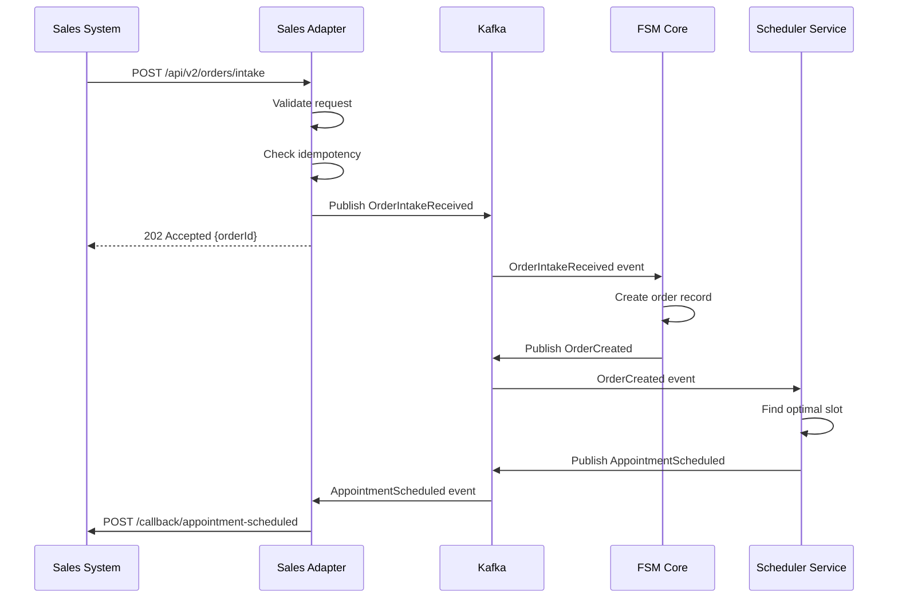

# Sales System Integration (Pyxis/Tempo)

## Overview

The Field Service Management system integrates with external sales systems (Pyxis and Tempo) to receive order intake, synchronize appointment slots, and report installation outcomes. This integration enables seamless handoff from sales to field service operations.

## Integration Architecture

```
┌─────────────────┐         ┌──────────────────┐         ┌─────────────────┐
│  Sales System   │────────>│  FSM Integration │────────>│  FSM Core API   │
│ (Pyxis/Tempo)   │<────────│     Adapter      │<────────│                 │
└─────────────────┘         └──────────────────┘         └─────────────────┘
        │                            │                            │
        │                            │                            │
        v                            v                            v
   ┌─────────┐              ┌──────────────┐           ┌──────────────────┐
   │ Webhook │              │ Kafka Topics │           │ PostgreSQL DB    │
   │Callbacks│              │              │           │                  │
   └─────────┘              └──────────────┘           └──────────────────┘
```

## Integration Flows

### 1. Order Intake Flow

When a sales order is created in Pyxis/Tempo, it is sent to FSM for scheduling and fulfillment.



### Order Intake API

#### Request Schema

```typescript
interface OrderIntakeRequest {
  externalOrderId: string;
  salesSystem: 'PYXIS' | 'TEMPO';
  orderType: 'INSTALLATION' | 'REPAIR' | 'MAINTENANCE' | 'UPGRADE';
  priority: 'LOW' | 'MEDIUM' | 'HIGH' | 'URGENT' | 'EMERGENCY';

  customer: {
    customerId: string;
    firstName: string;
    lastName: string;
    email: string;
    phone: string;
    preferredContactMethod: 'EMAIL' | 'SMS' | 'PHONE';
  };

  serviceAddress: {
    street: string;
    street2?: string;
    city: string;
    state: string;
    postalCode: string;
    country: string;
    accessNotes?: string;
    parkingInstructions?: string;
  };

  serviceItems: Array<{
    itemId: string;
    productId: string;
    productName: string;
    quantity: number;
    unitPrice: {
      amount: string;
      currency: string;
    };
    serialNumbers?: string[];
    requiresInstallation: boolean;
  }>;

  totalAmount: {
    subtotal: string;
    tax: string;
    total: string;
    currency: string;
  };

  schedulingPreferences?: {
    preferredDate?: string; // ISO 8601 date
    timeWindow?: {
      start: string; // HH:mm format
      end: string;
    };
    excludedDates?: string[];
    technicianPreference?: string;
    notes?: string;
  };

  requiredSkills?: string[];
  estimatedDuration?: number; // minutes

  metadata?: Record<string, string>;
}
```

#### Response Schema

```typescript
interface OrderIntakeResponse {
  orderId: string;
  externalOrderId: string;
  status: 'RECEIVED' | 'PROCESSING' | 'SCHEDULED' | 'FAILED';
  correlationId: string;
  receivedAt: string; // ISO 8601 timestamp

  appointment?: {
    appointmentId: string;
    scheduledStart: string;
    scheduledEnd: string;
    technicianId: string;
    technicianName: string;
  };

  errors?: Array<{
    code: string;
    message: string;
    field?: string;
  }>;
}
```

#### Implementation

```typescript
class SalesOrderIntakeAdapter implements IntegrationAdapter<OrderIntakeRequest, OrderIntakeResponse> {
  readonly adapterId = 'sales-order-intake';
  readonly version = '2.1.0';

  constructor(
    private httpClient: HttpClient,
    private kafkaProducer: KafkaProducer,
    private idempotencyManager: IdempotencyManager,
    private validator: Validator,
    private logger: Logger
  ) {}

  async execute(
    request: OrderIntakeRequest,
    context: IntegrationContext
  ): Promise<OrderIntakeResponse> {
    const idempotencyKey = this.generateIdempotencyKey(request, context);

    return this.idempotencyManager.execute(idempotencyKey, async () => {
      // Validate request
      const validation = this.validate(request);
      if (!validation.isValid) {
        throw new ValidationError(validation.errors);
      }

      // Generate FSM order ID
      const orderId = generateUUID();

      // Publish order intake event
      await this.kafkaProducer.send({
        topic: 'sales.order.intake',
        messages: [{
          key: orderId,
          value: JSON.stringify({
            eventId: generateUUID(),
            correlationId: context.correlationId,
            timestamp: new Date().toISOString(),
            orderId,
            externalOrderId: request.externalOrderId,
            salesSystem: request.salesSystem,
            orderData: request
          }),
          headers: {
            'correlation-id': context.correlationId,
            'tenant-id': context.tenantId,
            'idempotency-key': idempotencyKey
          }
        }]
      });

      this.logger.info('Order intake received', {
        orderId,
        externalOrderId: request.externalOrderId,
        correlationId: context.correlationId
      });

      return {
        orderId,
        externalOrderId: request.externalOrderId,
        status: 'RECEIVED',
        correlationId: context.correlationId,
        receivedAt: new Date().toISOString()
      };
    });
  }

  validate(request: OrderIntakeRequest): ValidationResult {
    const errors: ValidationError[] = [];

    // Validate required fields
    if (!request.externalOrderId) {
      errors.push({
        field: 'externalOrderId',
        message: 'External order ID is required'
      });
    }

    if (!request.customer?.email && !request.customer?.phone) {
      errors.push({
        field: 'customer',
        message: 'At least one contact method (email or phone) is required'
      });
    }

    // Validate email format
    if (request.customer?.email && !this.isValidEmail(request.customer.email)) {
      errors.push({
        field: 'customer.email',
        message: 'Invalid email format'
      });
    }

    // Validate phone format
    if (request.customer?.phone && !this.isValidPhone(request.customer.phone)) {
      errors.push({
        field: 'customer.phone',
        message: 'Invalid phone format'
      });
    }

    // Validate service items
    if (!request.serviceItems || request.serviceItems.length === 0) {
      errors.push({
        field: 'serviceItems',
        message: 'At least one service item is required'
      });
    }

    // Validate amounts
    if (request.totalAmount) {
      const subtotal = parseFloat(request.totalAmount.subtotal);
      const tax = parseFloat(request.totalAmount.tax);
      const total = parseFloat(request.totalAmount.total);

      if (Math.abs((subtotal + tax) - total) > 0.01) {
        errors.push({
          field: 'totalAmount',
          message: 'Total amount does not match subtotal + tax'
        });
      }
    }

    return {
      isValid: errors.length === 0,
      errors
    };
  }

  transform(externalResponse: unknown): OrderIntakeResponse {
    return externalResponse as OrderIntakeResponse;
  }

  async healthCheck(): Promise<HealthStatus> {
    // Check Kafka connectivity
    const kafkaHealthy = await this.kafkaProducer.ping();

    return {
      status: kafkaHealthy ? 'healthy' : 'unhealthy',
      latency: 0,
      lastChecked: new Date()
    };
  }

  private generateIdempotencyKey(
    request: OrderIntakeRequest,
    context: IntegrationContext
  ): string {
    return createHash('sha256')
      .update(`${request.externalOrderId}-${request.salesSystem}`)
      .digest('hex');
  }

  private isValidEmail(email: string): boolean {
    return /^[^\s@]+@[^\s@]+\.[^\s@]+$/.test(email);
  }

  private isValidPhone(phone: string): boolean {
    return /^\+?[1-9]\d{1,14}$/.test(phone.replace(/[\s()-]/g, ''));
  }
}
```

### 2. Slot Availability API

Sales systems query FSM to check available appointment slots before confirming orders with customers.

#### Request Schema

```typescript
interface SlotAvailabilityRequest {
  serviceAddress: {
    latitude: number;
    longitude: number;
  };

  serviceType: string;
  estimatedDuration: number; // minutes

  dateRange: {
    startDate: string; // ISO 8601 date
    endDate: string;
  };

  requiredSkills?: string[];
  technicianPreference?: string;

  filters?: {
    timeWindow?: {
      start: string; // HH:mm
      end: string;
    };
    excludeDates?: string[];
    preferredDays?: ('MON' | 'TUE' | 'WED' | 'THU' | 'FRI' | 'SAT' | 'SUN')[];
  };
}
```

#### Response Schema

```typescript
interface SlotAvailabilityResponse {
  availableSlots: Array<{
    slotId: string;
    date: string; // ISO 8601 date
    timeWindow: {
      start: string; // ISO 8601 timestamp
      end: string;
    };
    slotType: 'MORNING' | 'AFTERNOON' | 'EVENING' | 'FULL_DAY';
    technicianId: string;
    technicianName: string;
    travelTime: number; // minutes
    capacityRemaining: number;
    price?: {
      amount: string;
      currency: string;
    };
  }>;

  totalSlotsFound: number;
  searchCriteria: SlotAvailabilityRequest;
}
```

#### Implementation

```typescript
class SlotAvailabilityAdapter implements IntegrationAdapter<SlotAvailabilityRequest, SlotAvailabilityResponse> {
  readonly adapterId = 'slot-availability';
  readonly version = '1.0.0';

  constructor(
    private schedulerService: SchedulerService,
    private technicianService: TechnicianService,
    private circuitBreaker: CircuitBreaker,
    private cache: CacheService,
    private logger: Logger
  ) {}

  async execute(
    request: SlotAvailabilityRequest,
    context: IntegrationContext
  ): Promise<SlotAvailabilityResponse> {
    // Check cache first
    const cacheKey = this.generateCacheKey(request);
    const cached = await this.cache.get(cacheKey);
    if (cached) {
      this.logger.debug('Returning cached slot availability', { cacheKey });
      return JSON.parse(cached);
    }

    // Execute with circuit breaker
    const result = await this.circuitBreaker.execute(async () => {
      // Find technicians with required skills in service area
      const technicians = await this.technicianService.findAvailable({
        location: request.serviceAddress,
        skills: request.requiredSkills || [],
        dateRange: request.dateRange
      });

      // Query scheduler for available slots
      const slots = await this.schedulerService.findAvailableSlots({
        technicians: technicians.map(t => t.id),
        duration: request.estimatedDuration,
        dateRange: request.dateRange,
        filters: request.filters
      });

      // Enrich slots with technician and travel information
      const enrichedSlots = await Promise.all(
        slots.map(async (slot) => {
          const technician = technicians.find(t => t.id === slot.technicianId);
          const travelTime = await this.calculateTravelTime(
            technician!.currentLocation,
            request.serviceAddress
          );

          return {
            slotId: slot.id,
            date: slot.date,
            timeWindow: slot.timeWindow,
            slotType: slot.type,
            technicianId: slot.technicianId,
            technicianName: technician!.name,
            travelTime,
            capacityRemaining: slot.capacityRemaining
          };
        })
      );

      const response: SlotAvailabilityResponse = {
        availableSlots: enrichedSlots,
        totalSlotsFound: enrichedSlots.length,
        searchCriteria: request
      };

      // Cache for 5 minutes
      await this.cache.setex(cacheKey, 300, JSON.stringify(response));

      return response;
    });

    return result;
  }

  validate(request: SlotAvailabilityRequest): ValidationResult {
    const errors: ValidationError[] = [];

    if (!request.serviceAddress?.latitude || !request.serviceAddress?.longitude) {
      errors.push({
        field: 'serviceAddress',
        message: 'Valid latitude and longitude are required'
      });
    }

    if (!request.estimatedDuration || request.estimatedDuration <= 0) {
      errors.push({
        field: 'estimatedDuration',
        message: 'Valid estimated duration is required'
      });
    }

    const startDate = new Date(request.dateRange.startDate);
    const endDate = new Date(request.dateRange.endDate);

    if (startDate >= endDate) {
      errors.push({
        field: 'dateRange',
        message: 'Start date must be before end date'
      });
    }

    if ((endDate.getTime() - startDate.getTime()) > 90 * 24 * 60 * 60 * 1000) {
      errors.push({
        field: 'dateRange',
        message: 'Date range cannot exceed 90 days'
      });
    }

    return {
      isValid: errors.length === 0,
      errors
    };
  }

  transform(externalResponse: unknown): SlotAvailabilityResponse {
    return externalResponse as SlotAvailabilityResponse;
  }

  async healthCheck(): Promise<HealthStatus> {
    const start = Date.now();

    try {
      await this.schedulerService.healthCheck();
      const latency = Date.now() - start;

      return {
        status: 'healthy',
        latency,
        lastChecked: new Date()
      };
    } catch (error) {
      return {
        status: 'unhealthy',
        latency: Date.now() - start,
        lastChecked: new Date(),
        details: {
          error: (error as Error).message
        }
      };
    }
  }

  private generateCacheKey(request: SlotAvailabilityRequest): string {
    return createHash('md5')
      .update(JSON.stringify(request))
      .digest('hex');
  }

  private async calculateTravelTime(
    from: { latitude: number; longitude: number },
    to: { latitude: number; longitude: number }
  ): Promise<number> {
    // Simple Haversine distance calculation
    // In production, use actual routing API
    const R = 6371; // Earth's radius in km
    const dLat = this.toRad(to.latitude - from.latitude);
    const dLon = this.toRad(to.longitude - from.longitude);

    const a = Math.sin(dLat / 2) * Math.sin(dLat / 2) +
              Math.cos(this.toRad(from.latitude)) *
              Math.cos(this.toRad(to.latitude)) *
              Math.sin(dLon / 2) * Math.sin(dLon / 2);

    const c = 2 * Math.atan2(Math.sqrt(a), Math.sqrt(1 - a));
    const distance = R * c;

    // Assume 40 km/h average speed in urban areas
    const travelTimeHours = distance / 40;
    return Math.ceil(travelTimeHours * 60); // Convert to minutes
  }

  private toRad(degrees: number): number {
    return degrees * (Math.PI / 180);
  }
}
```

### 3. Installation Outcome Reporting

After installation completion, FSM reports outcomes back to the sales system.

#### Outcome Event Schema

```typescript
interface InstallationOutcome {
  eventId: string;
  correlationId: string;
  timestamp: string;

  orderId: string;
  externalOrderId: string;
  appointmentId: string;

  outcome: 'COMPLETED' | 'PARTIALLY_COMPLETED' | 'FAILED' | 'CANCELLED';

  completionDetails: {
    completedAt: string; // ISO 8601 timestamp
    technicianId: string;
    technicianName: string;
    actualDuration: number; // minutes
  };

  installedItems: Array<{
    itemId: string;
    productId: string;
    quantity: number;
    serialNumbers: string[];
    installationStatus: 'INSTALLED' | 'PARTIALLY_INSTALLED' | 'NOT_INSTALLED';
    notes?: string;
  }>;

  testResults?: Array<{
    testType: string;
    result: 'PASS' | 'FAIL';
    details?: string;
  }>;

  customerSatisfaction?: {
    rating: number; // 1-5
    feedback?: string;
    signatureUrl?: string;
  };

  photos?: Array<{
    photoId: string;
    url: string;
    caption?: string;
    takenAt: string;
  }>;

  issues?: Array<{
    issueType: string;
    description: string;
    severity: 'LOW' | 'MEDIUM' | 'HIGH' | 'CRITICAL';
    resolved: boolean;
  }>;

  followUpRequired: boolean;
  followUpReason?: string;
}
```

#### Webhook Implementation

```typescript
class InstallationOutcomeWebhook {
  constructor(
    private httpClient: HttpClient,
    private secretManager: SecretManager,
    private circuitBreaker: CircuitBreaker,
    private retryStrategy: RetryStrategy,
    private logger: Logger
  ) {}

  async sendOutcome(
    outcome: InstallationOutcome,
    tenantId: string
  ): Promise<void> {
    // Get webhook URL and secret from configuration
    const config = await this.getWebhookConfig(tenantId, outcome.externalOrderId);

    // Sign the payload
    const payload = JSON.stringify(outcome);
    const signature = this.signPayload(payload, config.secret);

    // Send with retry and circuit breaker
    await this.retryStrategy.execute(async () => {
      await this.circuitBreaker.execute(async () => {
        const response = await this.httpClient.post(config.url, {
          headers: {
            'Content-Type': 'application/json',
            'X-FSM-Signature': signature,
            'X-FSM-Timestamp': new Date().toISOString(),
            'X-Correlation-ID': outcome.correlationId
          },
          body: payload,
          timeout: 30000
        });

        if (response.status !== 200 && response.status !== 202) {
          throw new Error(`Webhook failed with status ${response.status}`);
        }

        this.logger.info('Installation outcome sent', {
          orderId: outcome.orderId,
          externalOrderId: outcome.externalOrderId,
          webhookUrl: config.url
        });
      });
    });
  }

  private async getWebhookConfig(
    tenantId: string,
    externalOrderId: string
  ): Promise<{ url: string; secret: string }> {
    // Determine sales system from external order ID format
    const salesSystem = this.determineSalesSystem(externalOrderId);

    const url = await this.secretManager.getSecret(
      `integrations/${tenantId}/sales/${salesSystem}/webhook-url`
    );

    const secret = await this.secretManager.getSecret(
      `integrations/${tenantId}/sales/${salesSystem}/webhook-secret`
    );

    return { url, secret };
  }

  private signPayload(payload: string, secret: string): string {
    return createHmac('sha256', secret)
      .update(payload)
      .digest('hex');
  }

  private determineSalesSystem(externalOrderId: string): 'PYXIS' | 'TEMPO' {
    // Pyxis orders start with 'PX-', Tempo orders with 'TMP-'
    if (externalOrderId.startsWith('PX-')) {
      return 'PYXIS';
    } else if (externalOrderId.startsWith('TMP-')) {
      return 'TEMPO';
    }
    throw new Error(`Unable to determine sales system from order ID: ${externalOrderId}`);
  }
}
```

### Webhook Security

#### Signature Verification

Sales systems must verify webhook signatures to ensure authenticity:

```typescript
class WebhookSignatureVerifier {
  verify(
    payload: string,
    signature: string,
    secret: string,
    timestamp: string
  ): boolean {
    // Prevent replay attacks (reject requests older than 5 minutes)
    const requestTime = new Date(timestamp);
    const now = new Date();
    const timeDiff = Math.abs(now.getTime() - requestTime.getTime());

    if (timeDiff > 5 * 60 * 1000) {
      return false;
    }

    // Verify HMAC signature
    const expectedSignature = createHmac('sha256', secret)
      .update(payload)
      .digest('hex');

    return timingSafeEqual(
      Buffer.from(signature),
      Buffer.from(expectedSignature)
    );
  }
}
```

## Error Handling

### Error Codes

| Code | Description | Retry? |
|------|-------------|--------|
| `INVALID_ORDER` | Order data validation failed | No |
| `DUPLICATE_ORDER` | Order already exists (idempotency) | No |
| `NO_SLOTS_AVAILABLE` | No available appointment slots | No |
| `INVALID_ADDRESS` | Service address cannot be geocoded | No |
| `SKILLS_NOT_AVAILABLE` | No technicians with required skills | No |
| `RATE_LIMIT_EXCEEDED` | Too many requests | Yes |
| `SERVICE_UNAVAILABLE` | FSM service temporarily unavailable | Yes |
| `TIMEOUT` | Request timeout | Yes |

### Error Response Format

```typescript
interface ErrorResponse {
  error: {
    code: string;
    message: string;
    details?: Array<{
      field?: string;
      message: string;
    }>;
  };
  correlationId: string;
  timestamp: string;
}
```

## Rate Limiting

Sales integrations are rate-limited to protect system stability:

- **Order Intake**: 100 requests/minute per tenant
- **Slot Availability**: 200 requests/minute per tenant
- **Burst**: 150% of limit for 10 seconds

Rate limit headers:
```
X-RateLimit-Limit: 100
X-RateLimit-Remaining: 95
X-RateLimit-Reset: 1640995200
```

## Monitoring and Alerts

### Key Metrics

1. **Order Intake Rate**: Orders received per hour
2. **Slot Query Rate**: Slot availability requests per minute
3. **Integration Latency**: P50, P95, P99 response times
4. **Error Rate**: Failed requests as percentage
5. **Webhook Delivery Rate**: Successful outcome deliveries

### Alerts

- **High Error Rate**: Error rate > 5% for 5 minutes
- **Slow Response**: P95 latency > 2 seconds for 5 minutes
- **Webhook Failures**: Failed webhook deliveries > 10% for 10 minutes
- **Circuit Breaker Open**: Sales integration circuit breaker opened

## Testing

### Test Scenarios

1. **Happy Path**: Complete order intake to installation outcome
2. **Duplicate Order**: Idempotency verification
3. **Invalid Data**: Validation error handling
4. **No Slots Available**: Graceful degradation
5. **Webhook Failure**: Retry and DLQ handling
6. **Rate Limiting**: Throttling behavior
7. **Circuit Breaker**: Fault tolerance

### Sample Test Data

```typescript
const testOrderIntake: OrderIntakeRequest = {
  externalOrderId: 'PX-TEST-001',
  salesSystem: 'PYXIS',
  orderType: 'INSTALLATION',
  priority: 'MEDIUM',
  customer: {
    customerId: 'CUST-001',
    firstName: 'John',
    lastName: 'Doe',
    email: 'john.doe@example.com',
    phone: '+1-555-0100',
    preferredContactMethod: 'EMAIL'
  },
  serviceAddress: {
    street: '123 Main St',
    city: 'San Francisco',
    state: 'CA',
    postalCode: '94105',
    country: 'US'
  },
  serviceItems: [{
    itemId: 'ITEM-001',
    productId: 'PROD-FIBER-1GB',
    productName: 'Fiber Internet 1GB',
    quantity: 1,
    unitPrice: {
      amount: '99.99',
      currency: 'USD'
    },
    requiresInstallation: true
  }],
  totalAmount: {
    subtotal: '99.99',
    tax: '8.50',
    total: '108.49',
    currency: 'USD'
  },
  schedulingPreferences: {
    preferredDate: '2025-01-20',
    timeWindow: {
      start: '09:00',
      end: '12:00'
    }
  },
  requiredSkills: ['FIBER_INSTALLATION'],
  estimatedDuration: 120
};
```

## Next Steps

- [ERP Integration](./04-erp-integration.md)
- [E-Signature Integration](./05-e-signature-integration.md)
- [Communication Gateways](./06-communication-gateways.md)
