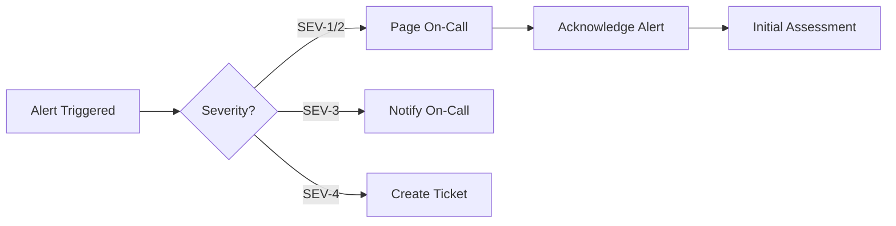

# Incident Response

## Overview

This document outlines incident response procedures, severity classifications, escalation paths, communication protocols, and postmortem processes.

## Incident Severity Levels

### Severity Classification Matrix

| Severity | Impact | Response Time | Examples | Notification |
|----------|--------|---------------|----------|--------------|
| **SEV-1** | Critical business impact | Immediate (< 5 min) | Complete outage, data breach, payment system down | Page on-call + executives |
| **SEV-2** | Major degradation | < 15 min | Elevated errors (>5%), latency >2x normal, partial outage | Page on-call team |
| **SEV-3** | Minor degradation | < 1 hour | Elevated errors (1-5%), non-critical feature down | Notify on-call |
| **SEV-4** | Minimal impact | Next business day | Cosmetic issues, minor bugs | Create ticket |

### Detailed Severity Definitions

#### SEV-1: Critical

**Criteria:**
- Complete service outage affecting all users
- Data breach or security incident
- Payment processing completely down
- Critical data loss or corruption
- Customer-facing SLO breach >10%

**Response:**
- Immediate page to on-call engineer
- Auto-page backup engineer after 5 minutes
- Notify incident commander
- Escalate to VP Engineering after 30 minutes
- Create executive war room if >1 hour

**Examples:**
```
- Database cluster completely down
- Authentication service unavailable
- Payment gateway returning 100% errors
- DDoS attack in progress
- Critical security vulnerability actively exploited
```

#### SEV-2: Major

**Criteria:**
- Partial service degradation affecting >20% of users
- Error rate >5% on critical paths
- Latency >2x normal on critical endpoints
- Non-redundant critical service down
- SLO breach projected within 2 hours

**Response:**
- Page on-call engineer
- Incident commander assigned within 15 minutes
- Notify engineering manager
- Status page update within 30 minutes

**Examples:**
```
- One database replica down
- Cache cluster degraded
- Search functionality unavailable
- Email delivery delayed >1 hour
- API rate limiting overly aggressive
```

#### SEV-3: Minor

**Criteria:**
- Degradation affecting <20% of users
- Error rate 1-5% on non-critical paths
- Non-critical feature unavailable
- Performance degradation not affecting SLOs

**Response:**
- Notify on-call engineer (no page)
- Begin investigation within 1 hour
- Status page update if user-visible

**Examples:**
```
- Recommendation engine slow
- Image uploads occasionally failing
- Export feature not working
- Dashboard loading slowly
- Notification delays
```

#### SEV-4: Minimal

**Criteria:**
- Cosmetic issues
- Internal tools affected
- Documentation errors
- Minor UI glitches

**Response:**
- Create ticket in backlog
- Address during normal work hours

**Examples:**
```
- Button misaligned
- Typo in UI
- Internal dashboard broken
- Non-critical log errors
```

## Incident Response Workflow

### Phase 1: Detection (0-5 minutes)



**Actions:**
1. Alert fires from monitoring system
2. PagerDuty/Opsgenie pages on-call engineer
3. Engineer acknowledges alert within 5 minutes
4. Begin initial triage

**SLA:**
- SEV-1: Acknowledge within 5 minutes
- SEV-2: Acknowledge within 15 minutes
- SEV-3: Acknowledge within 1 hour

### Phase 2: Triage (5-15 minutes)

**Actions:**
1. Determine severity level
2. Assess customer impact
3. Identify affected systems
4. Declare incident if necessary
5. Assign incident commander

**Triage Checklist:**
```markdown
## Triage Checklist

- [ ] What is broken?
- [ ] How many users affected?
- [ ] What is the customer impact?
- [ ] Are we losing data?
- [ ] Are we losing money?
- [ ] What is the error rate/latency?
- [ ] When did this start?
- [ ] What changed recently?
- [ ] Is this a security incident?
- [ ] What is the blast radius?
```

### Phase 3: Incident Declaration (0-15 minutes)

**Incident Commander Responsibilities:**
1. Coordinate response efforts
2. Make key decisions
3. Manage communications
4. Delegate tasks
5. Document timeline
6. Drive incident to resolution

**Initial Actions:**
```bash
# Create incident Slack channel
/incident declare sev-1 "Payment processing down"

# Update status page
curl -X POST https://api.statuspage.io/v1/incidents \
  -H "Authorization: Bearer $API_KEY" \
  -d '{
    "name": "Payment Processing Issues",
    "status": "investigating",
    "impact": "critical",
    "message": "We are investigating issues with payment processing."
  }'

# Start incident document
https://docs.company.com/incidents/2024-01-15-payment-outage
```

### Phase 4: Investigation & Mitigation (15 min - 2 hours)

**Investigation Process:**

```typescript
// Runbook: Investigation Steps
const investigationSteps = [
  // 1. Check recent changes
  'git log --since="2 hours ago" --oneline',
  'kubectl get events --sort-by=.lastTimestamp',

  // 2. Check system health
  'kubectl get pods -A | grep -v Running',
  'docker ps -a | grep -v Up',

  // 3. Check logs
  'kubectl logs -f deployment/api-service --tail=100',

  // 4. Check metrics
  'Open Grafana dashboard',
  'Check error rate spike',
  'Check latency spike',

  // 5. Check dependencies
  'curl https://api.stripe.com/healthcheck',
  'redis-cli ping',
  'psql -c "SELECT 1"',

  // 6. Check configuration
  'kubectl get configmap',
  'kubectl describe deployment api-service',
];
```

**Mitigation Strategies (in order):**

1. **Immediate Mitigation:**
   - Rollback recent deployment
   - Disable problematic feature flag
   - Scale up resources
   - Failover to backup system
   - Enable maintenance mode

2. **Temporary Fix:**
   - Apply hotfix
   - Increase rate limits
   - Clear caches
   - Restart services
   - Route around problem

3. **Permanent Fix:**
   - Deploy proper fix
   - Update configuration
   - Patch vulnerability
   - Optimize performance

### Phase 5: Communication

**Internal Communication:**

```markdown
## Incident Update Template

**Status:** Investigating / Identified / Mitigating / Resolved
**Severity:** SEV-1
**Started:** 2024-01-15 10:30 UTC
**Commander:** @jane.doe
**Next Update:** 15 minutes

**Current Situation:**
Payment processing is returning errors at 30% rate. We have identified the issue as a database connection pool exhaustion.

**Impact:**
- 30% of payment attempts failing
- Estimated $5000/minute revenue loss
- Approximately 10,000 users affected

**Actions Taken:**
- Increased database connection pool from 100 to 500
- Deployed emergency patch to fix connection leak
- Monitoring recovery

**Next Steps:**
- Wait for connection pool to stabilize
- Monitor error rate for 15 minutes
- Roll forward once confirmed stable
```

**External Communication:**

```markdown
## Status Page Update

**Title:** Payment Processing Issues - Resolved

**Update 1 (10:35 UTC):**
We are investigating issues with payment processing. Some customers may be unable to complete purchases.

**Update 2 (10:50 UTC):**
We have identified the issue as a database connection problem and are deploying a fix.

**Update 3 (11:15 UTC):**
The fix has been deployed and payment processing is recovering. We continue to monitor.

**Update 4 (11:30 UTC):**
Resolved. Payment processing has fully recovered. We will publish a postmortem within 48 hours.
```

### Phase 6: Resolution (1-4 hours)

**Resolution Criteria:**
- Error rate back to normal levels
- Latency within acceptable range
- All systems showing healthy status
- No user-visible impact
- Monitoring confirms stability for 30+ minutes

**Resolution Checklist:**
```markdown
- [ ] Metrics returned to normal
- [ ] No new errors appearing
- [ ] Customer impact eliminated
- [ ] Monitoring confirms stability (30 min)
- [ ] Root cause identified
- [ ] Temporary mitigation in place OR permanent fix deployed
- [ ] Status page updated to resolved
- [ ] Customer communication sent
- [ ] Incident channel archived
- [ ] Postmortem scheduled
```

### Phase 7: Postmortem (24-72 hours)

**Postmortem Template:**

```markdown
# Incident Postmortem: Payment Processing Outage

**Date:** 2024-01-15
**Duration:** 10:30 UTC - 11:30 UTC (60 minutes)
**Severity:** SEV-1
**Impact:** $30,000 estimated revenue loss, 10,000+ users affected

## Executive Summary

Payment processing was unavailable for 60 minutes due to database connection pool exhaustion caused by a connection leak in the newly deployed caching layer.

## Timeline

**10:30 UTC** - Alert triggered: High error rate on payment endpoint
**10:33 UTC** - On-call engineer acknowledged alert
**10:35 UTC** - Incident declared SEV-1, commander assigned
**10:38 UTC** - Investigation identified database connection pool exhausted
**10:42 UTC** - Rolled back latest deployment (v2.5.3)
**10:45 UTC** - Rollback complete, no improvement
**10:50 UTC** - Identified connection leak in caching layer
**10:52 UTC** - Emergency hotfix prepared
**11:00 UTC** - Hotfix deployed to production
**11:05 UTC** - Connection pool recovering
**11:15 UTC** - Error rate returned to normal
**11:30 UTC** - Incident resolved after 30-min stability

## Root Cause

The caching layer introduced in v2.5.3 opened database connections for cache invalidation but failed to close them properly. Under high load, this exhausted the database connection pool (max 100 connections), causing all new connection attempts to fail.

## Impact

- **Users Affected:** ~10,000 users attempted checkout during outage
- **Error Rate:** 30% payment failures
- **Revenue Loss:** $30,000 estimated
- **SLO Impact:** Consumed 40% of monthly error budget

## What Went Well

- Alert fired within 1 minute of issue starting
- On-call engineer responded quickly (3 minutes)
- Incident commander made decisive rollback decision
- Team identified root cause within 20 minutes
- Effective communication to stakeholders

## What Went Wrong

- Code review missed connection leak
- No load testing of caching layer before deployment
- Database connection pool monitoring gaps
- Rollback didn't fix issue (leak in shared code)
- Status page update delayed 15 minutes

## Action Items

| Action | Owner | Priority | Due Date |
|--------|-------|----------|----------|
| Add connection pool metrics to dashboard | @devops | P0 | 2024-01-17 |
| Implement connection leak detection in tests | @backend | P0 | 2024-01-20 |
| Add load testing to CI/CD pipeline | @sre | P0 | 2024-01-25 |
| Review all database connection handling | @backend | P1 | 2024-01-30 |
| Improve status page automation | @devops | P1 | 2024-02-05 |
| Increase database connection pool to 500 | @dba | P2 | 2024-01-18 |

## Lessons Learned

1. **Prevention:** Load testing must include new infrastructure components
2. **Detection:** Need better resource exhaustion alerting
3. **Mitigation:** Rollback strategy should consider shared dependencies
4. **Communication:** Automate status page updates from incident channel
```

## On-Call Procedures

### On-Call Rotation

```yaml
# PagerDuty schedule configuration
schedule:
  name: "Primary On-Call"
  time_zone: "UTC"

  layers:
    - name: "Weekly Rotation"
      rotation_virtual_start: "2024-01-01T00:00:00Z"
      rotation_turn_length_seconds: 604800  # 1 week
      users:
        - user_1
        - user_2
        - user_3
        - user_4

  restrictions:
    - type: "weekly_restriction"
      start_day_of_week: 1  # Monday
      start_time_of_day: "09:00:00"
      duration_seconds: 432000  # 5 days (Mon-Fri)

escalation_policy:
  name: "Engineering Escalation"
  escalation_rules:
    - escalation_delay_in_minutes: 5
      targets:
        - id: "primary_oncall"
          type: "schedule_reference"

    - escalation_delay_in_minutes: 10
      targets:
        - id: "backup_oncall"
          type: "schedule_reference"

    - escalation_delay_in_minutes: 15
      targets:
        - id: "engineering_manager"
          type: "user_reference"
```

### On-Call Handoff

```markdown
## Weekly On-Call Handoff Template

**Date:** 2024-01-15
**Outgoing:** Alice Chen
**Incoming:** Bob Smith

### Active Incidents
- None

### Ongoing Issues
- API latency elevated 10% - monitoring
- Database replica lag - scheduled maintenance this week

### Recent Changes
- Deployed v2.5.4 on 2024-01-13
- Database maintenance window: 2024-01-17 02:00-04:00 UTC

### Watch Items
- Black Friday traffic starting Thursday
- New feature flag rollout in progress (20% enabled)

### Runbook Updates
- Updated payment processing runbook with new troubleshooting steps

### Questions / Notes
- Database team still investigating replica lag
- Consider enabling auto-scaling before traffic spike
```

### On-Call Responsibilities

**Before Shift:**
- Review handoff notes
- Test PagerDuty notifications
- Ensure access to all systems
- Review recent deployments
- Check upcoming maintenance windows

**During Shift:**
- Acknowledge alerts within SLA
- Keep incident documentation updated
- Escalate appropriately
- Communicate status regularly
- Follow runbooks

**After Shift:**
- Complete handoff document
- Close out resolved incidents
- Update runbooks if needed
- File any follow-up tickets

## Escalation Paths

### Technical Escalation

```
Level 1: On-Call Engineer (0-15 min)
  ↓ (if unresolved)
Level 2: Backup On-Call (15-30 min)
  ↓ (if unresolved)
Level 3: Engineering Manager (30-45 min)
  ↓ (if SEV-1 and >1 hour)
Level 4: VP Engineering + CTO (>1 hour)
```

### Business Escalation

```
SEV-1 Incidents:
  ↓
Customer Success (immediate notification)
  ↓
Product Management (15 min)
  ↓
VP Product + VP Engineering (30 min)
  ↓
CEO (if >1 hour or major customer impact)
```

## Communication Channels

### Slack Channels

```yaml
channels:
  # Real-time incident response
  - "#incidents": All incident notifications
  - "#incident-<ID>": Per-incident war room
  - "#on-call": On-call team coordination

  # Monitoring and alerts
  - "#alerts-critical": SEV-1/2 alerts
  - "#alerts-warning": SEV-3 alerts
  - "#monitoring": General monitoring discussions

  # Post-incident
  - "#postmortems": Postmortem reviews
  - "#action-items": Tracking improvements
```

### Status Page

```bash
# Statuspage.io API integration
curl -X POST "https://api.statuspage.io/v1/pages/$PAGE_ID/incidents" \
  -H "Authorization: OAuth $API_KEY" \
  -H "Content-Type: application/json" \
  -d '{
    "incident": {
      "name": "Payment Processing Issues",
      "status": "investigating",
      "impact_override": "critical",
      "body": "We are investigating issues with payment processing.",
      "component_ids": ["payment_api"],
      "components": {
        "payment_api": "major_outage"
      }
    }
  }'
```

## Incident Metrics

### Key Metrics to Track

```promql
# Time to Acknowledge (TTA)
histogram_quantile(0.95,
  rate(incident_acknowledgement_seconds_bucket[30d])
)

# Time to Mitigate (TTM)
histogram_quantile(0.95,
  rate(incident_mitigation_seconds_bucket[30d])
)

# Time to Resolve (TTR)
histogram_quantile(0.95,
  rate(incident_resolution_seconds_bucket[30d])
)

# Incident count by severity
sum by (severity) (
  increase(incidents_total[30d])
)

# MTBF (Mean Time Between Failures)
30 * 24 * 3600 / sum(increase(incidents_total{severity="sev-1"}[30d]))

# MTTR (Mean Time To Recovery)
avg(incident_resolution_seconds{severity="sev-1"})
```

### Monthly Incident Report

```markdown
## January 2024 Incident Report

### Summary
- Total Incidents: 42
- SEV-1: 2
- SEV-2: 5
- SEV-3: 15
- SEV-4: 20

### Key Metrics
- MTTR (SEV-1): 45 minutes
- MTTR (SEV-2): 1.5 hours
- MTBF: 15 days
- Total Downtime: 90 minutes
- Availability: 99.95%

### Top Incident Categories
1. Database issues (35%)
2. Deployment problems (25%)
3. Third-party failures (20%)
4. Performance degradation (15%)
5. Other (5%)

### Action Items Completed
- 12/15 P0 items completed
- 28/35 P1 items completed
- Average completion time: 8 days

### Trends
- Incident count down 15% from last month
- MTTR improved by 20%
- Database incidents increasing (action: DB upgrade planned)
```

## Summary

This incident response framework ensures:

- **Clear severity definitions** for appropriate response
- **Defined workflows** from detection to resolution
- **Effective communication** internally and externally
- **Proper escalation** paths for timely decision-making
- **Comprehensive postmortems** for continuous improvement
- **Measurable metrics** for tracking reliability
